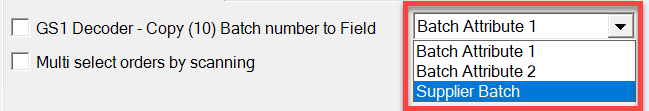

# Scanning: General

The following section outlines the key scanning functionalities and settings available to optimize your workflow.

---

**Identify/open items with batch/serial scanning** – This feature allows you to identify an item based on its Batch or Serial Number. It enables finding items in all transactions (except receipt transactions) under the following conditions:

- the Batch number is unique
- the Batch is present just in one location
- for Delivery - "Enable scanning and adding Items from distinct warehouses" is checked
- for Stock Transfer, Goods Issue, and Delivery: it is possible to scan the Batch and quantity on the Warehouse selection window if 'Enable scanning and adding Items from distinct warehouses' is checked.

On Stock Transfer and Goods Issue, when on the Warehouse selection list, a user can (on top of the previously added feature for Batch Numbers scanning) scan Serial Number, and it will behave as a Fast Scan, i.e.:

- The warehouse will be chosen.
- A line with the scanned item code and serial number will be added.

**Force quantity confirmation on quantity screen** – When enabled, this option requires manual confirmation of the previously set quantity. Scanning a barcode will not automatically confirm it.

**GS1 Decoder - Check BP catalog No. on item scanning** – Ensures that the BP catalog number is verified during item scanning.

**GS1 Decoder: Remove zeros from the beginning of scanned values with GTIN 02 and 01 prefixes** – Removes leading zeros from scanned values with GTIN 01 and 02 prefixes.

**GS1 - Join (10)Batch with (17)Expiry Date if both are present in the barcode** – Links the Batch Number to the Expiry Date if both are found in the barcode.

**Date connector sign/string** – Defines the symbol used as a data connector (e.g., '-', ',', '/', '.').

**GS1 Decoder** - Copy (10) Batch number to Field – When enabled, the Batch number is copied to the Supplier Batch, Batch Attribute 1, or Batch Attribute 2 fields.

**Multi-select orders by scanning** – When unchecked, scanning a Sales Order code in the order selection form selects the order and proceeds to the next form. When checked, you can scan multiple codes, and the next form will only appear after clicking the right arrow.

---
By leveraging these scanning capabilities, businesses can maintain accurate inventory records and streamline transactional processes, ultimately leading to improved productivity and reduced errors.
