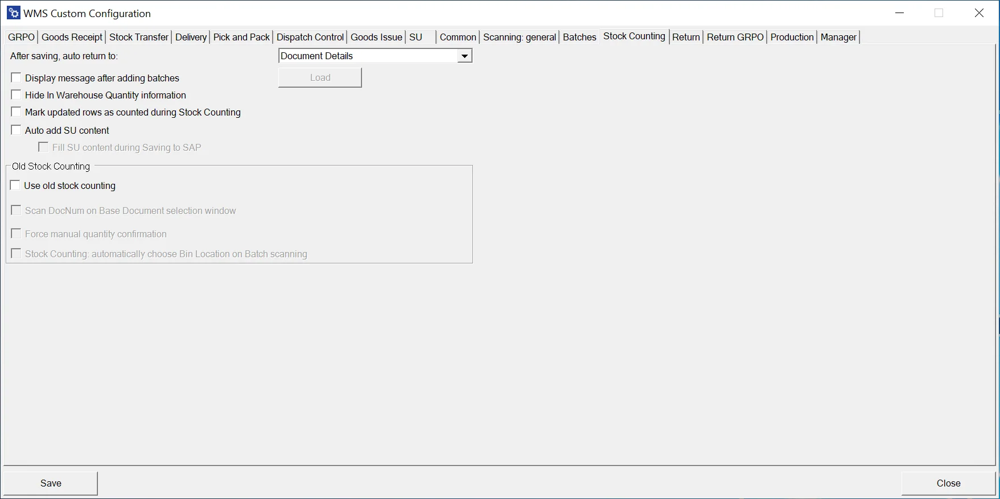

# Stock Counting

The new Stock Counting is created based on an empty document created in CompuTec WMS. Next, it is sent to SAP Business One. In the old Stock Counting, an SAP Business One user created a document based on which a list was displayed in CompuTec WMS. After enabling the old Stock Counting, you can use all of the checkboxes from this view (both for the old and new option versions).

---

**After saving, auto return to:** – Defines the form to return to after saving Item Details on a document. You can choose either the Document Details or the Item Details.

**Display message after adding batches** – Configures a message that will be displayed after adding a Batch. The message can be based on an SQL query.

**Hide In Warehouse Quantity Information** – Hides the warehouse quantity information, preventing the WMS user from viewing the system quantity

**Mark updated rows as counted during Stock Counting** – Marks all rows added in the WMS as counted in SAP.

**Auto add SU content** – Enabling this option allows you to add an entire Storage Unit (along with its contents).

**Fill SU content during Saving to SAP** – When checked, all items in the Storage Unit are saved only after clicking the "Save to SAP" button, rather than during the entry of specific lines. This can help speed up the counting process.

## Old Stock Counting

**Scan DocNum on the Base Document selection window** – When enabled, you can scan a document by DocNum instead of DocEntry if a base document is selected.

**Force manual quantity confirmation** – After scanning required prefixes (Warehouse, Vendor, Item, Quantity, Batch number), the application forces manual confirmation of the quantity, rather than automatically confirming it after scanning a barcode with the quantity.

**Stock Counting: automatically choose Bin Location on Batch scanning** – Automatically selects the Bin Location when scanning a Batch, if the batch is located in only one bin.

---
The Stock Counting functionality in SAP Business One, integrated with CompuTec WMS, offers flexibility and efficiency in managing stock verification processes. Whether using the new or old Stock Counting methods, these features enable businesses to streamline their operations by automating tasks like batch handling, bin location selection, and quantity confirmation.
