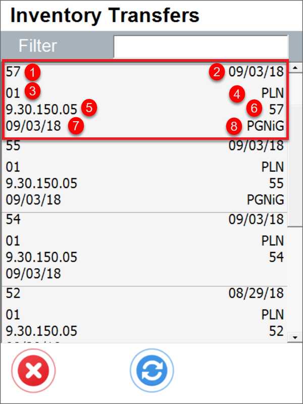

# Stock Transfer

**Show Project selection** – Choosing this option results in displaying the Project Selection form before the Remarks form during the creation of a document (to which it is required to add receiving Items)
    

    
Click here to expand

    

        
    

    

**Default Project** – If a default project is selected, you can click the right arrow icon on the Project selection form. The default project configured here will be automatically selected.
    

    
Click here to expand

    

        
    

    

**Scan DocNum on the Base Document selection window** – Checking this option allows you to scan a document by Docnum, not by DocEntry.

**Enable dismiss Inventory Transfer Request before closing document** – This option allows to dismiss working on a document. The option is available on the Remarks window.
    

    
Click here to expand

    

         
    

    

**Canceling document releases Transfer Request document** – This option is linked to the previous one. When selected, it closes the Inventory Transfer Request document where Dismiss is set to 'Yes.' The document will no longer be available in the Inventory Transfer Request section of CompuTec WMS and will have a 'Closed' status in SAP Business One.

**Block adding Items to base documents** – Prevent adding items when a base document is present (restricts adding items not included in the base document).
    

    
Click here to expand

    

         
    

    

**Skip destination Warehouse and Bin Location selection** – Skip Destination Warehouse/Bin Location selection step (a base document destination is chosen).
    

    
Click here to expand

    

    **Before marked**

       

    **After marked**

      
    

    

**Force manual quantity confirmation** – When this option is checked, manually confirming the previously set quantity is required, as scanning a barcode will not automatically confirm it.

**Forbid picking more than is on Transfer Request** – It's not possible to assign a greater quantity of an item to a document than what's specified in the base document.

**Show Cost Dimensions** – Enabling this checkbox adds a button (located next to the Back button) on the Quantity form, which directs the user to the Cost Dimensions form.

**Skip SAP Allocation Quantity, Skip ProcessForce Allocation Quantity** – Allows disabling SAP Business One Batch/Serial Numbers allocation (if needed for some custom changes). The Stock Transfer works within a Warehouse with Bin locations for allocated Batches and Serial Numbers Items.

**Use Sales UoM** – click [here](../../../user-guide/managing-uom-in-computec-wms.md) to find out more.

**Ask to continue scanning when multiple items are over-picked** – When checked: if two lines with the same item are added to a document, exceeding the required quantity prompts the system to display a message allowing the user to choose which line has the exceeded quantity.

**Disable auto "From Bin" assigment (when intentory exists in single bin) while adding item by scanning** - If the item is placed in a different bin location than specified in the Transfer Request document, the user can select it from the alternative bin.

**Automatically populate the Quantity field with the value from the base document** - The quantity from the base document automatically populates in the quantity field when the Quantity screen is opened.

## Changes

The old view of Stock Transfer tab. The following options have been removed:

- Inventory Transfer Requests sorting order
- Filter Inventory Transfer Request for bin
- Extra fields in Inventory Transfer Request query

    

It is possible to realize Inventory Transfer Requests sorting order function by creating a specific SQL query in Custom Query Manager. Choose the option and then, choose a required transaction:

    
    
The displayed records order can by modify by modifying the default line: `ORDER BY T0."DocEntry"`

    

We have 4 options for change, just like it was possible before. On the left side, the selection options from the old view are described, and on the right side, the appropriate commands that we can currently use.

1. creationdate ascending - "DocDate" ASC
2. creationdate descending - "DocDate" DESC
3. duodate ascending - "DocDuoDate" ASC
4. duodate descending - "DocDuoDate" DESC

We can also create our own filters. Just search and enter the appropriate column name, which we can obtain via SQL Manager.

    

Below is an example in which documents can be sorted by document number from highest to lowest. A column called "DocNum" will be used for this

    

The Changes look like this:

1. without making any changes (fig.1)

    

2. sorting by document number (fig.2)

    

Below is an example for the "Extra field in Inventory Transfer Request query" checkbox. We open SQL Manager and search for the table from which we will retrieve data.

    

Then, go to Custom config, select the manager tab and the transaction (in this case "Stock Transfer")

    

There are eight fields available. The standard query contains six of them. There are two more fields ("Field7" and "Field8") available, taken from the "OWTQ" table.

    

Fields marked according to the field layout in Custom Query:

    
