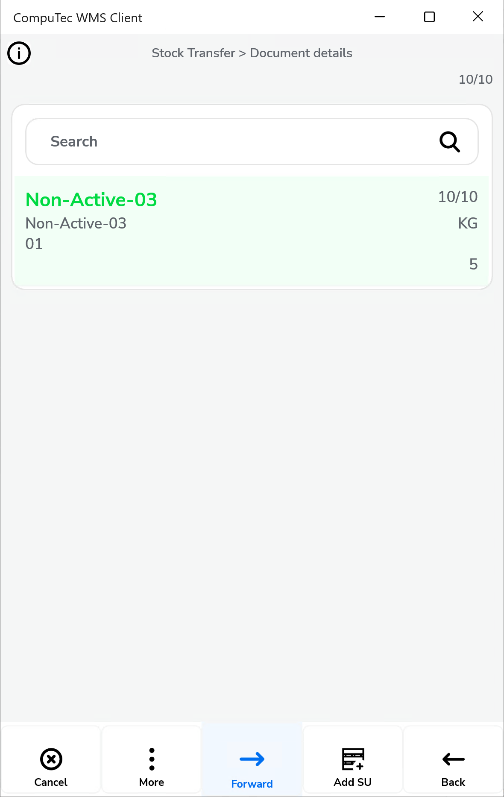

# Stock Transfer

The Stock Transfer module within SAP Business One offers comprehensive options for managing Inventory Transfer and stock movement between warehouses. This overview walks through key configuration options, changes, and customization capabilities, helping ensure seamless and efficient inventory handling.

---

## Configuration Options

Below are the available settings and behaviors you can enable or disable in the Stock Transfer process:

1. **Show Project selection**: Displays the Project Selection form before the Remarks form, ensuring the correct project is linked during document creation.  

    

2. **Default Project**: If a default project is set, it can be automatically applied by clicking the right arrow in the Project Selection form, speeding up document processing.  

    

3. **Move only indexes by default**: This option allows you to move indexes from Storage Unit to another location.

    - Move only indexes by default

        

    - Move only indexes by default X

        

4. **Scan DocNum on the Base Document selection window**: Enables scanning by **document number (DocNum)** instead of **entry number (DocEntry)**, simplifying document retrieval.

5. **Enable dismiss Inventory Transfer Request before closing document**: Provides an option to dismiss an active document, accessible from the Remarks window.

     

6. **Canceling document releases Transfer Request document**: When cancellation occurs, the related Inventory Transfer Request document is also closed (if *Dismiss* is set to **Yes**). This prevents further processing in CompuTec WMS and updates the status to **Closed** in SAP Business One.

7. **Block adding Items to base documents**:  Prevents adding items not listed in the base document, ensuring transfers remain aligned with original requests.

     

8. **Skip destination Warehouse and Bin Location selection**: Automatically uses the destination warehouse/bin defined in the base document, bypassing manual entry.  
    

    
Click here to expand

    

    **Before marked**

       

    **After marked**

      
    

    

9. **Force manual quantity confirmation**: Requires users to confirm quantities manually instead of relying only on barcode scans, reducing errors in allocation.

10. **Forbid picking more than is on Transfer Request**: Prevents assigning a higher quantity than what is specified in the base Transfer Request.

11. **Show Cost Dimensions**: Adds a **Cost Dimensions** button to the Quantity form for users who need to assign extra cost dimensions.

12. **Skip SAP Allocation Quantity, Skip CompuTec ProcessForce Allocation Quantity**: Disables batch and serial allocations in SAP Business One and CompuTec ProcessForce if custom allocations are required.

13. **Use Sales UoM**: For details, see [Manging UoM in CompuTec WMS](../../../user-guide/managing-uom-in-computec-wms.md).

14. **Ask to continue scanning when multiple items are over-picked**: If an item’s picked quantity exceeds requirements across multiple lines, the system prompts users to confirm whether to continue scanning.

15. **Disable auto "From Bin" assignment (when inventory exists in single bin) while adding item by scanning**: Stops automatic bin assignment when stock exists in a single bin, allowing users to choose manually.

16. **Automatically populate the Quantity field with the value from the base document**: When opening the Quantity screen, the value from the base document is prefilled automatically.

17. **Quick SU Transfer - Select SU only by scanning**: Allows SU transfer only by scanning.

    

18. **Quick SU Transfer - Skip remarks**: Skips the **Remarks** window during Storage Unit transfer and automatically returns to the first **Stock Transfer** > **List of SUs** screen after saving. This allows users to immediately scan and transfer another SU without additional confirmation steps.

    

19. **Move fully picked lines to the bottom of the list**:  Lines that have been fully picked are automatically moved to the bottom of the list, keeping focus on pending lines.  

    - Move fully picked lines to the bottom of the list:

        

    - Move fully picked lines to the bottom of the list X

        

20. **Quick SU Tool Tip Fill strategy (scanning)**: Defines how the system automatically fills the **Source** and **Destination** warehouse and bin fields when scanning a **Storage Unit (SU)** during **Stock Transfer**.

    

    Available values:
    - **Set to Source**: Always updates the **Source** warehouse and bin fields.
    - **Set to Destination**: Always updates the **Destination** warehouse and bin fields.
    - **Set to First Empty then Source**: If either **Source** or **Destination** is empty, the system fills the empty one. If both are filled, the system updates the **Source** fields.
    - **Set to First Empty then Destination**: If either **Source** or **Destination** is empty, the system fills the empty one. If both are filled, the system updates the **Destination** fields.  

    

## Changes

In the updated Stock Transfer tab, some previous features have been removed or adjusted to streamline processes. Here’s a look at these adjustments and custom query options available for advanced users.

The following options have been removed:

- Inventory Transfer Requests sorting order
- Filter Inventory Transfer Request for bin
- Extra fields in Inventory Transfer Request query

    

It is possible to realize Inventory Transfer Requests sorting order function by creating a specific SQL query in Custom Query Manager. Choose the option and then, choose a required transaction:

    
    
The displayed records order can by modified by modifying the default line: `ORDER BY T0."DocEntry"`

    

We have four options for changes, similar to the previous version. On the left side, the selection options from the old view are listed, and on the right side, the corresponding commands we can use now are provided.

1. creationdate ascending - "DocDate" ASC
2. creationdate descending - "DocDate" DESC
3. duodate ascending - "DocDuoDate" ASC
4. duodate descending - "DocDuoDate" DESC

We can also create custom filters by searching for and entering the relevant column name, which can be obtained through SQL Manager.

    

Here is an example where documents can be sorted by document number, from highest to lowest, using the "DocNum" column.

    

The Changes look like this:

1. without making any changes (fig.1)

    

2. sorting by document number (fig.2)

    

Here is an example for the "Extra field in Inventory Transfer Request query" checkbox. We open SQL Manager and locate the table from which to retrieve the data.

    

Next, go to Custom Config, select the Manager tab, and choose the transaction (in this case, "Stock Transfer").

    

The SQL Manager provides access to eight fields for customization within Inventory Transfer Request queries. The default query includes six fields, with two extra fields, "Field7" and "Field8", available from the "OWTQ" table.

    

Fields marked according to the field layout in the Custom Query:

    

---
