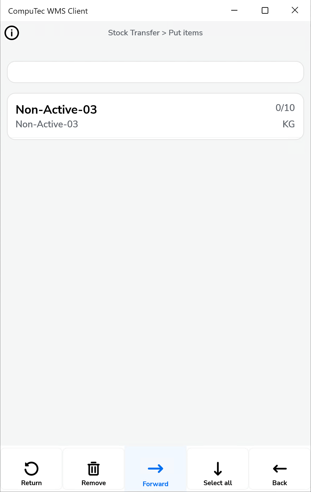
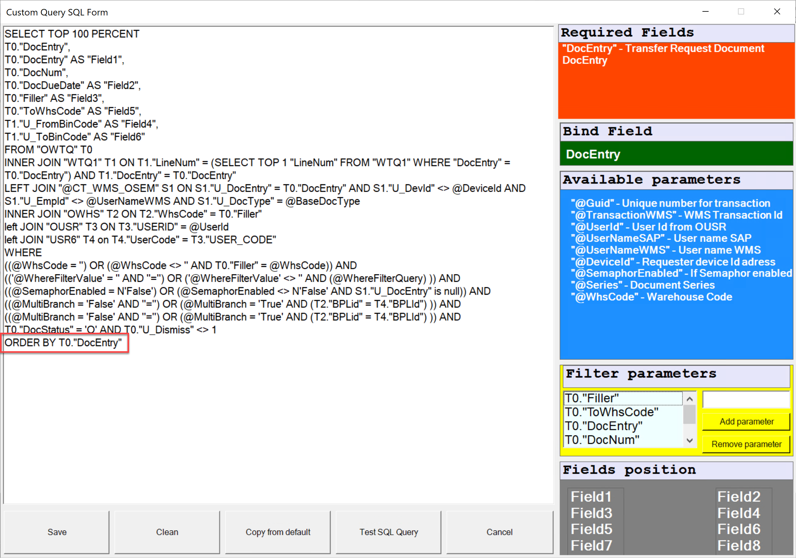
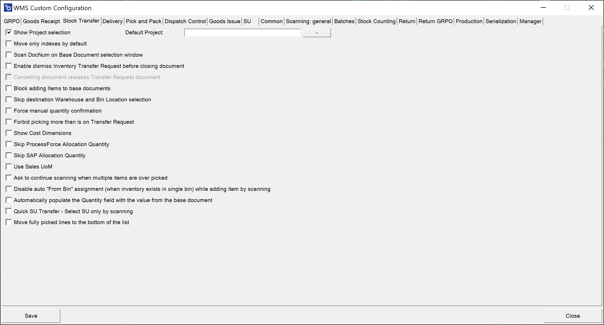

# Stock Transfer

**Show Project selection** – choosing this option results in displaying the Project Selection form before the Remarks form during the creation of a document (to which it is required to add receiving Items)
    

    
Click here to expand

    

         
    

    

**Default Project** – if a default project is chosen, clicking the right arrow icon on the Project selection form is possible. A default project set up here will be chosen automatically.
    

    
Click here to expand

    

        
    

    

**Scan DocNum on the Base Document selection window** – checking this option allows you to scan a document by Docnum, not by DocEntry.

**Enable dismiss Inventory Transfer Request before closing document** – this option allows to dismiss working on a document. The option is available on the Remarks window.
    

    
Click here to expand

    

        
    

    

**Canceling document releases Transfer Request document** – this option is related to the previous one. Checking it results in closing the Inventory Transfer Request document on which Dismiss was set to 'Yes.' The document will not be available on Inventory Transfer Request in CompuTec WMS and will have a 'Closed' Status in SAP Business One.

**Block adding Items to base documents** – block adding Items when there is a base document (prevents from adding Items not included in the base document).
    

    
Click here to expand

    

        
    

    

**Skip destination Warehouse and Bin Location selection** – skip Destination Warehouse/Bin Location selection step (a base document destination is chosen)
    

    
Click here to expand

    

    **Before marked**
        

    **After marked**
      
    

    

**Force manual quantity confirmation** – with this option checked, it is required to manually confirm previously set up quantity (scanning a barcode does not confirm it automatically)

**Forbid picking more than is on Transfer Request** – cannot assign greater quantities for an Item to a document than it is on the base document.

**Show Cost Dimensions** – checking this checkbox adds a button (next to the Back button) on the Quantity form that leads to the Cost Dimensions form.

**Skip SAP Allocation Quantity, Skip ProcessForce Allocation Quantity** – allows disabling SAP Business One Batch/Serial Numbers allocation (if needed for some custom changes). The Stock Transfer works within a Warehouse with Bin locations for allocated Batches and Serial Numbers Items.

**Use Sales UoM** – click [here](../../../user-guide/managing-uom-in-computec-wms.md) to find out more.

**Ask to continue scanning when multiple items are over-picked** – when checked: when two lines with the same Item are added to a document, exceeding the required quantity causes the system to display a message with a choice to which of the lines added exceeded the quantity.

## Changes

The old view of Stock Transfer tab. The following options have been removed:

- Inventory Transfer Requests sorting order
- Filter Inventory Transfer Request for bin
- Extra fields in Inventory Transfer Request query

    

It is possible to realize Inventory Transfer Requests sorting order function by creating a specific SQL query in Custom Query Manager. Choose the option and then, choose a required transaction:
    
    

The displayed records order can by modify by modifying the default line: `ORDER BY T0."DocEntry"`
    

We have 4 options for change, just like it was possible before. On the left side, the selection options from the old view are described, and on the right side, the appropriate commands that we can currently use.

1. <s>creationdate ascending</s> - "DocDate" ASC
2. <s>creationdate descending</s> - "DocDate" DESC
3. <s>duodate ascending</s> - "DocDuoDate" ASC
4. <s>duodate descending</s> - "DocDuoDate" DESC

We can also create our own filters. Just search and enter the appropriate column name, which we can obtain via SQL Manager.
    

Below is an example in which documents can be sorted by document number from highest to lowest. A column called "DocNum" will be used for this
    

The Changes look like this:

1. without making any changes (fig.1)
    

2. sorting by document number (fig.2)
    

Below is an example for the "Extra field in Inventory Transfer Request query" checkbox. We open SQL Manager and search for the table from which we will retrieve data.
    

Then, go to Custom config, select the manager tab and the transaction (in this case "Stock Transfer")
    

There are eight fields available. The standard query contains six of them. There are two more fields ("Field7" and "Field8") available, taken from the "OWTQ" table.
    

Fields marked according to the field layout in Custom Query:
    
