# Storage Unit

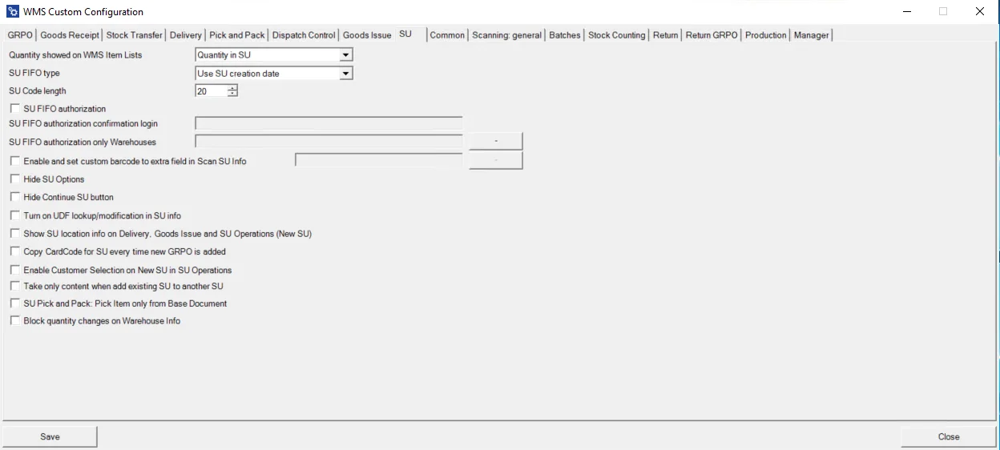

**Quantity showed on WMS Item Lists** – checking this checkbox results in displaying quantity packed in an SU.
    

    
Click here to expand

    

    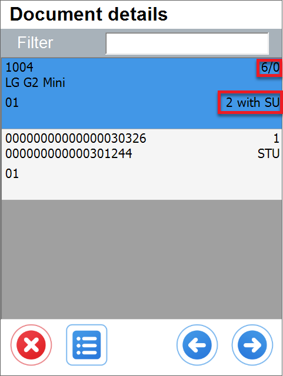
    

    

**SU FIFO type** allows setting the date to be created/displayed on a new SU. Options are SU creation date or creation date of the Items in the SU.

**SU Code length** – number of characters in the SU code

**SU FIFO authorization** – checking this option enables SU creation authorization. It is possible to set up a mandatory log in on SU creation and to set up for which Warehouse's authorization will be required.

**SU FIFO authorization login** – an option related to the previous one: login details for SU FIFO authorization
    

    
Click here to find out more

    

    1. Start WMS
        1. Stock Transfer
            1. New Inventory Transfer for all Items.
            - FIFO does not work in Source Warehouse form:
            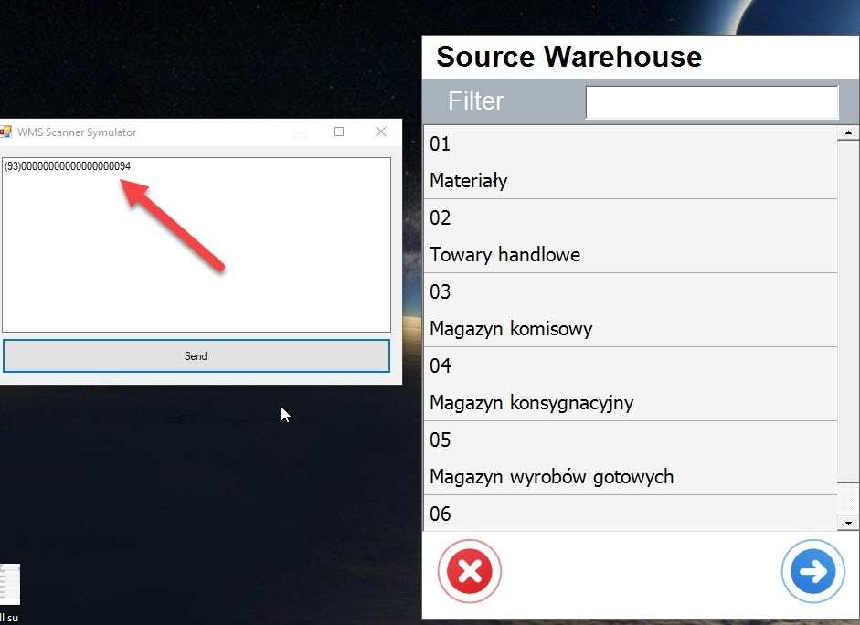

            - It works **only** in a Warehouse:

                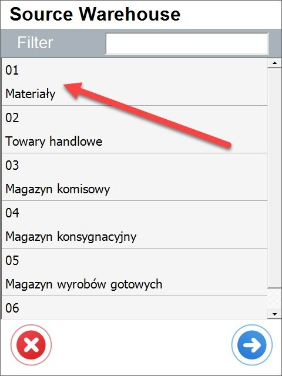

            - Select ALL SU (Sorted by InTime, Code)
            - This option allows you to see **all** the Storage Units in the specific Warehouse

                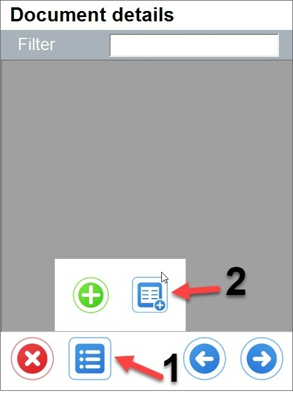
                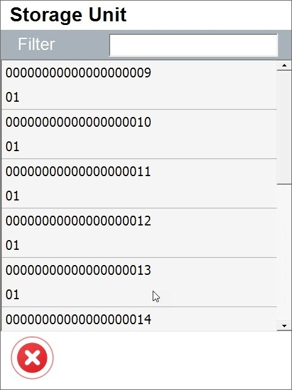

            2. New Inventory Transfer Batch Item

                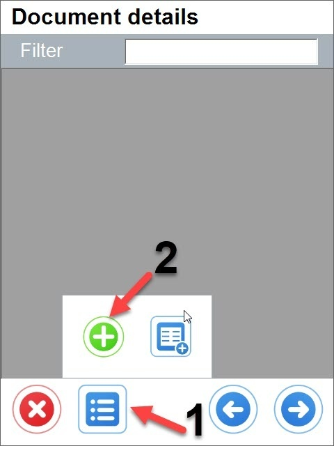

            - Select batch item

                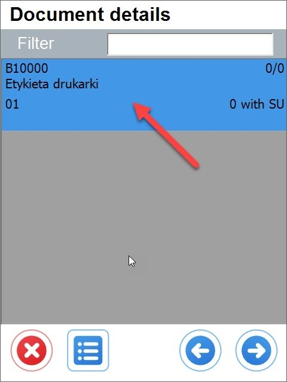

            - Select SU FIFO

                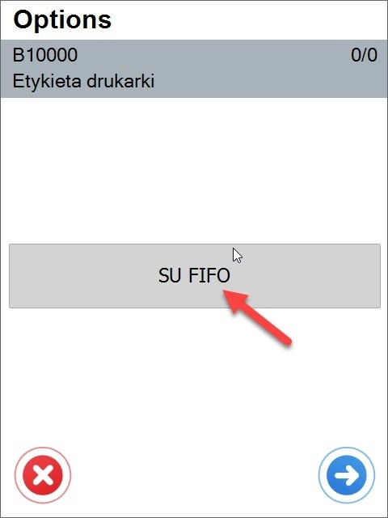

            - Select SU for Batch Item(Sorted By InData, Code)
            - This option allows you to see all the Storage Units for **one** item(batch)

                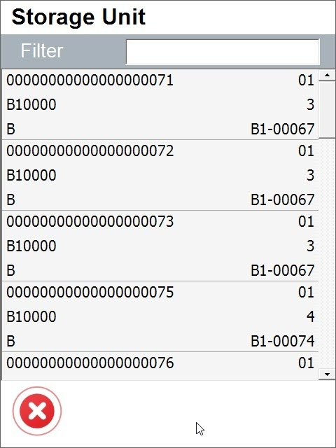

            - SU 90, 91,92 have the same InTime Date **2007-03-26**
            - Su 94 has a different **InTime Date, 2019-10-30**
            - **In this case, WMS shows a message if you select SU 94**
            - **WMS does not show a message if you select 90,91 or 92**

                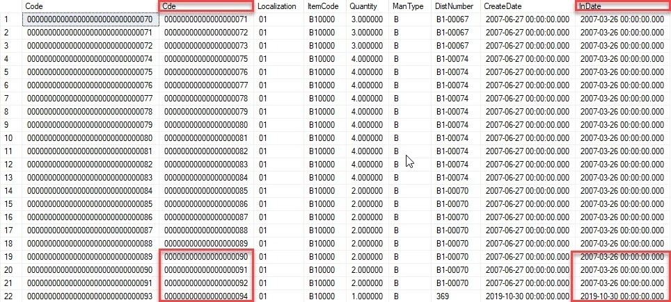

            - FIFO Message(for SU 00000000000000000094)

                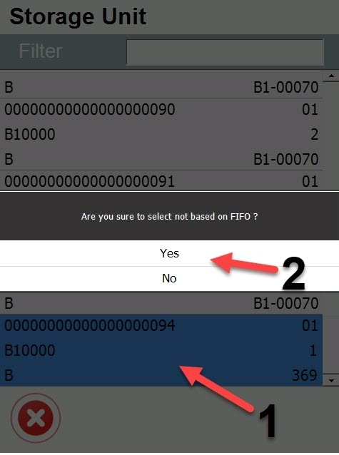
    

    

**SU FIFO authorization only Warehouses** – an option related to the two previous ones: you can choose to which Warehouses authorization applies

**Enable and set custom barcode to the extra field in Scan SU Info** – allows assigning a custom barcode to a different field in Scan SU Info.

**Hide SU Options** – when the checkbox is checked, SU-related options (Continue SU, New SU, New SU for each Qty) are not displayed.

**Hide Continue SU button** – hides the option to continue SU – it is then only possible to create New SU or New SU for each Qty (the option is greyed out when the Hide SU Options checkbox is checked)

**Turn on UDF lookup/modification in SU info** – allows modifying UDFs from SU Info form in transactions.

**Show SU location info on Delivery, Goods Issue, and SU Operations (New SU)** – shows the number of SUs available on a specific Bin Location (this option is only considered when a Warehouse with Bin locations is selected on a transaction. To make sure that the proper Warehouse is set, please uncheck the option in Custom Configuration: Delivery > Enable scanning and adding Items from distinct Warehouses)

**Copy CardCode for SU every time new GRPO is added** – allows to automatically copy a CardCode for SU every time Goods Receipt PO is created.

**Enable Customer Selection on New SU in SU Operations** – allows choosing a Customer while creating a new SU in SU Operations.

**Take only content when adding existing SU to another SU** – when the checkbox is checked, adding SU to another SU adds only its content. When unchecked, a whole SU is added – creating a multi-level SU.

**SU Pick and Pack: Pick Item only from Base Document** – choosing this option blocks the possibility of adding Items that are not on a base document

**Block quantity changes on Warehouse Info** – checking this option blocks the possibility of opening an Item line on Whs Info → SU Info
