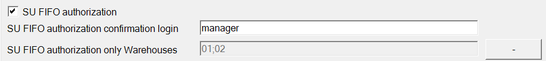

# Storage Unit

**After scanning an item into new SU, auto return to: Document Details, Quantity** - After scanning an item into New SU, auto return to: Document Details, Quantity - this option allows you to change the window to which the application will go after scanning an item.
    

    
Click here to expand

    

    **Document Details**

        

    **Quantity**

        
    

    

**Quantity showed on WMS Item Lists** – checking this checkbox results in displaying quantity in the SU or outside the SU
    

    
Click here to expand

    

     In the below example, you can compare how it will look if you will take 30 pieces of some item - 10 is in the SU, 20 outside SU.

        
    

    

**SU FIFO type** allows setting the date to be created/displayed on a new SU. Options are SU creation date or creation date of the Items in the SU.

**SU Code length** – number of characters in the SU code

**SU FIFO authorization** – checking this option enables SU creation authorization. It is possible to set up a mandatory log in on SU creation and to set up for which Warehouse's authorization will be required.

Click here to expand

When you take SU outside the FIFO queue, you are asking for the confirmation by logging by the user selected in the field SU FIFO confirmation authorization login (in this case: manager).
The warehouses where the this restrictions are applied are in the field are listed in SU FIFO authorization only warehouses (in this case: warehouses 01 and 02).

        

This is how the process would look like if you take the SU outside the FIFO queue:

        

**SU FIFO authorization login** – This is an option related to the previous one: login details for SU FIFO authorization. If you select the SU outside the FIFO queue(it means that the selected SU is newer than the other one you can choose), you are asking for the confirmation by the login of the selected user in selected warehouses.

**SU FIFO authorization only Warehouses** – an option related to the two previous ones: you can choose to which Warehouses authorization applies.

**Enable and set custom barcode to the extra field in Scan SU Info** – allows assigning a custom barcode to a different field in Scan SU Info.

**Hide SU Options** – when the checkbox is checked, SU-related options (Continue SU, New SU, New SU for each Qty) are not displayed.

**Hide Continue SU button** – hides the option to continue SU in Pick Receipt – it is then only possible to create New SU or New SU for each Qty (the option is greyed out when the Hide SU Options checkbox is checked)

**Turn on UDF lookup/modification in SU info** – allows modifying UDFs from SU Info form in transactions.

**Show SU location info on Delivery, Goods Issue, and SU Operations (New SU)** – shows the number of SUs available on a specific Bin Location (this option is only considered when a Warehouse with Bin locations is selected on a transaction. To make sure that the proper Warehouse is set, please uncheck the option in Custom Configuration: Delivery > Enable scanning and adding Items from distinct Warehouses)

**Copy CardCode for SU every time new GRPO is added** – allows to automatically copy a CardCode for SU every time Goods Receipt PO is created.

    

**Enable Customer Selection on New SU in SU Operations** – allows choosing a Customer while creating a new SU in SU Operations.

**Take only content when adding existing SU to another SU** – when the checkbox is checked, adding SU to another SU adds only its content. When unchecked, a whole SU is added – creating a multi-level SU.

**SU Pick and Pack: Pick Item only from Base Document** – choosing this option blocks the possibility of adding Items that are not on a base document

**Block quantity changes on Warehouse Info** – checking this option blocks the possibility of opening an Item line on Whs Info → SU Info

**Stay on Existing SU List after picking/scanning a SU** - After picking/scanning an SU you will not get back to the Document Details screen, but you will remain on the SU List screen
