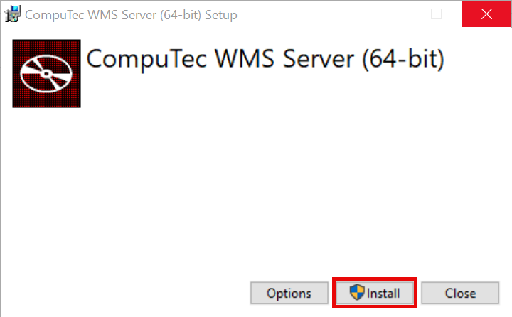
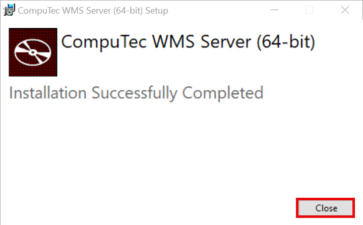
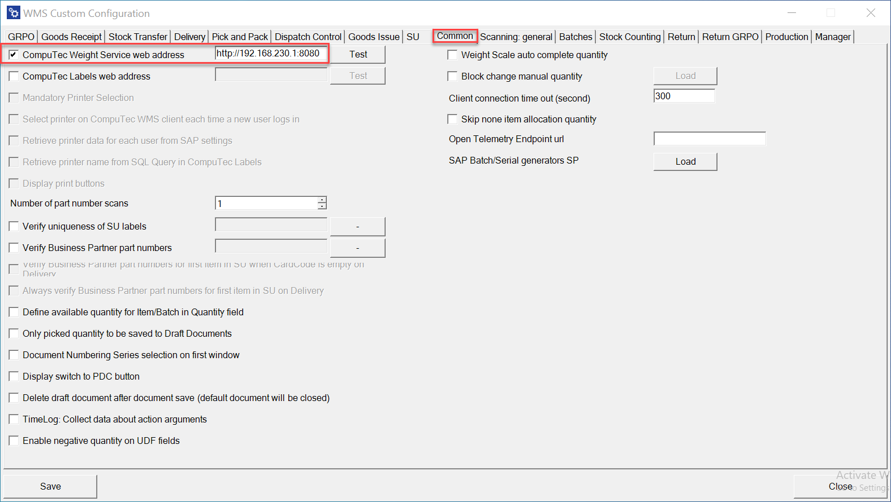
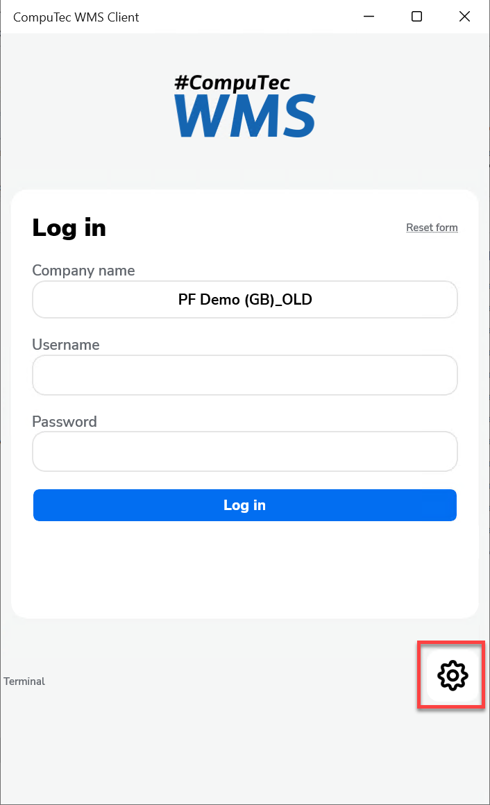
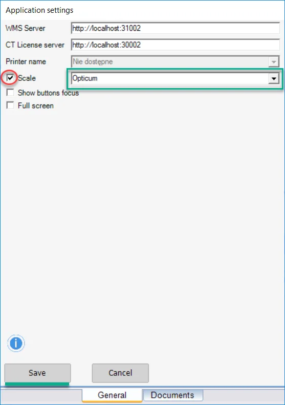

# Integration CompuTec WMS with Weight Scale Service

:::info
    This document contains a step-by-step guide on installing the CompuTec WMS server and Client with weight scale support.
:::

:::warning
    If you already have CompuTec WMS installed, please uninstall it. The CompuTec WMS client and server with support weight must be installed from scratch.

    Net Framework 4.7 is required.
:::

1. To run the CompuTec WMS desktop version, you must install a server and a client unit.
2. To install the server, download and run its installation file. You can find it [here](https://learn.computec.one/docs/wms/releases/download/)
3. In the window that will appear, click the "Install" button:

    
4. A window with an installation progress will be displayed. Click the "Close" button after a communication about a successful setup:

    
5. Now, you must run the Custom Configuration tool. The application is installed automatically during CompuTec WMS Server installation.

6. Click the Common tab and click the CT Weight Service web address checkbox to activate.
7. In the web address field type `http://localhost:8080` or `http://Your IP address:8080` and then click the Save button.

    
8. Go to the CompuTec WMS Client and click "Options".

    
9. Click the "Scale" checkbox, choose your scale, then click the save button.

    
10. Your CompuTec WMS is ready to proceed with the weight scale.

---
