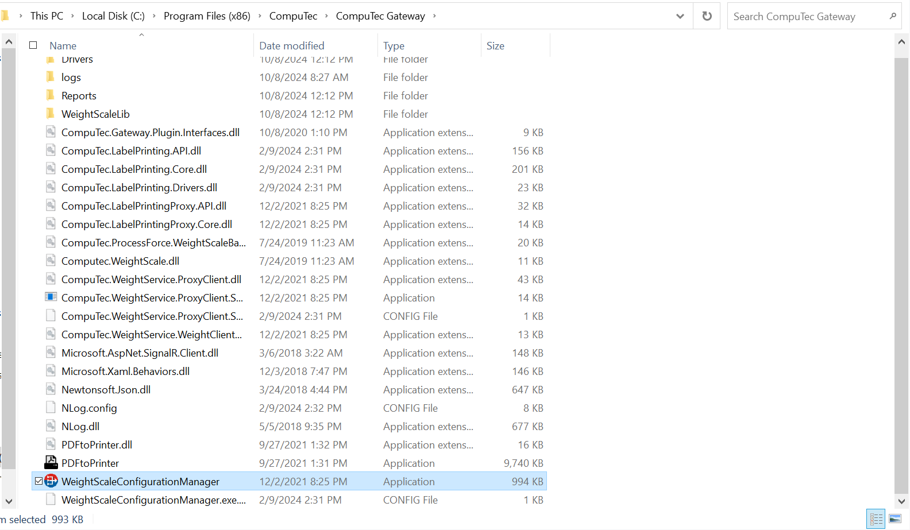
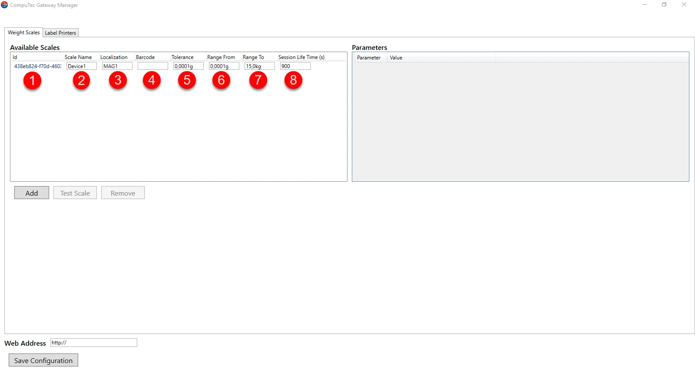
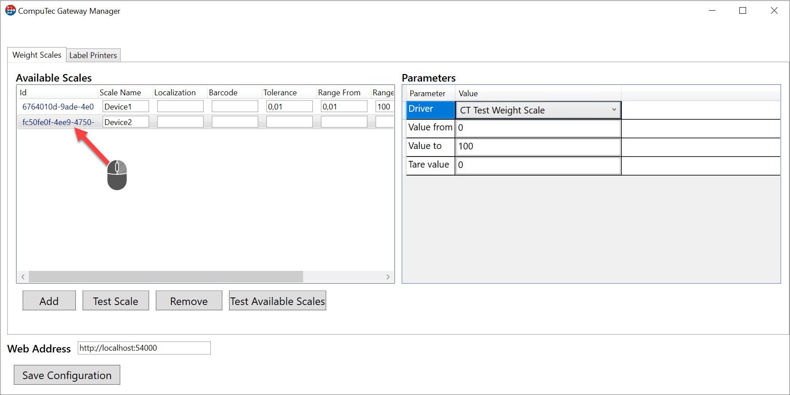
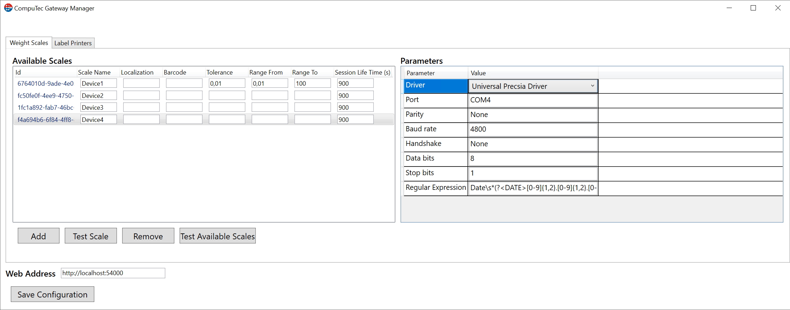
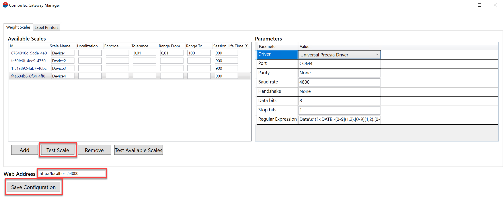
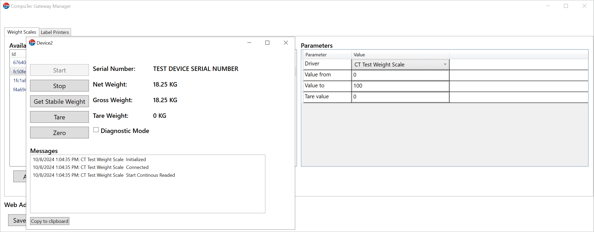

# Weight Scale Configuration

This document provides a step-by-step guide on how to configure CompuTec WeightScale manager.

:::warning
    For the program to work properly, configure your firewall to make the 8080 port available
:::

:::note
    .Net Framework 4.7 is required.
:::

1. The application is installed automatically during CompuTec Gateway Service installation.
2. Go to the WeightScale configuration manager installation folder and run the file "WeightScaleConfigurationManager".

    It is placed in an installation folder, which is by default in the following location: C:\Program Files (x86)\CompuTec\CompuTec Gateway

    
3. Click "Add" to add a new weight with a unique identifier.

    
4. Available Scales tab columns:

    - **Id** - Unique identifier of the scale (automatically generated)
    - **Scale name** - name of the weight (eg manufacturer)
    - **Localization** - location of our device
    - **Barcode** - bar code or serial number of weight
    - **Tolerance** - weight tolerance
    - **Range From** - weighing range (start)
    - **Range To** - weighing range (end)
    - **Session Life Time** - inactive session time (seconds).

    
5. Now click on the scales identifier. As you can see the setup window opened in the Parameters tab.

    
6. Expand the driver tab to select an available device. There are two possibilities to connect the scale weight:

    - TCP/IP - Enter the IP address and port of our weight scale (a default port number is 4305).

        
    - RS232 - We can change COM port, parity, baud rate, handshake, data bits, stop bits, regular expression.

        

7. Now we can save configuration and make a test of printer. Remember to put Web Address. (We must put IP adress or Machine name where Service Layer was installed).

    We can change/setup Port number in C:\Program Files\CompuTec\CompuTec Service Layer\CompuTec.ServiceLayer.Host.WindowsService.exe

    

    

---
