# Installation Overview

This guide explains the installation and configuration process for **CompuTec WMS**.

CompuTec WMS consists of several components that work together. Complete the installation in the order described below to make sure that all required components are available and configured correctly.

## Before you start

Before installing CompuTec WMS:

- Review the [CompuTec WMS requirements](./requirements).
- Make sure **CompuTec AppEngine** is installed and configured.
- Make sure you have access to the **CompuTec AppEngine Administration Panel**.
- Make sure at least one CompuTec AppEngine instance is configured and active.
- Make sure you have the required SAP Business One and system administrator permissions.

If you use **CompuTec ProcessForce**, additional components may be required. See the relevant installation instructions before continuing.

## Installation process

Install and configure CompuTec WMS in the following order.

### Step 1: Install the CompuTec WMS plugin

To install and activate a CompuTec AppEngine WMS 3.0 plugin, follow these steps:

1. Log in to **CompuTec AppEngine Administration Panel**.

    

2. Go to **Plugins**.

    

3. Navigate to **Store**.

    

4. Find the plugin you want to install:

    - Use the **Search** field

        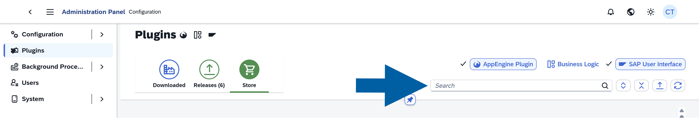

    - or filter by plugin type : **AppEngine Plugins**, **Business Logic**, or **SAP User Interface** plugins

        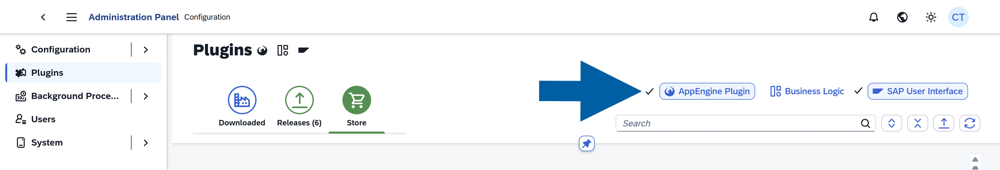

    :::info[note]
    **Business Logic** plugins are typically installed automatically as dependencies when required by another plugin. You do not need to select or install them manually.
    :::

5. Click **Get...** next to the plugin name on the list to install the latest plugin version.

    

6. (optional) To install a different version of the plugin:

    - Click the plugin name or the arrow next to the version number and click **Find different version**.

        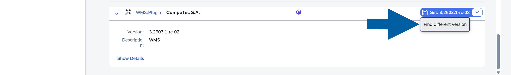

    - You will see the plugin details with all the available versions. [Read more](/docs/appengine/plugins-user-guide/overview#plugin-versions)

        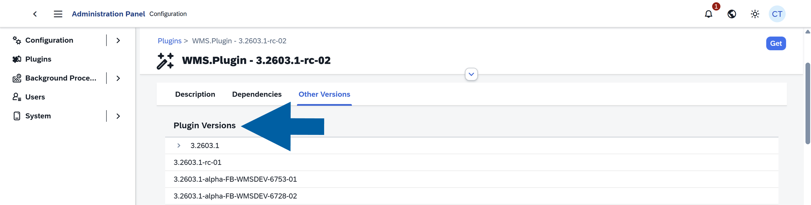

    - Find the version you want to install and click **Get**.

        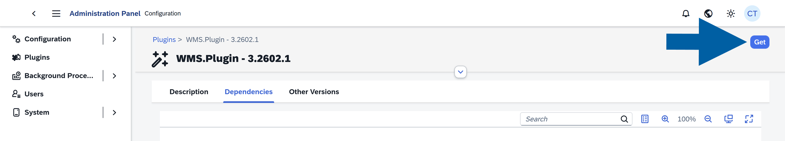

7. Click **Get & Install** next to the chosen plugin version.

    

8. Select **Company** for installation and click **Accept**.

    

9. Select **CompuTec AppEngine Instance** for installation and click **Accept**.

    

10. Review the installation details and click **Perform Installation**.

    

11. Click **OK** to confirm the plugin installation.

    

12. You can now track the installation progress. Once the installation is complete, click **Close**.

    

13. Click **Yes** to restart the **CompuTec AppEngine**.

    

14. Once the restart is complete, click **OK**.

    

15. Done! The CompuTec WMS 3.0 plugin is now installed and ready to use.

:::info[Note]

You don’t need to manage dependencies manually. During the installation, the system automatically:

- installs all required plugins
- ensures compatible versions are used
- includes any missing components

This allows you to continue with the setup without additional configuration steps.
:::

#### After installation

After successful installation:

- the plugin appears in the **Downloaded** tab
- it is assigned to the selected **Company**
- it is active on the selected **CompuTec AppEngine Instance**
- the plugin is available in the **CompuTec AppEngine Launchpad**

    

### Step 2: Download the CompuTec WMS Server installer

After the CompuTec WMS 3.0 plugin is installed:

1. Open the installed **CompuTec WMS plugin** in CompuTec AppEngine.

    

2. Locate the link to the **CompuTec WMS Server installer**.

    

3. Download the installer.

You will use this package to install CompuTec WMS Server in the next step.

### Step 3: Install and configure CompuTec WMS Server

Install **CompuTec WMS Server** using the installer downloaded from the CompuTec WMS plugin.

After installation, configure the server connection and the SAP Business One companies that will use CompuTec WMS.

:::note[info]
For detailed instructions, see [WMS Server Installation Guide](/docs/wms/administrator-guide/installation/wms-server/overview).
:::

### Step 4: Configure CompuTec WMS licensing

Configure the required CompuTec WMS licenses and assign them according to your environment.

For detailed instructions, see [WMS Licensing](/docs/wms/administrator-guide/installation/wms-licensing).

### Step 5: Install and configure CompuTec WMS Client

Install **CompuTec WMS Client** on the devices that will be used for warehouse operations.

Connect the client to the WMS Server and configure the required application settings.

For detailed instructions, see [WMS Client](/docs/wms/administrator-guide/installation/wms-client/computec-wms-client-download).

### Step 6: Configure additional components

Depending on your environment and warehouse processes, you may also need to configure additional components, including:

- **CompuTec Gateway Service** for weight scales and label printing
- **RDP scanner configuration**
- **SAP Business One settings**
- **CompuTec ProcessForce integration**

These components are not required in every environment. Configure only the components relevant to your implementation.

---

### Activate WMS.BusinessLogic and WMS.Plugin

    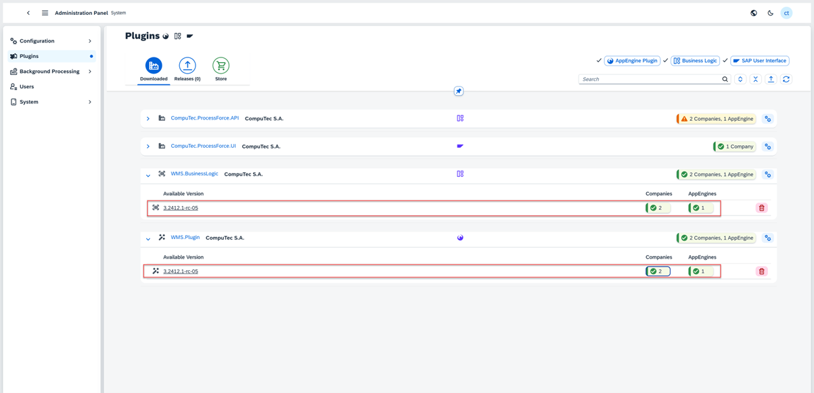

### Activate WMS.Plugin Job

    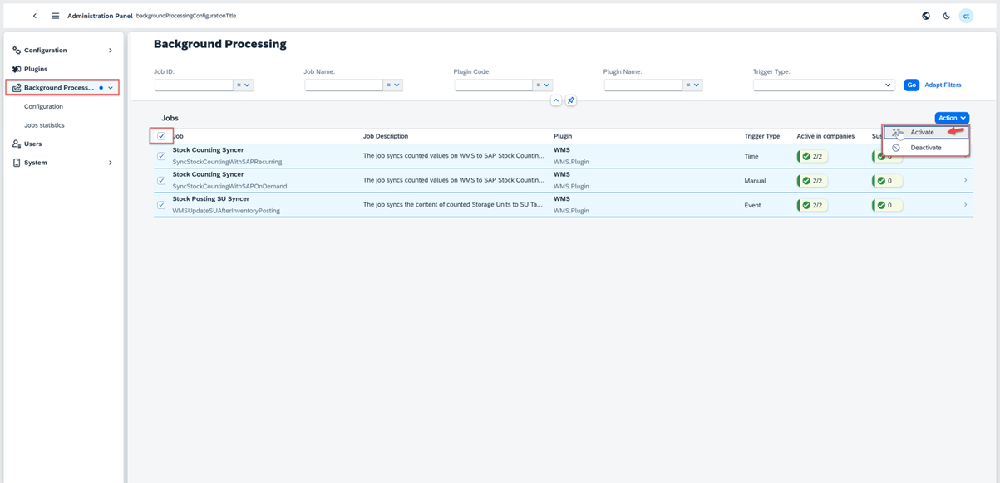

### Install CompuTec.ProcessForce.API *

Install CompuTec.ProcessForce.API for customers utilizing CompuTec ProcessForce. This step is essential for ensuring compatibility with the CompuTec ProcessForce solution.
:::info
    Please uninstall the previous version of the CompuTec ProcessForce API first.
:::
   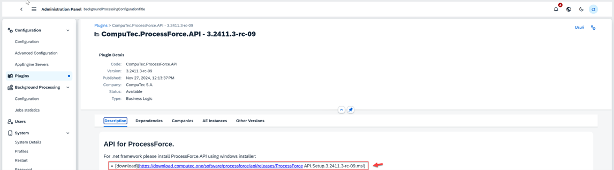

### Install WMS Server

Execute the installation process for the CompuTec WMS Server.
Learn how to install the CompuTec WMS Client [here](../../administrator-guide/installation/wms-client/computec-wms-client-download.md)

### Configuration

**a. CompuTec Service Manager**

    - Import the license file

        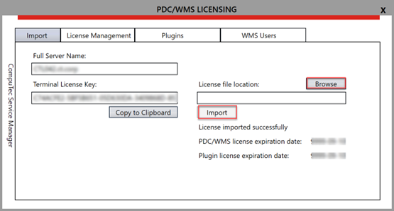
    
    -  Optionally, configure new users to automatically obtain licenses upon connection

        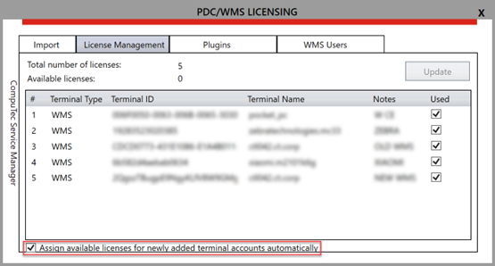
    
    - Set up CompuTec WMS users and provide credentials for access

**b. CompuTec WMS Server**

    - Enter the address of the CompuTec AppEngine server, and provide the username and password for the SAP Business One system.

        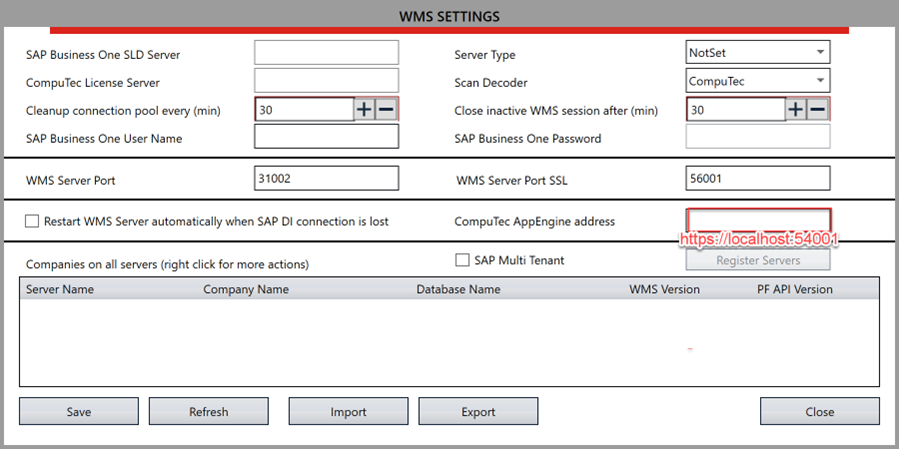
    
    - Refresh the settings

        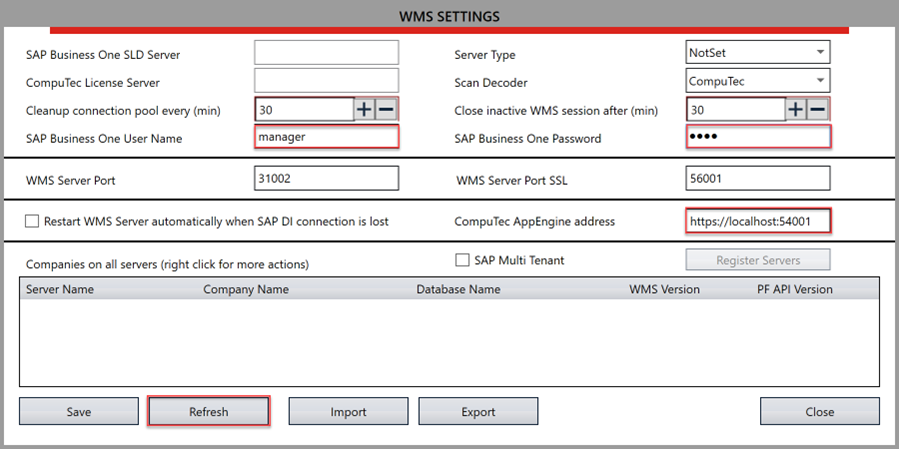

        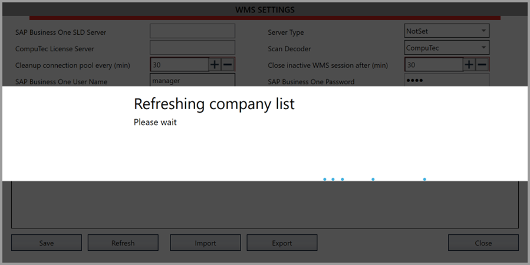
    
    - Save the configuration

        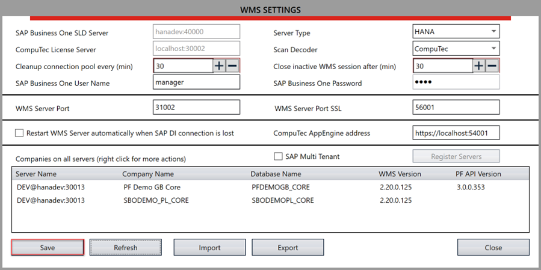
    
    - Assign users to the appropriate database and configure the language of the CompuTec WMS interface

        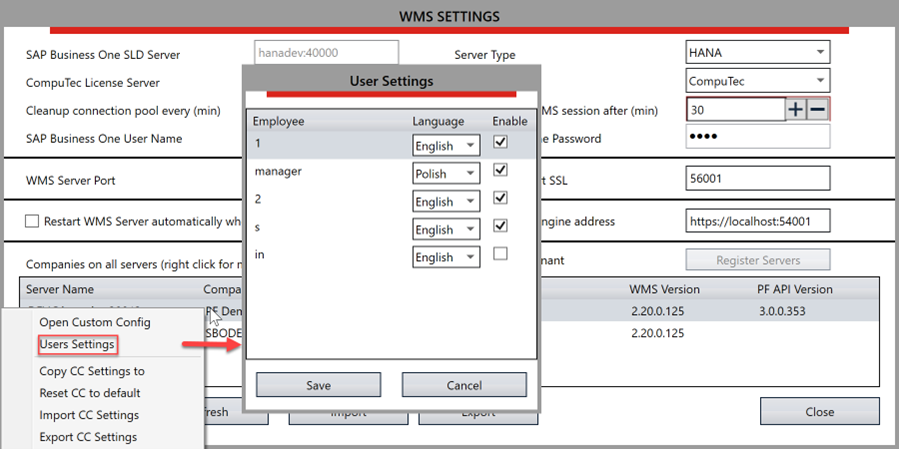
    
    - Enter custom configuration

        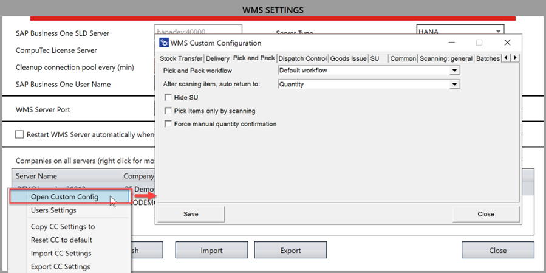

**c. Configuration Client WMS**

    - Enter the WMS Server address and save the configuration

        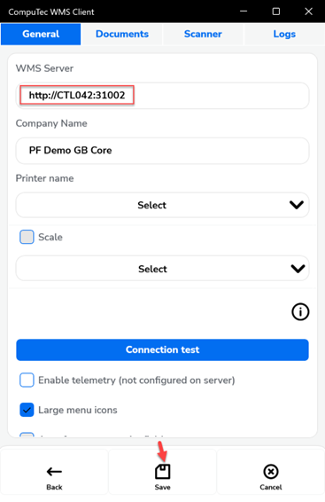
    
    - Select the database by first entering your username and password

        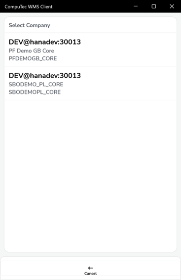
    
    - Login with your credentials
    
        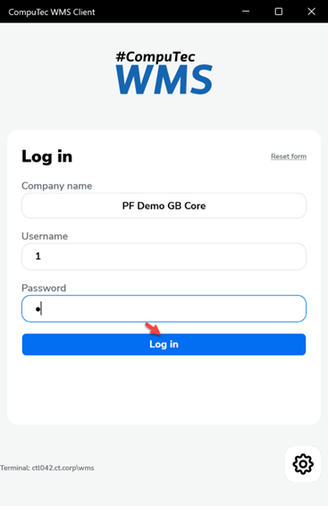 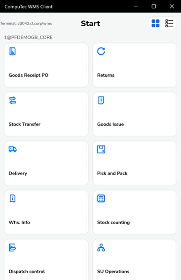

### Important Changes

**a. CompuTec WMS Client**

- Database selection requires entering a username and password first.

    

**b. CompuTec WMS Server**

- After selecting CompuTec WMS Server in the CompuTec Service Manager, provide a username and password.

    

- Only databases configured in CompuTec AppEngine will be visible.

    

    

- Installation of CompuTec WMS objects has now been moved to CompuTec AppEngine under CompuTec WMS.BusinessLogic.

    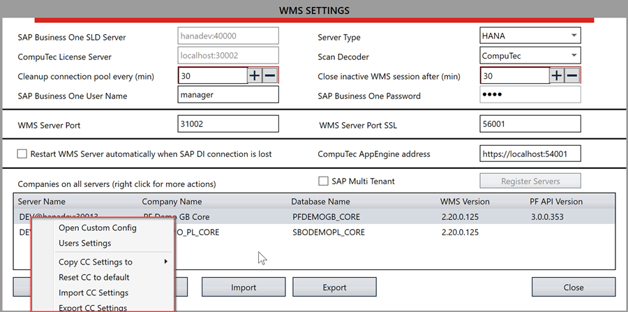

### Validations

    To ensure a seamless and error-free experience with CompuTec WMS, verify the following during installation and configuration:

- Log in with your username and password to authenticate credentials before selecting a database.

    

- Verify CompuTec AppEngine connection by checking the connectivity to the CompuTec AppEngine server and confirm the accuracy of the data entered in the CompuTec WMS Server configuration.

    

- Ensure that the CompuTec ProcessForce API is updated to the latest version for compatibility.

    

- Verify that the installed CompuTec WMS version is compatible or update it directly via CompuTec AppEngine.

    

- If WMS.BusinessLogic is not linked to the selected database, assign it and ensure the correct CompuTec AppEngine instance is chosen.

    

---
