# Install CompuTec WMS 3.0

This guide provides an overview of the installation process for **CompuTec WMS 2.0** and **CompuTec WMS 3.0**.

The installation process differs depending on the version you are using. Select your version below and complete the steps in the order shown.

:::info[note]
Please note that **CompuTec WMS 2.0** will be supported only **until the end of 2026**. After this time, WMS 2.0 will no longer receive regular support or maintenance updates.

We recommend planning your upgrade to **CompuTec WMS 3.0**.
:::

CompuTec WMS 3.0 uses **CompuTec AppEngine** for its plugin-based components.

## Before you start

Before you start, make sure:

- You have reviewed the [CompuTec WMS requirements](/docs/wms/administrator-guide/installation/requirements)
- **CompuTec AppEngine** is installed and configured. [Read more](/docs/appengine/administrators-guide/configuration-and-administration/installation)
- You have access to the **CompuTec AppEngine Administration Panel**.
- At least one **CompuTec AppEngine instance** is configured and active.
- You have the required **SAP Business One and system administrator permissions**.

If you use **CompuTec ProcessForce**, additional components may be required. See the relevant installation instructions before continuing.

## Step 1: Install the CompuTec WMS 3.0 Plugin

To install and activate a CompuTec AppEngine WMS 3.0 plugin, follow these steps:

1. Log in to **CompuTec AppEngine Administration Panel**.

    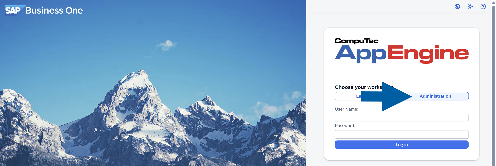

2. Go to **Plugins**.

    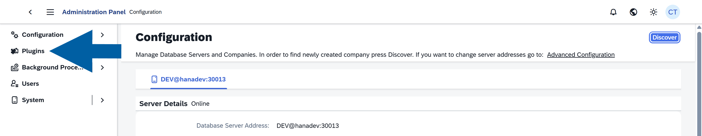

3. Navigate to **Store**.

    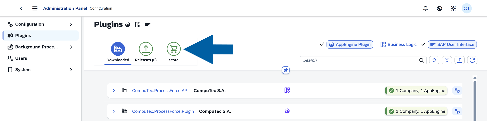

4. Find the **WMS.Plugin** in the Plugin Store.

   The required **Business Logic** plugin is installed automatically as a dependency of **WMS.Plugin**. You do not need to install it separately.

    :::info[note]
    **Business Logic** plugins are typically installed automatically as dependencies when required by another plugin. You do not need to select or install them manually.
    :::

5. Click **Get...** next to the plugin name on the list to install the latest plugin version.

    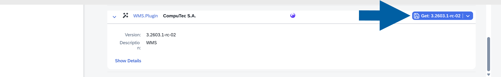

6. Click **Get & Install**.

    

7. Select **Company** for installation and click **Accept**.

    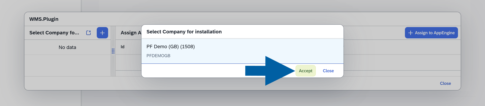

8. Select **CompuTec AppEngine Instance** for installation and click **Accept**.

    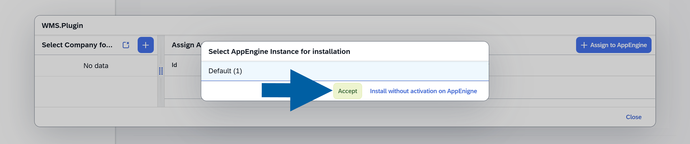

9. Review the installation details and click **Perform Installation**.

    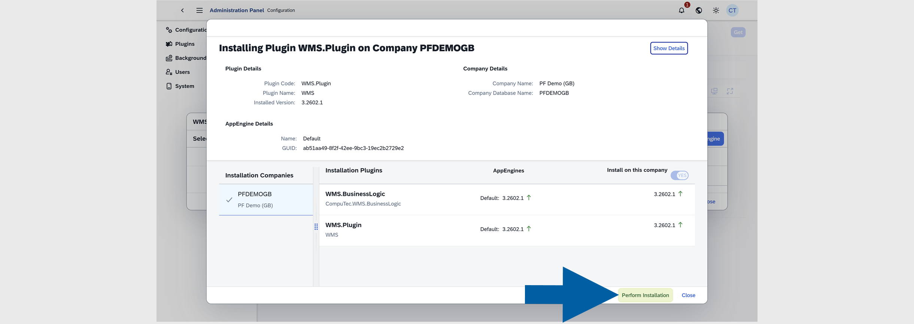

10. Click **OK** to confirm the plugin installation.

    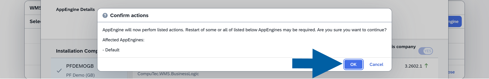

11. You can now track the installation progress. Once the installation is complete, click **Close**.

    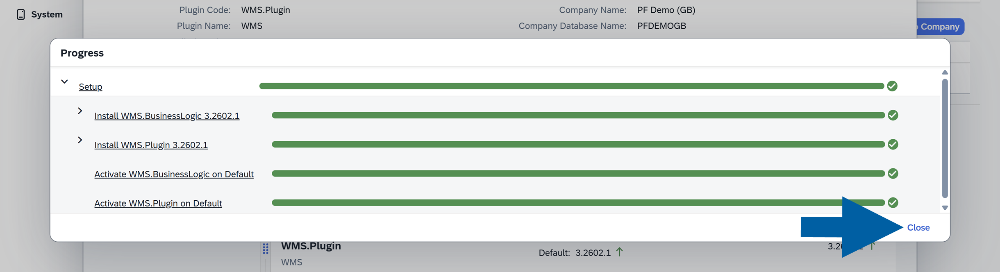

12. Click **Yes** to restart the **CompuTec AppEngine**.

    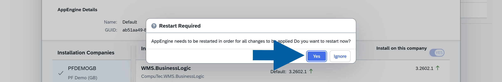

13. Once the restart is complete, click **OK**.

    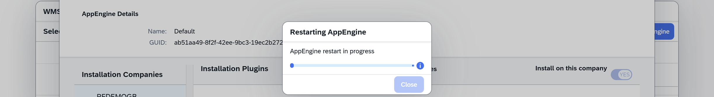

14. The CompuTec WMS 3.0 plugin is now installed and ready to use.

    After successful installation:

    - the plugin appears in the **Downloaded** tab
    - it is assigned to the selected **Company**
    - it is active on the selected **CompuTec AppEngine Instance**
    - the plugin is available in the **CompuTec AppEngine Launchpad**

    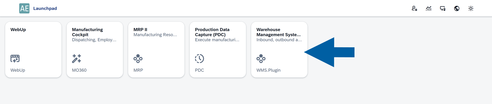

:::info[Note]

You don’t need to manage dependencies manually. During the installation, the system automatically:

- installs all required plugins
- ensures compatible versions are used
- includes any missing components

This allows you to continue with the setup without additional configuration steps.
:::

## Step 2: Activate the WMS background processing job

After installing and activating the CompuTec WMS 3.0 Plugin, activate the required **WMS background processing job** in CompuTec AppEngine.

1. Go to **CompuTec AppEngine Administration Panel** > **Background Processing**.

    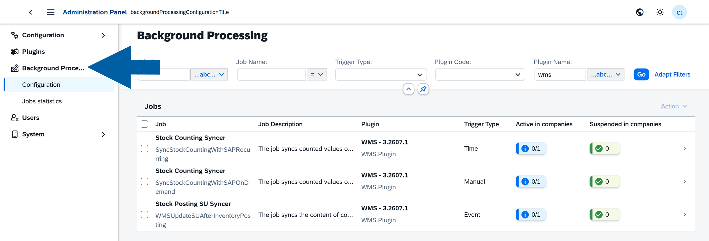

2. Filter Jobs by **Plugin Name** containing `wms`, and click **Go** to apply filters.

    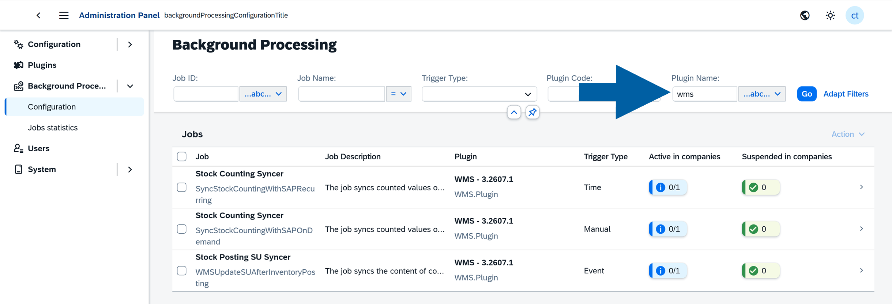

3. Mark all the WMS plugins in the list and click **Action** > **Activate**.

    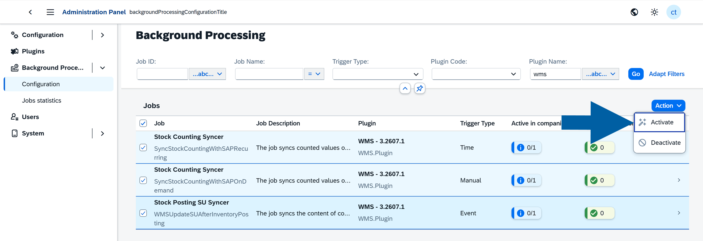

4. Select a company and click **Accept**.

    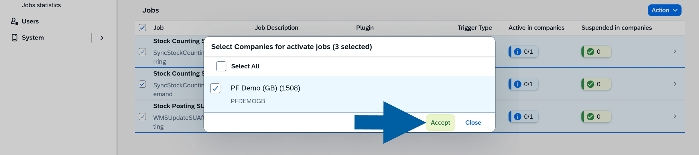

5. Now all WMS Background Processing jobs are active.

    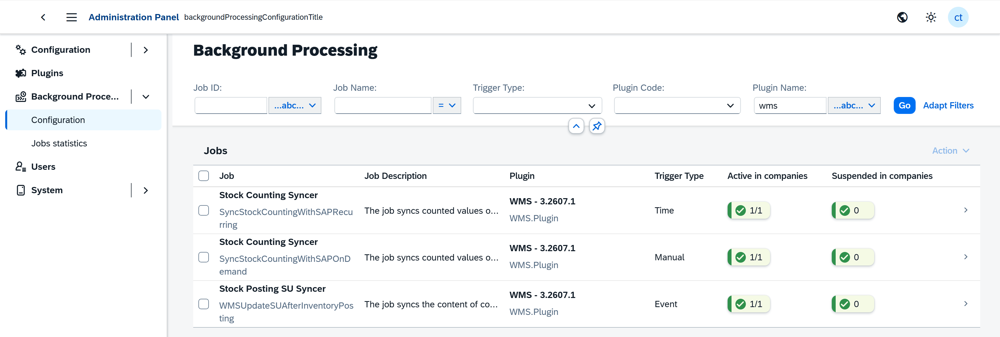

:::info[Note]
This step applies to **CompuTec WMS 3.0** only.
:::

## Step 3: Download and install CompuTec WMS Server

To download and install **CompuTec WMS Server**, follow these steps:

1. Open the installed **CompuTec WMS plugin** in CompuTec AppEngine.

    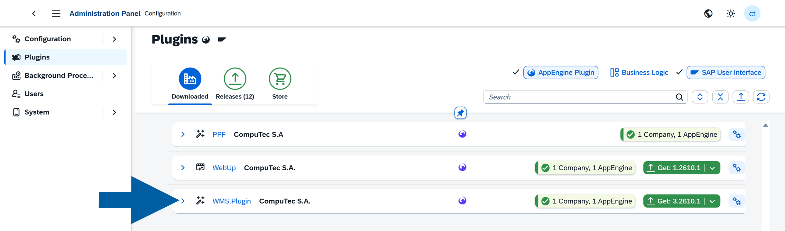

2. Locate the link to the **CompuTec WMS Server installer**.

    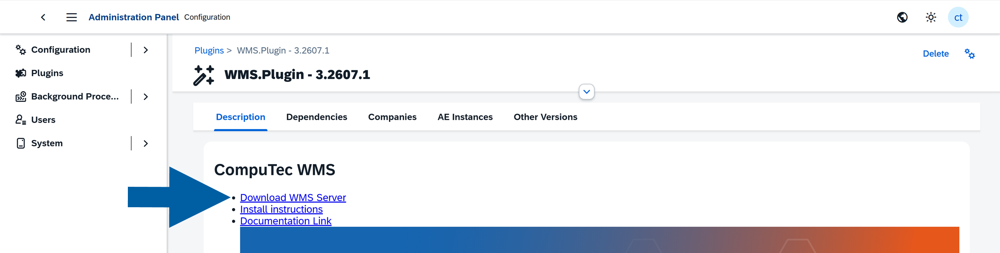

3. Download the installer.

4. Install **CompuTec WMS Server** using the installer downloaded from the CompuTec WMS plugin.

    After installation, configure the server connection and the SAP Business One companies that will use CompuTec WMS.

    :::note[info]
    For detailed instructions, see [WMS Server Installation and Configuration Guide](/docs/wms/administrator-guide/installation/wms-server/overview).
    :::

## Step 4: Install CompuTec ProcessForce API, if ProcessForce is installed

If **CompuTec ProcessForce** is installed in the SAP Business One environment, you must also install the **CompuTec ProcessForce API Plugin**.

CompuTec WMS detects that ProcessForce is installed and requires the **ProcessForce API** to communicate with it correctly.

1. Go to **CompuTec Administration Panel** > **Plugins** > **Store**.

2. Install the **CompuTec ProcessForce API** following the same plugin installation process used for the CompuTec WMS 3.0 Plugin.

    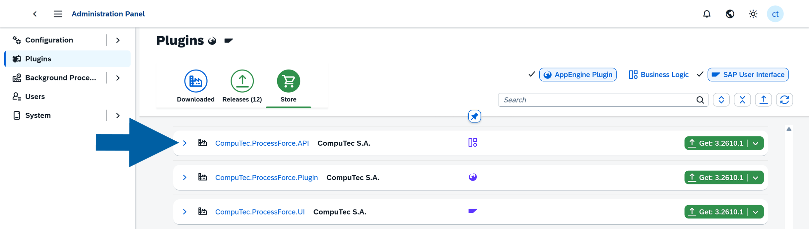

3. Go to CompuTec.API Plugin **Description**, and click the link to download CompuTec ProcessForce API for WMS.

    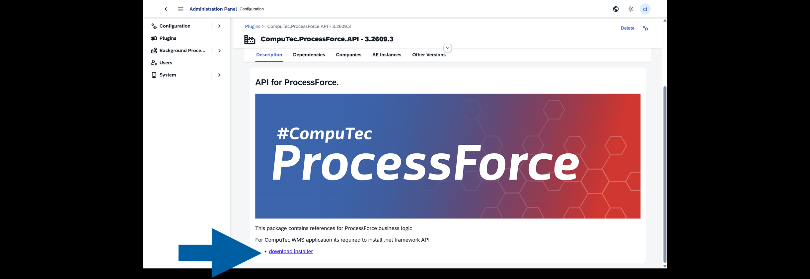

4. Follow the installation steps.

    

:::info[Note]
If CompuTec ProcessForce is not installed in your environment, you can skip this step.
:::

## Step 5: Configure CompuTec WMS licensing

Configure the required **CompuTec WMS licenses** and assign them according to your environment.

:::note[info]
For detailed instructions, see [WMS Licensing](/docs/wms/administrator-guide/installation/wms-licensing).
:::

## Step 6: Install CompuTec WMS Client

Download and install **CompuTec WMS Client** on the devices that will be used for warehouse operations.

:::note[info]
For detailed instructions, see [Download CompuTec WMS Client](/docs/wms/administrator-guide/installation/wms-client/computec-wms-client-download).
:::

## Step 7: Configure CompuTec WMS Client

Connect the **WMS Client** to the **WMS Server** and configure the required client settings.

:::note[info]
For detailed instructions, see [Configure CompuTec WMS Client](/docs/wms/administrator-guide/installation/wms-client/configuration).
:::

## Validations

    To ensure a seamless and error-free experience with CompuTec WMS, verify the following during installation and configuration:

1. Log in with your username and password to authenticate credentials before selecting a database.

    

2. Verify CompuTec AppEngine connection by checking the connectivity to the CompuTec AppEngine server and confirm the accuracy of the data entered in the CompuTec WMS Server configuration.

    

3. Ensure that the CompuTec ProcessForce API is updated to the latest version for compatibility.

    

4. Verify that the installed CompuTec WMS version is compatible or update it directly via CompuTec AppEngine.

    

5. If WMS.BusinessLogic is not linked to the selected database, assign it and ensure the correct CompuTec AppEngine instance is chosen.

    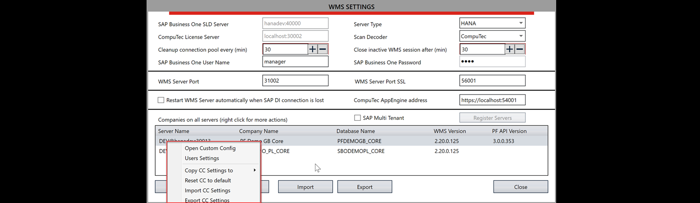

## Additional Configuration

Depending on your environment and warehouse processes, additional configuration may be required, such as:

- CompuTec Gateway Service for weight scales and label printing
- RDP scanner configuration
- SAP Business One settings
- Barcode configuration
- Company-specific WMS settings

For company-specific application settings, see [Custom Configuration](/docs/wms/administrator-guide/custom-configuration/overview).

## Important Changes in CompuTec WMS 3.0

:::info[Upgrading from WMS 2.0?]
If you have previously installed or administered **CompuTec WMS 2.0**, review these changes before configuring WMS 3.0. They describe differences in the installation and configuration process that may affect an existing WMS environment.
:::

If you are **upgrading from CompuTec WMS 2.0 to 3.0**, be aware of several changes to the installation and configuration process:

- **CompuTec WMS 3.0** uses **CompuTec AppEngine** for plugin installation and management.
- Only databases configured in **CompuTec AppEngine** are available to **CompuTec WMS Server**.

    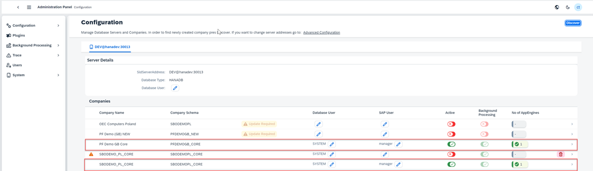

    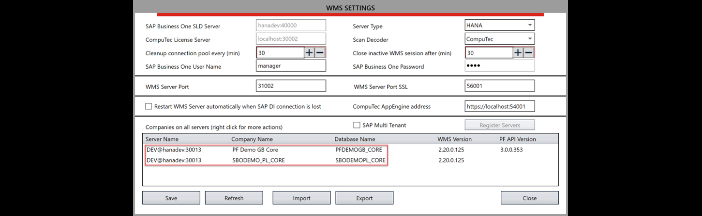

- WMS plugin components and their dependencies are managed through **CompuTec AppEngine**.
- WMS background processing jobs must be activated in **CompuTec AppEngine**.
- The WMS Server installer is available from the installed WMS Plugin in the **CompuTec AppEngine Administration Panel**.
- In **CompuTec WMS Client**, database selection requires entering a username and password first.

    

- In **CompuTec WMS Server**, after selecting **CompuTec WMS Server** in the **CompuTec Service Manager**, provide a username and password.

    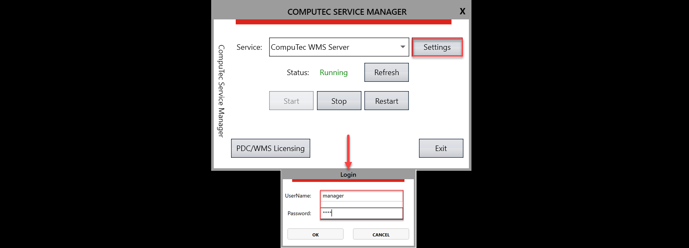

- Installation of **CompuTec WMS** objects has now been moved to **CompuTec AppEngine** under **CompuTec WMS.BusinessLogic**.
