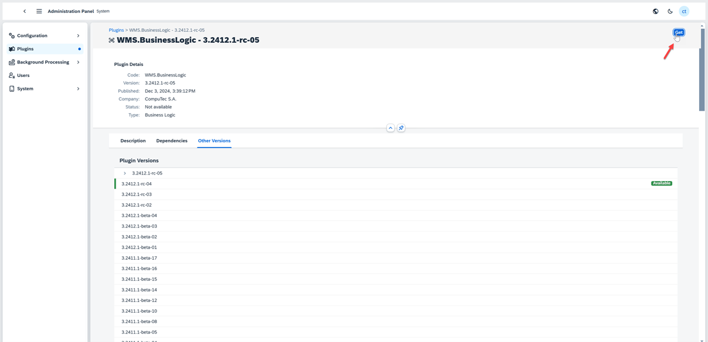
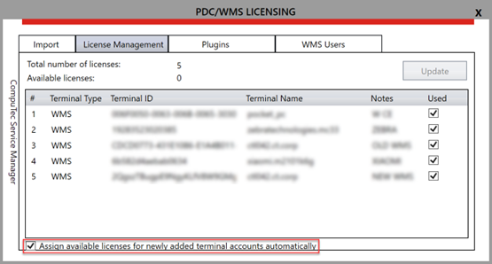
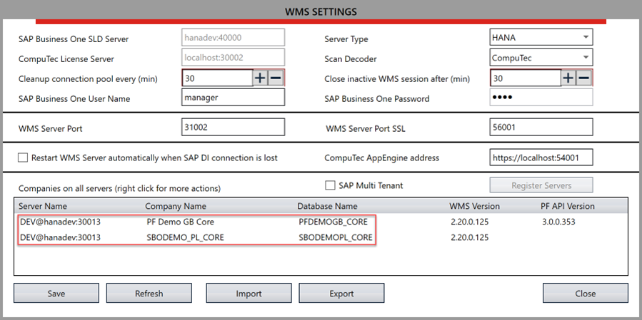

# Overview

CompuTec WMS is a robust Warehouse Management System designed to streamline warehouse operations and ensure seamless integration with SAP Business One. This guide outlines the step-by-step process for installing, configuring and validating the core components of the WMS solution. The instructions provided here are crucial for ensuring optimal performance and compatibility of WMS with your business processes.

---

## Step-by-Step Installation and Configuration

### Download WMS.BusinessLogic and WMS.Plugin

Obtain the latest versions of WMS.BusinessLogic and WMS.Plugin.

    

    

    

    

### Activate WMS.BusinessLogic and WMS.Plugin

    

### Activate WMS.Plugin Job

    

### Download the WMS Server Installer

Download the installer for the WMS Server application

    

    

### Install CompuTec.ProcessForce.API *

Install CompuTec.ProcessForce.API for customers utilizing ProcessForce. This step is essential for ensuring compatibility with the ProcessForce solution.
:::info
    Please uninstall the previous version of the ProcessForce API first.
:::
   

### Install WMS Server

Execute the installation process for the WMS Server.
Learn how to install the WMS Client [here](../../administrator-guide/installation/wms-client/computec-wms-client-download.md)

### Configuration

**a. CompuTec Service Manager**

    - Import the license file

        
    
    -  Optionally, configure new users to automatically obtain licenses upon connection

        
    
    - Set up WMS users and provide credentials for access

**b. WMS Server**

    - Enter the address of the CompuTec AppEngine server, and provide the username and password for the SAP Business One system.

        
    
    - Refresh the settings

        

        
    
    - Save the configuration

        
    
    - Assign users to the appropriate database and configure the language of the WMS interface

        
    
    - Enter custom configuration

        

**c. Configuration Client WMS**

    - Enter the WMS Server address and save the configuration

        
    
    - Select the database by first entering your username and password

        
    
    - Login with your credentials
    
         

### Important Changes

**a. WMS Client**

- Database selection requires entering a username and password first.

    

**b. WMS Server**

- After selecting WMS Server in the CompuTec Service Manager, provide a username and password.

    

- Only databases configured in CompuTec AppEngine will be visible.

    

    

- Installation of WMS objects has now been moved to CompuTec AppEngine under WMS.BusinessLogic.

    

### Validations

    To ensure a seamless and error-free experience with CompuTec WMS, verify the following during installation and configuration:

- Log in with your username and password to authenticate credentials before selecting a database.

    

- Verify CompuTec AppEngine connection by checking the connectivity to the CompuTec AppEngine server and confirm the accuracy of the data entered in the WMS Server configuration.

    

- Ensure that the ProcessForce API is updated to the latest version for compatibility.

    

- Verify that the installed WMS version is compatible or update it directly via CompuTec AppEngine.

    

- If WMS.BusinessLogic is not linked to the selected database, assign it and ensure the correct CompuTec AppEngine instance is chosen.

    

---
