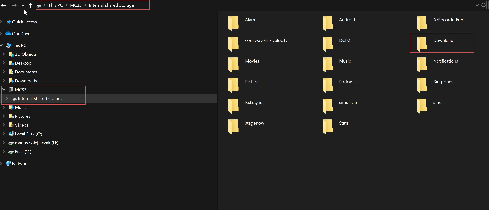

# RDP Connection between Android System and WMS Client for ZEBRA MC330K

In this guide, we'll walk you through the process of setting up a Remote Desktop Protocol (RDP) connection between an Android device and a Zebra MC330K device running the CompuTec WMS Client. By following these steps, you will be able to access your CompuTec WMS Client from your Zebra device remotely, providing you with seamless control and monitoring capabilities.

---

## Step-by-Step Instructions

1. **Download Bluestacks Application** - To begin, download the [Bluestacks application](https://www.wikihow.com/Download-Application-from-Google-Play-to-PC), which will help you run Android apps on your PC.

    
2. **Access Google Play Store** - Open the [Google Play Store](https://play.google.com/store) on your PC to search for the necessary apps.
3. **Search for Microsoft Remote Desktop** - Find the [Microsoft Remote Desktop](https://play.google.com/store/apps/details?id=com.microsoft.rdc.android) in the store.

    
4. **Download the APK File** - Open the link to download the APK file(Android Instalator Package) [https://apps.evozi.com/apk-downloader/](https://apps.evozi.com/apk-downloader/).
5. Copy the link [https://play.google.com/store/apps/details?id=com.microsoft.rdc.android](https://play.google.com/store/apps/details?id=com.microsoft.rdc.android) and paste it to APK Downloader to generate the download link.
6. **Download Microsoft Remote Desktop APK** - After generating the link, download the Microsoft Remote Desktop APK file to your PC.

    
7. **Transfer APK File to Your Device** - Copy downloaded APK File(Microsoft Remote Desktop) to your Device.
8. **Enable USB File Transfer** - On the Zebra device, go to MENU > Settings > Connected Devices > USB, and select "Use USB to Transfer Files" to enable file transfer mode.
9. **Acess device** - Your Zebra device will now be available on your PC.

    
10. **Copy the APK to Download Folder** - Copy the APK file to the Download folder on your Zebra device.
11. **Install APK** - On your Zebra device, go to MENU > Files > Download, Select APK File (Microsoft Remote Desktop) and Select Continue/Select Install/OK.
12. **Add a New RDP Connection** - Go to Device/Menu/RD Client/Select Button "+" to add New Connection and Select Desktop Connection/Add Manually.
13. **Enter PC Hostname or IP Address** - Enter the Hostname or IP address of your PC running the CompuTec WMS Client.
14. **Set up Credentials** - Enter the username and password to log in automatically each time.
15. **Save** - Save the configuration.
16. **Connect** - Select the "Connection" to begin using the CompuTec WMS Client from your Zebra MC330K device.

---
