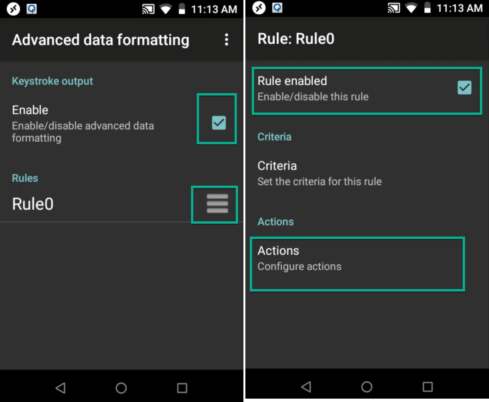

# Running CompuTec WMS through Remote Desktop Application for Android

Efficient warehouse management often requires seamless integration between software and hardware tools. This guide demonstrates how to run CompuTec WMS on an Android device using a remote desktop application, with additional configuration steps to ensure smooth barcode scanning via DataWedge for Zebra devices. By following this tutorial, you can streamline your warehouse operations, ensuring accurate and real-time data transfer.

## Remote Desktop App installation

To access CompuTec WMS remotely, a reliable remote desktop application is essential. This guide uses Microsoft Remote Desktop as an example.

**Installing via Google Play Store**

1. Open the Google Play Store on your device.
2. Download and install the Microsoft Remote Desktop app: [download](https://play.google.com/store/apps/details?id=com.microsoft.rdc.android).

**Manual Installation via APK File**

If your device does not support the Google Play Store, follow these steps to install the app manually:

1. Open this link: [https://play.google.com/store/apps/details?id=com.microsoft.rdc.android](https://play.google.com/store/apps/details?id=com.microsoft.rdc.android).
2. Use the website to generate and download the APK file.

    

    

3. Connect your device to a computer via USB. Ensure the USB connection is set to "File Transfer" by navigating to Settings → Connected Device → USB → Transfer File.

    

4. Install the app. Navigate to Menu → Files and locate the folder with the APK file.

5. Run the application:

    

## Remote Desktop App Configuration

To establish a connection to the remote desktop, click the "+" icon to create a new link. Once configured, select the added desktop and log in to the remote server.

## DataWedge Configuration

This section lets you check how to configure DataWedge for Zebra devices. It is required to pass scanned values to the CompuTec WMS Client.

:::note
    If you have a device from a different producer, please contact them to learn how to set up prefixes and suffixes for a scanner.
:::

In the default configuration, CompuTec supports prefixes as CTRL + B and suffixes as CTRL + C.

However, Zebra devices may not process CTRL + B correctly. To resolve this, CompuTec WMS versions 2.9.7_R1 and 2.10.7_R1 introduced the ability to customize prefixes and suffixes for individual clients.
[http://www.asciitable.com/](http://www.asciitable.com/) We use the DEC column.

**Steps to Configure DataWedge**

1. **Access DataWedge** - Open the DataWedge application from the device's main menu, and set it up in accordance with the screenshots below,

    

2. **Enable Keystroke Output** - Go to the Keystroke output and click Advanced data formatting.

    

3. **Enable and Customize Settings** - Ensure the Advanced Data Formatting option is turned on. Then, proceed to customize further settings.

    

4. **Add Actions for Prefixes and Suffixes**
    - Click the "+" icon and add a new action.
    - Choose "Char" from the list.
    - Repeat the process to add both the prefix and suffix actions.
    Use drag-and-drop to arrange the actions in the correct order, as shown:

        

5. Click each row to set it up. It is recommended to set up 05 for prefixes and 03 for suffixes.

     

6. **Save** - Once all settings are configured, save the changes and close the DataWedge application.

## CompuTec WMS Client Configuration

1. Run the remote desktop application, to log in to the server and launch CompuTec WMS.

    

2. Access the Settings menu and go to the Scanner tab. Configure the prefixes and suffixes as set up in DataWedge.

     

3. Save the changes and log in to CompuTec WMS.

    

## Testing Barcode Scanning

1. Navigate to Goods Receipt PO → New Goods Receipt PO in CompuTec WMS.
2. Scan any barcode (e.g., from everyday products) in the Warehouse window.
3. the application provides a system message for an unrecognized code, confirming the scanner's functionality.

     

4. Next, test it on barcodes used in your company.

---
