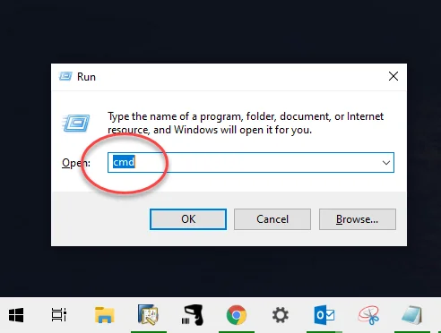
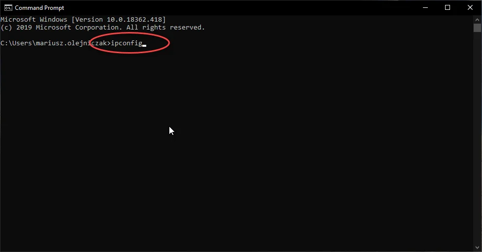
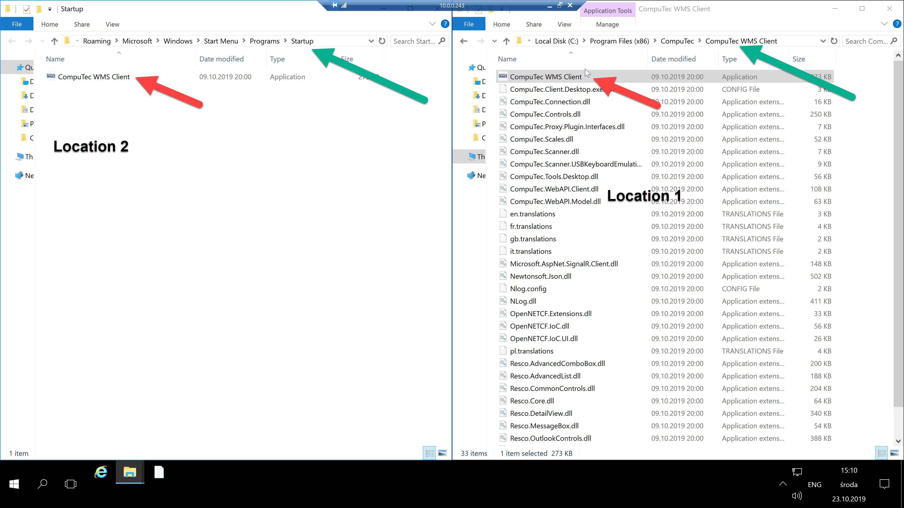

# RDP Scanner PC Configuration

This guide explains how to configure a manual scanner and a PC for use with the CompuTec WMS Client without requiring installation of the client on the scanner. The setup employs a remote desktop (RDP) connection, ensuring seamless operation between the scanner and PC. By following this step-by-step guide, you will successfully connect a SYMBOL MC32N0 scanner running Windows CE 7.0 with a PC.

---

## Requirements

In this manual, the following environment is used:

- System Windows CE 7.0
- Scanner SYMBOL MC32N0

## PC Setup

### Check your IP address

Press `Win + R`, type `cmd`, and click Enter:

Type `ipconfig` and click Enter:

Write down your IPv4 Address in the format presented on the screenshot, e.g., 192.168.0.143:

### Add CompuTec WMS Client to Startup

1. Press the Win key.
2. Search for CompuTec WMS Client.
3. Right-click on the CompuTec WMS Client icon and select Open file location (Location 1).
4. Do not close the window
5. Press Win+R
6. Type shell::startup and Enter (Location 2)
7. This is location 2
8. Copy the CompuTec WMS Client icon from Location 1 (client) to Location 2 (start up).
9. This ensures the CompuTec WMS Client will start automatically when Windows boots.

    

## DataWedge Setup on Scanner

You need to set up DataWedge to enable the CompuTec WMS Client on the PC through an RDP connection.

On your SYMBOL scanner, navigate to: Start → Settings → Control Panel → DataWedge.

Click the Running Button on YES → STATUS:Ready.

Click Basic Configuration, then Basic Format:

Prefix to data → Set \u0002 → Save

Suffix to data → Set \u0003 → Save

Save and Close.

## RDP Setup on Scanner

### Configuration

Open RDP on Scanner, then go to Configuration, General tab, and type in your IPv4 Address on Logon settings.

Now go to the Display tab, Display Configuration → Set Small.

Save and Close.

Next, go to the Local Resources tab, Local Resources - Keyboard - Apply Windows key combination On this computer.

### RDP Connect

Set IPv4 Address (it should be filled in automatically).

Set the User and Password of the PC.

## DataWedge Scanning Configuration(PickList Mode)

[Enable Picklist Mode](https://supportcommunity.zebra.com/s/article/Enable-Picklist-mode?language=en_US)

**DataWedge for Windows**:

    - Open the DataWedge setting.
    - Tap Basic configuration.
    - Scanner input.
    - Tap on the displayed internal scanner (for example, Long, range Imager, or Kepler Imager).
    - Reader Params.
    - More.
    - Picklist mode.
    - Select a Hardware or Software reticle to enable it.
    - Tap Back until you see the message 'saving changes, please wait...'.
    - Tap Home then Exit.
    - Hit OK to close DataWedge settings.

## Finish

After completing the above configurations, use the scanner to establish an RDP connection with your PC. The CompuTec WMS Client should now work seamlessly, enabling efficient scanning operations.

---

If you encounter issues connecting to Windows Mobile 6.x systems or require additional troubleshooting, please use the following instructions:

[https://www.zebra.com/us/en/support-downloads/knowledge-articles/evm/remote-desktop-connection-troubleshooting-and-terminal-services-server-common-issues-and-fixes.html](https://www.zebra.com/us/en/support-downloads/knowledge-articles/evm/remote-desktop-connection-troubleshooting-and-terminal-services-server-common-issues-and-fixes.html)

[https://social.technet.microsoft.com/Forums/windowsserver/en-US/e172f4c6-dbd1-4aa1-b6d7-ffff06b40a17/wyse-thin-client-not-connecting-to-windows-2008-r2-server?forum=winserverTS](https://social.technet.microsoft.com/Forums/windowsserver/en-US/e172f4c6-dbd1-4aa1-b6d7-ffff06b40a17/wyse-thin-client-not-connecting-to-windows-2008-r2-server?forum=winserverTS)

[https://www.zebra.com/us/en/support-downloads/software/operating-system/mc65-operating-system.html](https://www.zebra.com/us/en/support-downloads/software/operating-system/mc65-operating-system.html)

[https://www.zebra.com/us/en/support-downloads/mobile-computers/handheld/mc65.html#pageandfilelist_7308](https://www.zebra.com/us/en/support-downloads/mobile-computers/handheld/mc65.html#pageandfilelist_7308)

By following this guide, you are now ready to utilize your scanner with the CompuTec WMS Client efficiently.
