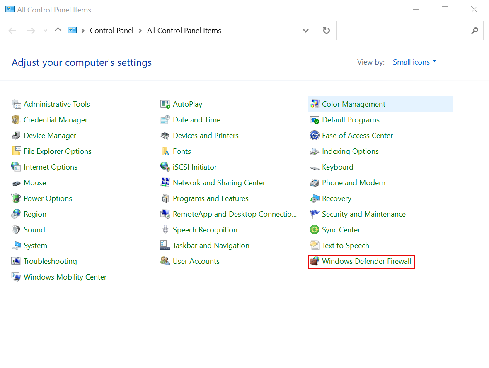
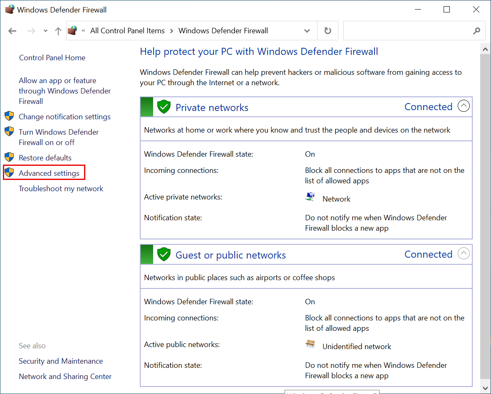
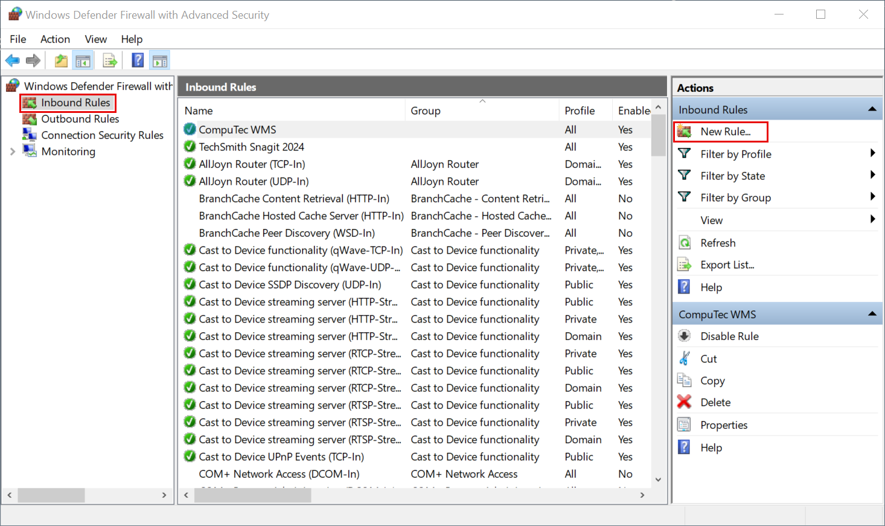
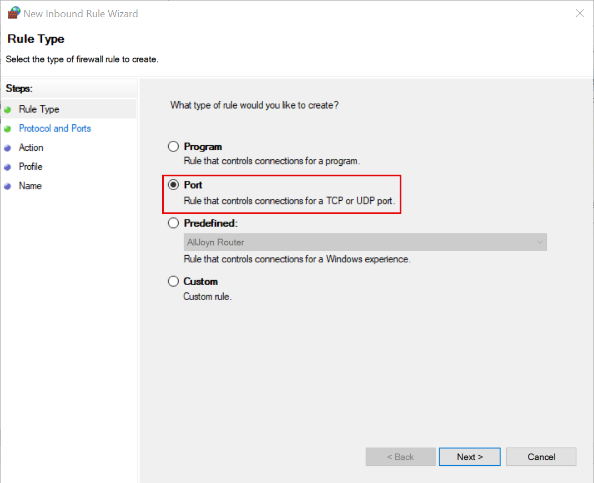
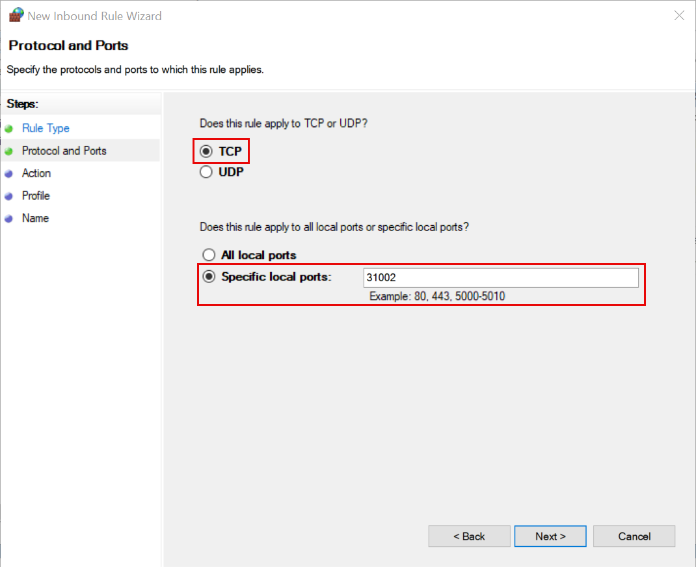
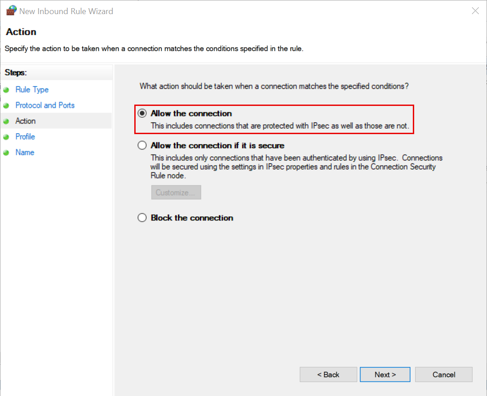
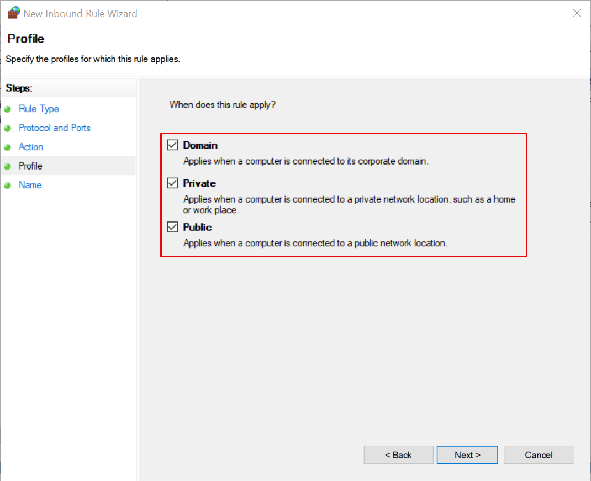
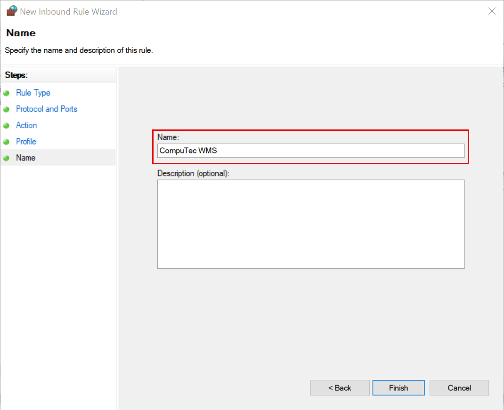

# System Requirements

Before installing **CompuTec WMS 3.0 Plugin**, check the software, hardware, and network requirements below.

**CompuTec WMS 3.0 Plugin** runs on **CompuTec AppEngine** and follows its configuration requirements.

:::warning[Upgrading from an earlier version]
**Before installing CompuTec WMS 3.0 Plugin**, manually uninstall the previous **CompuTec WMS Server** through **Windows Start** > **Apps** > **Installed Apps**.
:::

## Software requirements

### SAP Business One

    - **Minimum supported version:** 10.0 FP 2502 (or higher)
    - **SAP Business One Web Client**: Must be installed and properly configured.

### CompuTec AppEngine

Download the official release package from the [CompuTec AppEngine download page](/docs/appengine/releases/appengine/download).

For installation and configuration instructions, see the [CompuTec AppEngine Installation Guide](/docs/appengine/administrators-guide/configuration-and-administration/installation).

### CompuTec ProcessForce

The following requirements apply only if CompuTec ProcessForce is installed in the company database:

- **License:** The SAP Business One user must have a CompuTec ProcessForce license that matches their SAP Business One license type. For example, a user with a SAP Business One Limited Logistics license must also have a CompuTec ProcessForce Limited Logistics license.
- **API:** Install CompuTec ProcessForce API. Its version must exactly match the version of CompuTec ProcessForce installed in the company database.

For instructions, see [Install CompuTec ProcessForce API](/docs/wms/administrator-guide/installation/overview#step-4-install-computec-processforce-api-if-processforce-is-installed).

### Database servers

CompuTec WMS supports the following database platforms, provided that the database version is supported by SAP for the SAP Business One version you use:

- SAP HANA 2.0
- Microsoft SQL Server 2022
- Microsoft SQL Server 2019
- Microsoft SQL Server 2017
- Microsoft SQL Server 2016

## Hardware requirements

For server and client hardware requirements, see [CompuTec AppEngine System Requirements](/docs/appengine/administrators-guide/requirements).

## Network and authentication requirements

The devices used to access CompuTec WMS 3.0 Plugin must be able to reach both:

- The SAP Business One Web Client endpoint.
- The CompuTec AppEngine service over HTTPS.

After the user signs in to SAP Business One Web Client, CompuTec WMS 3.0 Plugin uses the same active session for authentication and authorization.

## CompuTec WMS Server requirements

### Server placement

:::warning[important]
Avoid installing CompuTec WMS Server on a Remote Desktop (RDP) server or a server that hosts other applications using the SAP Business One DI API, including the SAP Business One desktop client.

Concurrent DI API use by these applications can cause instability.
:::

### Windows Firewall

Allow inbound connections on **TCP port 31002** on the computer hosting CompuTec WMS Server.

Configure the Windows Firewall rule

    1. Open **Control Panel** > **Windows Defender Firewall**.

        

    2. Click **Advanced settings**.

        
    3. Select **Inbound Rules** and choose **New Rule...** in the **Actions** window. This runs **New Inbound Rule Wizard**.

        
    4. Choose **Port** as the rule type.

        
    5. Choose **TCP** protocol and specify `31002` as the local port.

        
    6. Choose the **Allow the connection** action.

        
    7. Choose all profiles.

        
    8.  Enter a descriptive rule name, such as **CompuTec WMS Server**, and click **Finish**.

        

### Anti-malware software

If anti-malware software blocks the installation, add an exception for the CompuTec WMS Server installer in its settings.
