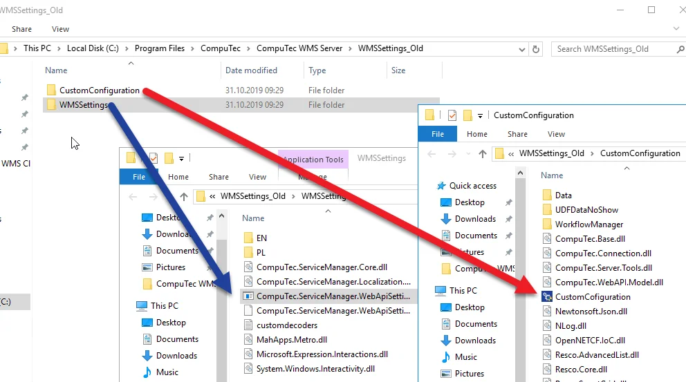

# Requirements

To ensure CompuTec WMS functions properly, certain requirements must be met. Below are the prerequisites and setup steps for optimal performance.

---

## .NET Framework

CompuTec WMS requires a minimum of .NET Framework version 4.7. You can verify your .NET Framework version by running this command in Command Prompt:

1. Type in the following command in Command Prompt from Windows applications:

    ```text
    reg query "HKEY_LOCAL_MACHINE\SOFTWARE\Microsoft\NET Framework Setup\NDP\v4\full" /v version
    ```

        

    and click enter.

2. The result will show the .NET Framework version:

    

For best results, update to the latest version of .NET Framework using Windows Update or download the installer directly from Microsoft:

- [Microsoft .NET Framework 4.7 (Web Installer)](https://www.microsoft.com/en-us/download/details.aspx?id=55170)
- [Microsoft .NET Framework 4.7 (Offline Installer)](https://www.microsoft.com/en-us/download/details.aspx?id=55167)

---

## User Defined Objects

Learn how to install the CompuTec WMS UDOs to a database [here](./wms-server/overview.md).

### Custom Batch User Defined Fields

To properly manage custom Batch UDFs in CompuTec WMS with ProcessForce, a specific UDF must be added to these tables:

- "OBTN" (SAP)

    

- "@CT_PF_OABT" (ProcessForce)

    

- "@CT_PF_PRE2" (for picked but unreceived batches)

    

See more information on [working with UDFs in ProcessForce](/docs/processforce/administrator-guide/udfs).

---

## SAP Business One User

When using CompuTec WMS with an SAP Business One user, log in to SAP Business One to accept or decline the 'SAP Business One Improvement Programme' message prompt.

    

### ProcessForce License Requirements

When using ProcessForce, the SAP Business One user must have a ProcessForce license matching their SAP Business One license (e.g., Limited Logistics or Indirect Access for both SAP Business One and ProcessForce).

## Unique Serial Numbers in SAP Business One General Settings

To prevent duplicate serial numbers, set the “Serial Number” option in "Unique Serial Numbers" under Inventory tab in SAP Business One General Settings.

    

## Firewall Configuration

Create an inbound rule in Windows Firewall for the required port to ensure CompuTec WMS Server functionality.

<details>
<summary>To get more information, see below.</summary>
<div>
    1. Open: Control Panel > Windows Defender Firewall:

        

    2. Click Advanced settings:

        
    3. Select Inbound Rules and choose New Rule... in the "Actions" window - this runs New Inbound Rule Wizard:

        
    4. Choose "Port" as the rule type:

        
    5. Choose "TCP" protocol and specify "31002" as the local port:

        
    6. Choose the "Allow the connection" action:

        
    7. Choose all profiles:

        
    8. Specify the rule name and click "Finish":

        
</div>
</details>

## Anti-malware Software

Some anti-malware software may block the installation. In such cases, add an exception in the anti-malware software settings.

## Data Restore

If your database now has ProcessForce but was previously used without it, make sure to run the Item Details restoration. Without this step, documents involving items without assigned Item Details may fail to create. See more information on [Item Details Restore](./sap-business-one-settings/item-details-restore.md) to find out more.

## Supported Database Servers

CompuTec WMS is compatible with the following database servers:

- Microsoft SQL Server 2016
- Microsoft SQL Server 2017
- Microsoft SQL Server 2019
- SAP HANA

## CompuTec ProcessForce API

If ProcessForce is installed, CompuTec WMS requires CompuTec ProcessForce API to work correctly. ProcessForce API has to be in the exact version as ProcessForce installed on the database.

## Preparing the Environment: Installation Order

:::danger
    Make sure to follow the installation order below precisely, as installing in a different order may cause issues with CompuTec WMS operation.
:::

### For SQL Environments

1. Microsoft ODBC Driver
2. Microsoft SQL Native Client (version based on SQL version being used)
3. SAP DI API
4. ProcessForce & ProcessForce API (optional)
5. WMS Server
6. WMS Client

### For HANA Environments

1. HANA ODBC Driver
2. SAP DI API
3. ProcessForce & ProcessForce API (optional)
4. WMS Server
5. WMS Client

## Upgrade

Before installing CompuTec WMS 2.0, manually uninstall the previous WMS Server from Programs and Features.

### Transferring Custom Configurations and Server Settings

When upgrading to version 2.0 from any previous version, you need to manually transfer the Custom Config and Server Settings. To do this, follow the below steps:

1. Locate your previous settings in the default directory:

    ```text
    `C:\Program Files\CompuTec\CompuTec WMS Server\WMSSettings_Old`
    ```

2. Go to the respective sub-folders and run old Settings and Custom Config:

    

3. Manually transfer the data from the old settings to the corresponding fields in the current installation.

    

    :::note
    Note that there is a "License Server" field in the old settings, and on the new form, there is an "SAP Business One SLD Server" field (these values can be different in some cases).
    :::

4. Repeat these steps for "Custom Config" options to ensure all settings are correctly transferred.

    

---
By carefully following these requirements and installation steps, you can ensure CompuTec WMS is set up correctly and operates smoothly. Each configuration plays a crucial role in preventing issues and optimizing system performance
