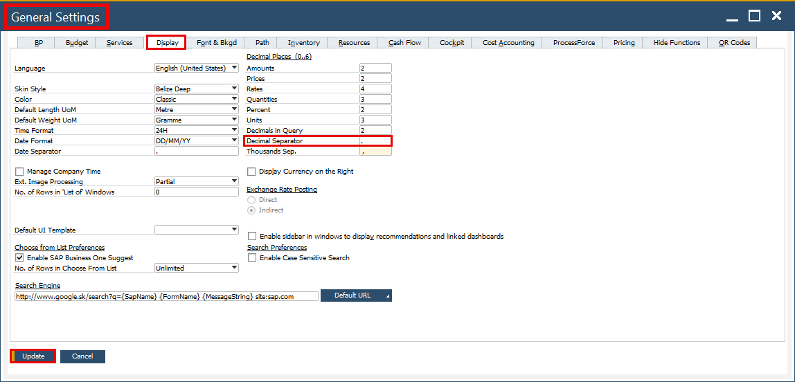
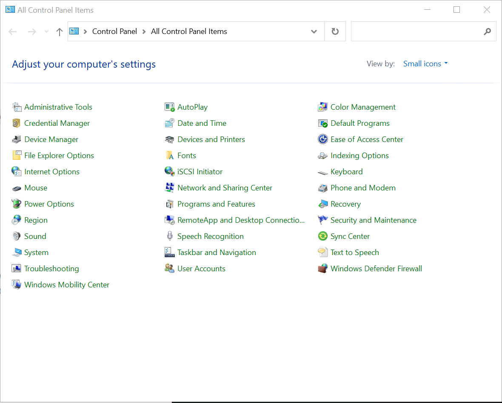
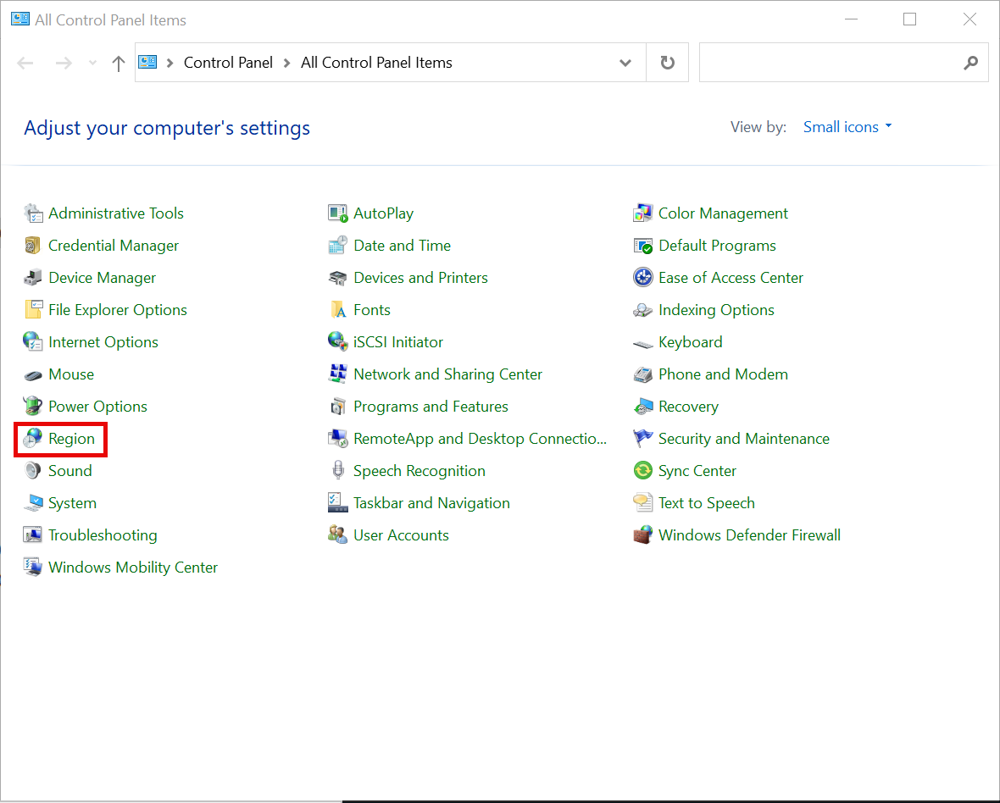
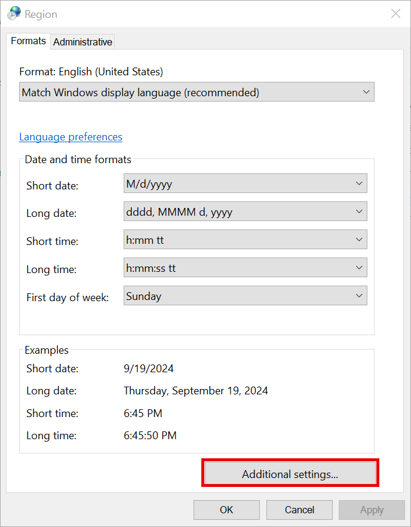
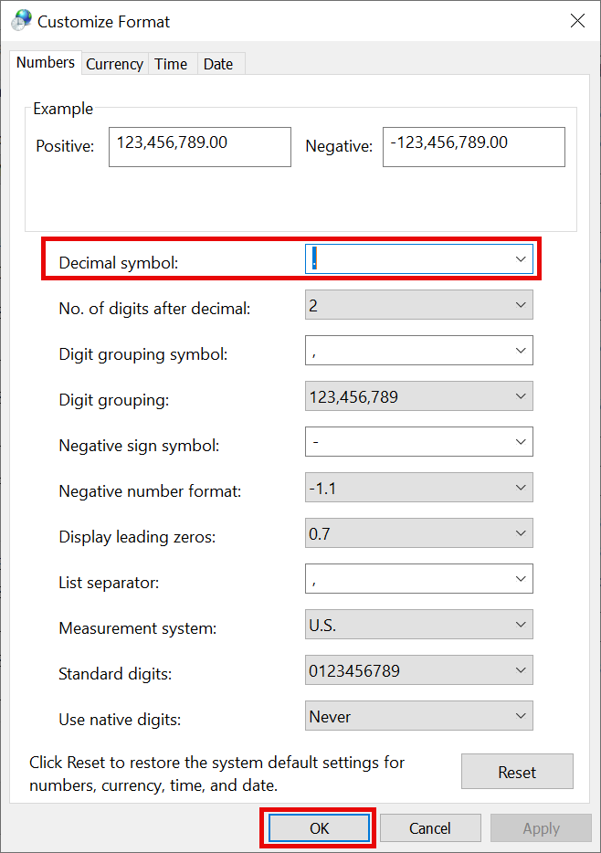

# Decimal/Thousand Separator

In CompuTec WMS, configuring the decimal and thousand separators is essential for ensuring consistency in numerical data formatting across various devices and clients. The following guide explains how to configure the decimal and thousand separators in both SAP Business One and the regional settings of your PC or device, ensuring your data is displayed correctly across all environments.

---

## Desktop Client

In CompuTec WMS for the Desktop Client, the decimal and thousand separators are inherited from the SAP Business One settings. These settings can be found under SAP Business One Settings:
    - Navigate to Administration > General Settings
    - Select the Display tab.
    - The Decimal Separator (0..6) is applied to most fields in CompuTec WMS.
    - For quantity fields, however, the separator is based on the regional settings of the PC being used.

## CE Client

For the CompuTec WMS CE (Client Edition) Client, the decimal and thousand separators are directly determined by the device's regional settings.

## Setting up

### SAP Business One Settings

1. In SAP Business One, open General Settings.
2. Select the "Display" tab.
3. Change the Decimal Separator, e.g., to a full stop (.) and Thousands Sep. to a comma (,).
4. Click "Update" to save the changes.

    

### Regional Settings

1. Open the "Control Panel".

    
2. Select "Region (and Language)".

    
3. On the "Formats" tab, click "Additional settings..."

    
4. Under the "Numbers" tab, change the Decimal symbol and Click "OK" to apply the new settings.

    

---
