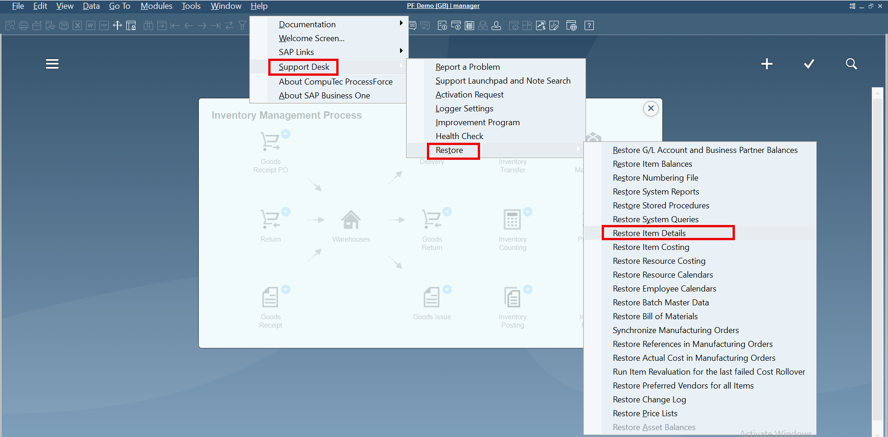

# Item Details Restore

Each time an Item Master Data is created in ProcessForce, corresponding Item Details are automatically recorded to ensure seamless communication between CompuTec WMS and ProcessForce:

When an Item Master Data is created without ProcessForce integration, the Item Details form may not be automatically populated. To ensure proper integration and communication between CompuTec WMS and ProcessForce, you need to restore the missing Item Details for the corresponding Item Master Data.

## Item Details Restore Procedure

To perform the Item Details procedure, choose the following path in SAP Business One with ProcessForce:

:::info Path
    Help → Support Desk → Restore → Restore Item Details
:::

1. Open SAP Business One with ProcessForce and go to the Help menu.
2. Choose Support Desk → Restore → Restore Item Details.
3. Once you select "Restore Item Details," the system will automatically generate the missing Item Details for the selected Item Master Data.

    

---
