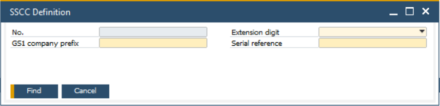

# Serial Shipping Container Code

The Serial Shipping Container Code (SSCC) plays a crucial role in modern logistics and warehouse management by uniquely identifying logistics units. In SAP Business One, the SSCC must be predefined to ensure seamless integration with warehouse processes. CompuTec WMS (Warehouse Management System) automates the creation of SSCCs when a Storage Unit (SU) is created, streamlining the logistics operations.

---

## Setting Up Serial Shipping Container Code

    

To define and configure the Serial Shipping Container Code in SAP Business One, follow these steps:

1. In the SAP Business One menu, open the "SSCC Definition" form. The form is available after the installation of CompuTec WMS and can be accessed via:

    :::info Path
        Stock Management → SSCC Definition
    :::

2. In this section, configure the SSCC according to your business requirements. The code should be structured based on your company's logistical needs.

3. The SSCC definition allows the use of an "Extension Digit", which increases the overall capacity of the SSCC. This extension can be a number within the 0-9 range, offering flexibility in the creation of codes to accommodate various business scenarios.

4. Each company needs a unique "GS1 prefix", which is used to create the SSCCs specific to that company. This prefix helps in ensuring the uniqueness of the SSCC for your company across global supply chains.

5. To manage the SSCC numbers systematically, set a "Serial Reference Number". For instance, if you enter 000000001, the SSCC numbering will begin at this point, and subsequent numbers will automatically be assigned (e.g., 000000002, 000000003, etc.). You can also set a higher number to adjust the starting point to align with previous SSCC series used by your company.

---
Properly setting up SSCC definitions not only facilitates better inventory control but also ensures compliance with global logistics standards.
