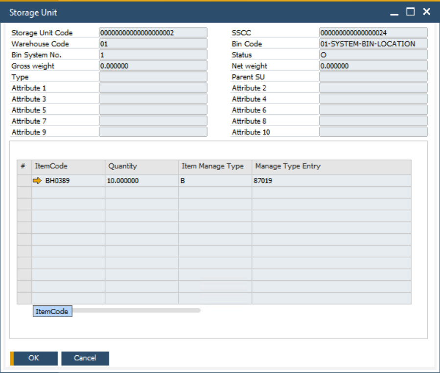
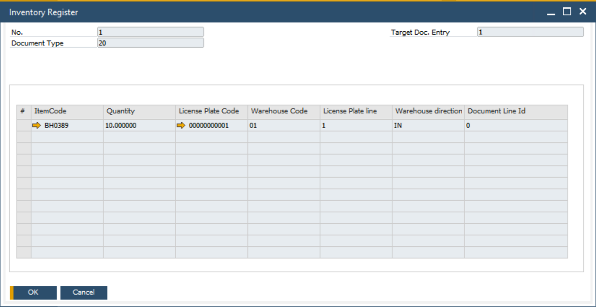

# Storage Unit

This document outlines the key forms available after the installation of CompuTec WMS (Warehouse Management System). Below, we provide an overview of the two critical forms included in the system.

:::note
    The following forms are available after the installation of CompuTec WMS.
:::

## Storage Unit Form

:::info Path
    Main Menu → Stock Management → Storage Unit
:::

All storage units created using CompuTec WMS can be viewed in this form, along with their details. It is a central place for managing and tracking all storage units within the system.

    

## Inventory Register Form

:::info Path
    Main Menu → Stock Management → Stock Transactions → Inventory Register
:::

The Inventory Register form offers an extensive view of all CompuTec WMS transactions that involve the usage of storage units.

    

---
