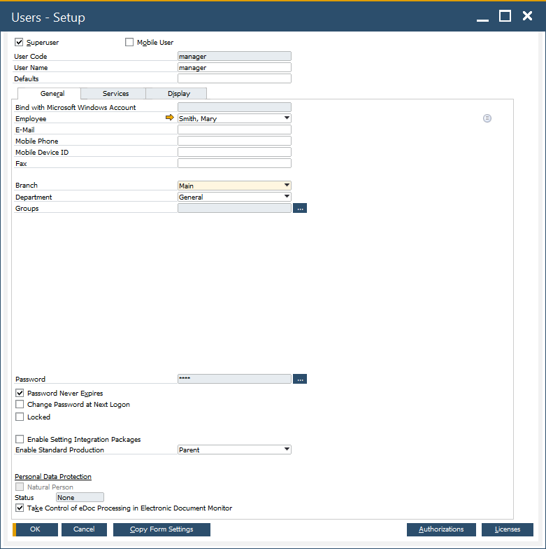

# Working on Database with Branches

To be able to work with CompuTec WMS on a database with branches, the following steps are required to be performed:

- Create a user defaults file with a needed branch. Please check the  [SAP Business One manual](https://help.sap.com/docs/SAP_BUSINESS_ONE/68a2e87fb29941b5bf959a184d9c6727/4506da43d8696c30e10000000a114a6b.html) to see how to do this.
- Assign a user to the branch in specific user settings (SAP Business One → Administration → Users).

    

Every CompuTec WMS operating user has to have a user defaults file (in which a branch is chosen) assigned.

CompuTec WMS users can only be assigned to one branch.
