# CompuTec WMS Android version

The CompuTec WMS Android version is a robust solution designed to enhance warehouse operations through seamless integration with Android devices. This guide provides step-by-step instructions for installing, configuring, and utilizing the Android client to streamline warehouse management processes. Whether you're a first-time user or upgrading to the latest version, this manual ensures a smooth setup and operational experience.

---

## Requirements

To run CompuTec WMS on Android, ensure the following prerequisites are met:

- **Android Device Compatibility** - Requires Android 6 (API 23) to 14.
- Network Access: The device must connect to the network hosting the CompuTec WMS Server. Test connectivity by entering `http://[server address]:31002/api/Test/Get` in a browser and verifying the response. Replace [server address] with the actual address of the CompuTec WMS Server.

    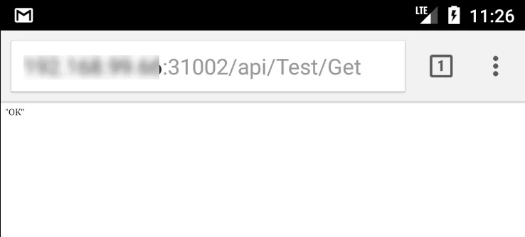

The image above shows the expected response. If you encounter a different response, consult your network administrator to adjust server settings, network configurations, or firewall rules to enable proper access.

- **App Installation Permissions**: Enable the installation of APK files from external sources in the device’s security settings. This option is typically found as a single setting in the security settings or as a permission to allow specific applications, such as file managers or browsers, to install applications from external sources.
  
    An example permission setting:

    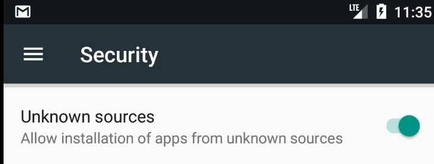

## Download and Installation

Download the installation file from [here](../../../releases/download.md) and then extract and transfer it to the device.

Using a file manager app, navigate to the download folder and tap the file to begin the installation, provided all necessary permissions are properly configured.

:::note
    On some devices, installing an application from the default download folder may not be possible. If this occurs, try moving the installation file to a different folder on the device.
:::

## Running and Configuration

- After the initial installation, configuration is required. Begin by tapping the log icon.

    

- Enter the correct CompuTec WMS Server name and save the changes

    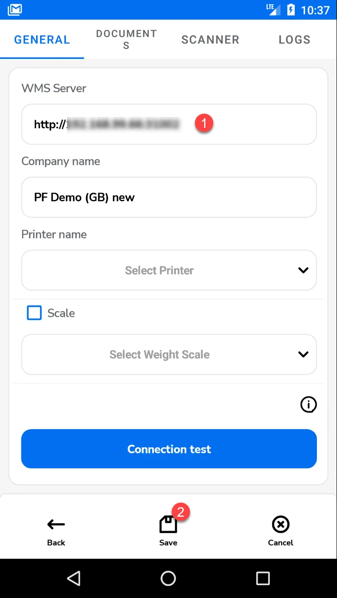

- Next, input your CompuTec WMS user credentials and tap the Company Name field. A list of databases will appear; select one by tapping it. You can then log in.

    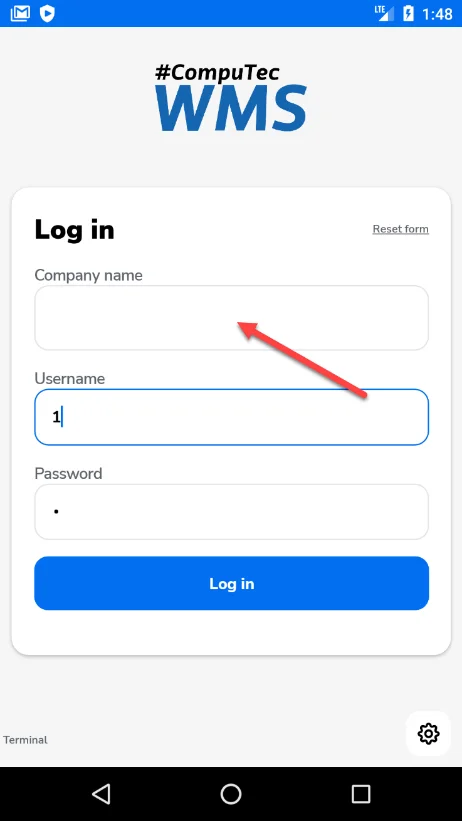 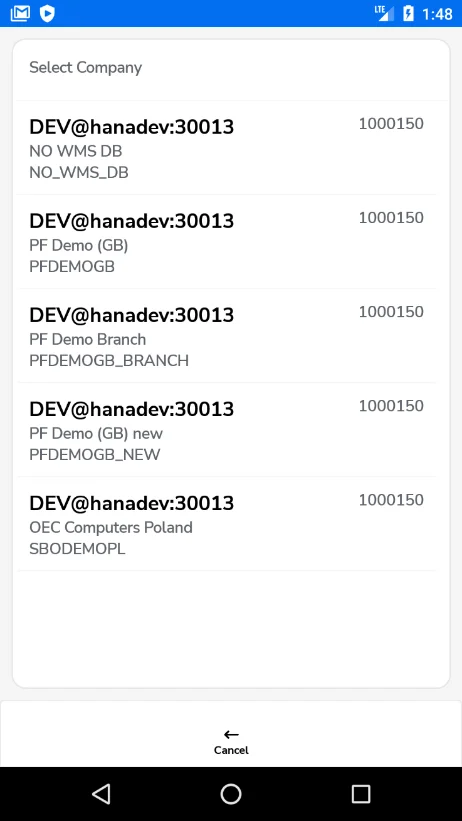 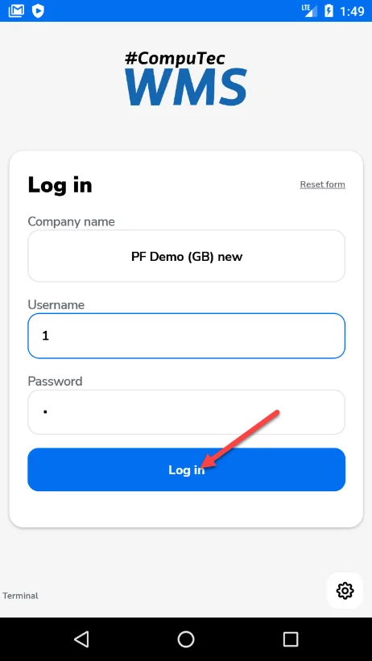

## Overwriting a Client Version

A manual option is available to change the client version, making the testing process easier. This helps prevent issues caused by mismatched versions between the CompuTec server and client, which can arise when testing the Android client with different CompuTec server versions.

To modify the version number, go to the CompuTec WMS client information section. Click the information icon in the General tab, double-click the client number, update the version, and click the Save button.

 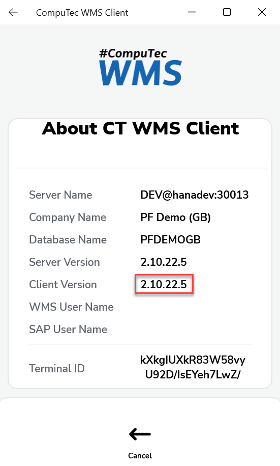 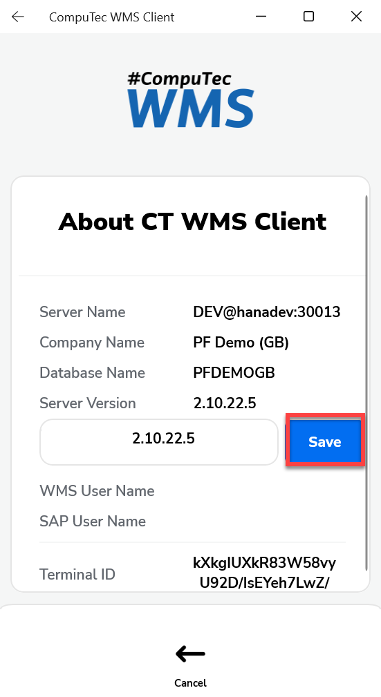

## Connection Testing

The Android version of the CompuTec WMS client includes tools to test the connection and its quality to the server. These tools can be found in the General tab, under the Connection Test button.

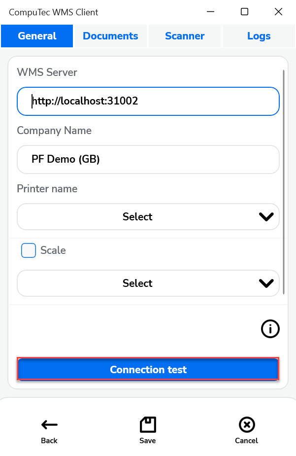

Here, you can use one of three tests:

- **Server**

    Select this option and click Test to check the connection to the CompuTec WMS server. You will receive a message indicating whether the connection attempt was successful.

    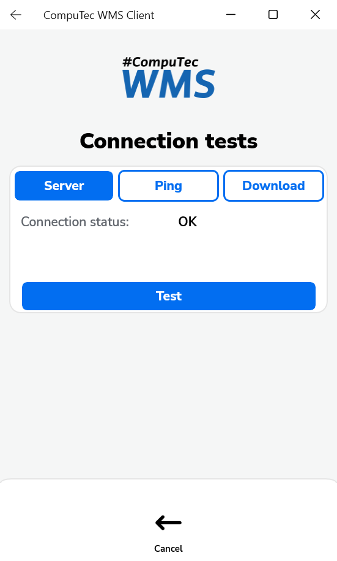
- **Ping**

    Choose this option and click Test to measure the latency of the connection. A message will display the latency value. Click Stop to end the test.

    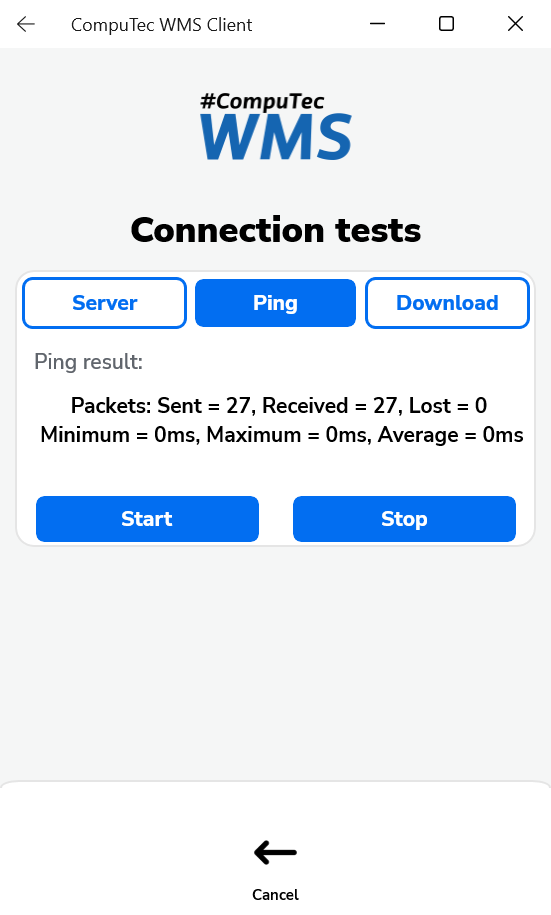
- **Download**

    Select this option and click Start to test the download speed. You will receive an approximate download speed message. The test will automatically stop after a short period, or you can click Stop to end the test.

    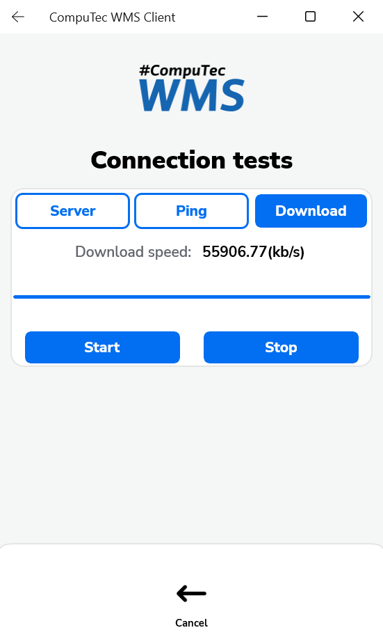

## Log Files

Direct access to the CompuTec WMS log files directory is not available on Android devices. However, you can view the log files through the Logs tab.

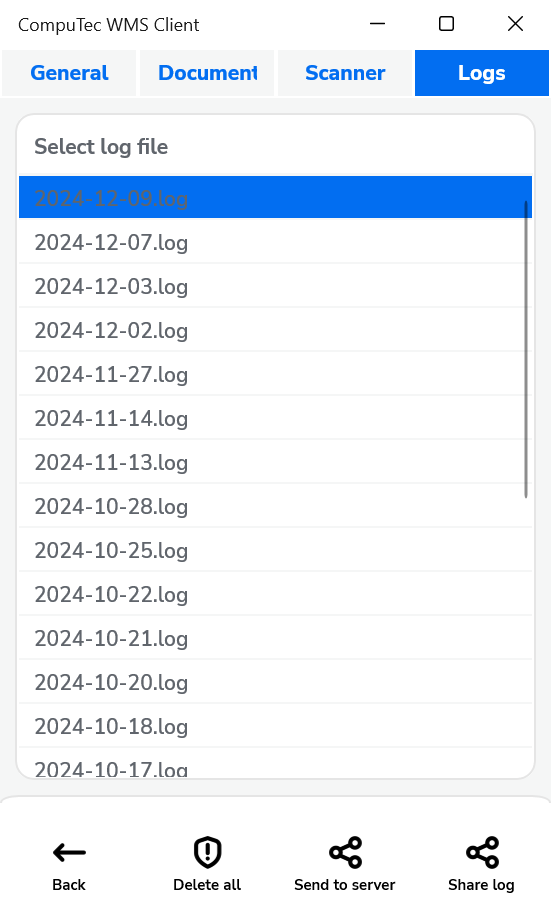

**Share log** – Use this option to send the selected log file via text message or save it as a file.

**Send to server** – This option allows you to send the selected log file to the associated server. The default location for the server is: c:\programdata\CompuTec\CompuTec WMS\Server\Logs\ClientLogs\XXXXXXXX-XXXX-XXXX-XXXX-XXXXXXXXXXXX.

This section XXXXXXXX-XXXX-XXXX-XXXX-XXXXXXXXXXXX refers to the device's unique identification number.

## Configure Scanning on Android Handheld Decoders

To enable proper barcode scanning functionality, you need to activate **Intent Output** in the scanner settings of your device. Following this, configure the **Intent Action** and **Intent Extra Key Data**(if available).

Set the Intent Action to: **barcodescanner.RECVR** – This action allows CompuTec WMS to receive data from the scanner.

For the Intent Extra Key Data, set it to: **com.motorolasolutions.emdk.datawedge.data_string** – This is the default key used by CompuTec WMS to extract barcode data from the Intent.

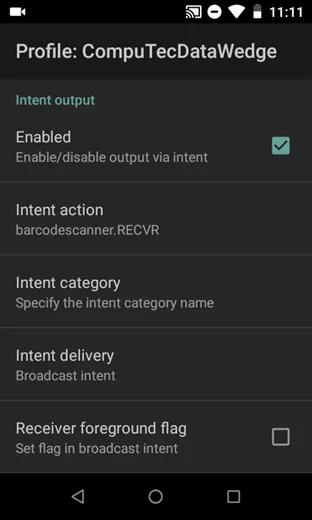 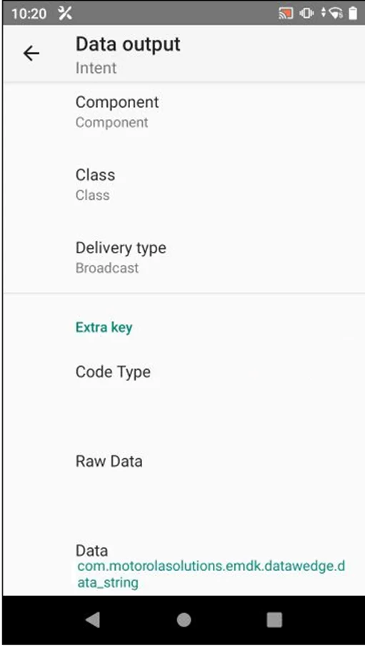

On certain Zebra devices, such as the MC330K, these settings are automatically configured because CompuTec WMS creates a DataWedge profile.

If your device does not provide an option to define the Intent Data key, refer to your device's documentation to identify the key used for sending barcode data. Once identified, enter this key in the CompuTec WMS Scanner settings under **Intent data string**. If you're unable to locate the key, you can enable logging in the CompuTec WMS scanner settings after activating the Intent action. This will allow you to check the log files for the correct barcode data key being sent to WMS.

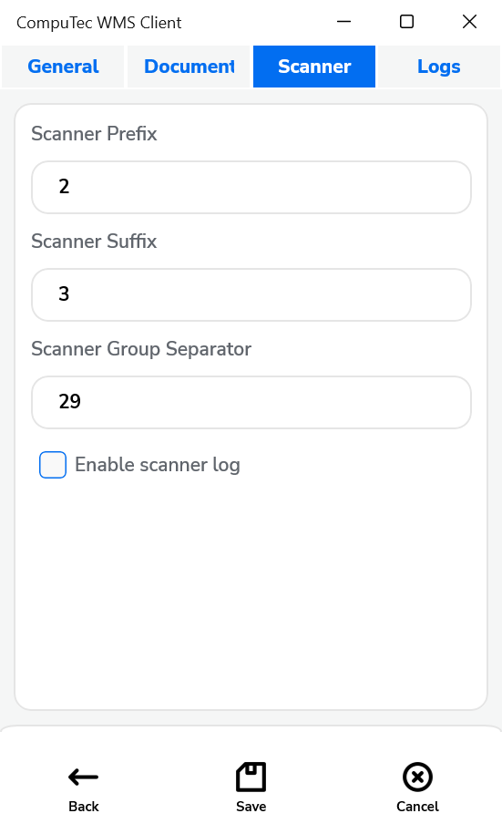

---
The CompuTec WMS Android version offers a powerful solution for warehouse management, providing users with an intuitive interface and seamless integration with Android devices. By following the detailed installation, configuration, and testing steps outlined in this guide, users can optimize their warehouse operations, ensuring efficient communication with the CompuTec WMS Server and accurate barcode scanning.
