# CompuTec WMS Android version

The CompuTec WMS Android version is a robust solution designed to enhance warehouse operations through seamless integration with Android devices. This guide provides step-by-step instructions for installing, configuring, and utilizing the Android client to streamline warehouse management processes. Whether you're a first-time user or upgrading to the latest version, this manual ensures a smooth setup and operational experience.

## Requirements

To run CompuTec WMS on Android, ensure the following prerequisites are met:

- **Supported Android OS**: Minimal required android version is Android 8. For best performance we recommend using one of the latest available versions.
- **Network Access**: The device must connect to the network hosting the CompuTec WMS Server. Test connectivity by entering `http://[server address]:31002/api/Test/Get` in a browser and verifying the response. Replace [server address] with the actual address of the CompuTec WMS Server.

    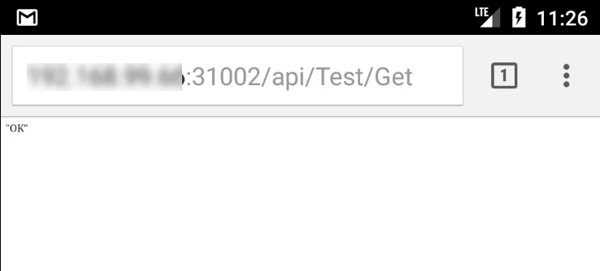

The image above shows the expected response. If you encounter a different response, consult your network administrator to adjust server settings, network configurations, or firewall rules to enable proper access.

- **App Installation Permissions**: Enable the installation of APK files from external sources in the device’s security settings. This option is typically found as a single setting in the security settings or as a permission to allow specific applications, such as file managers or browsers, to install applications from external sources.
  
    An example permission setting:

    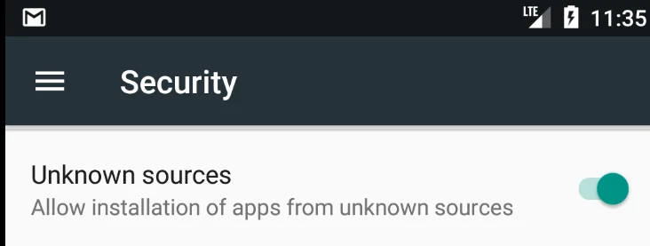

## Download and Installation

Download the installation file from [this link](/docs/wms/releases/download) and then extract and transfer it to the device.

Using a file manager app, navigate to the download folder and tap the file to begin the installation, provided all necessary permissions are properly configured.

:::note
    On some devices, installing an application from the default download folder may not be possible. If this occurs, try moving the installation file to a different folder on the device.
:::

## Running and Configuration

- After the initial installation, configuration is required. Begin by tapping the log icon.

    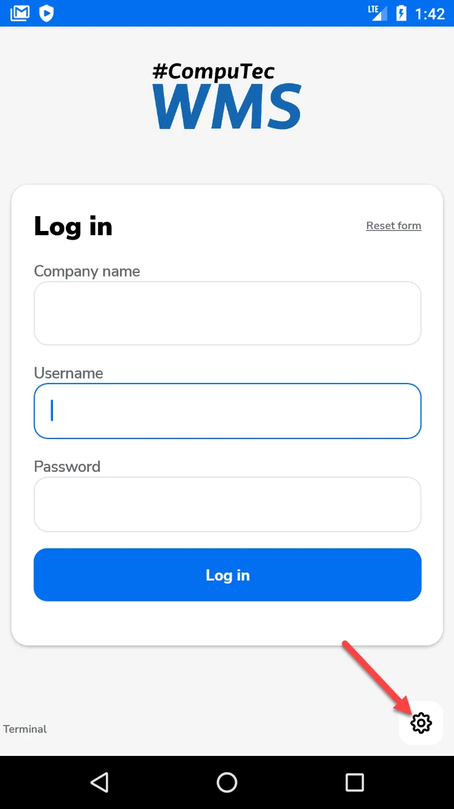

- Enter the correct CompuTec WMS Server name and save the changes

    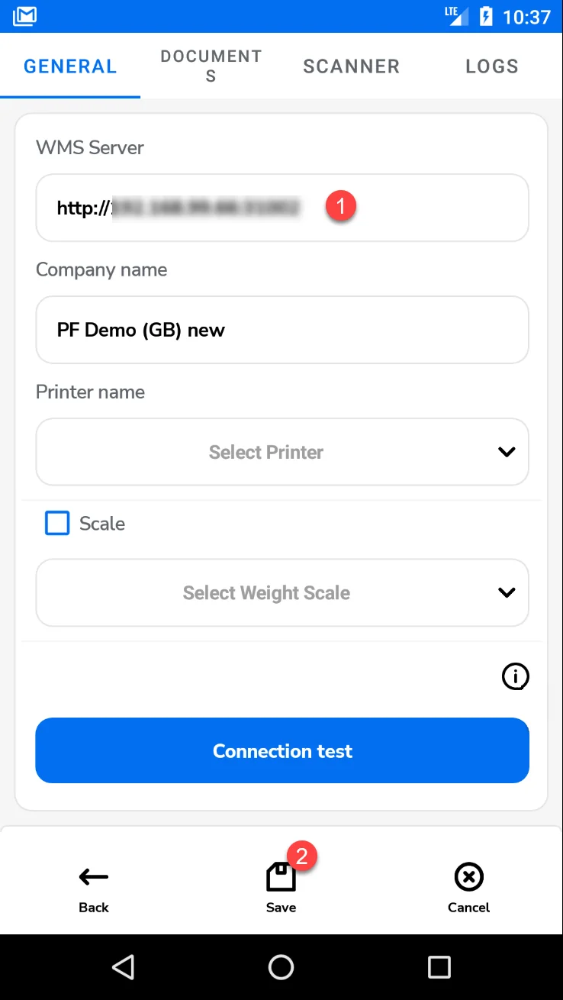

- Next, input your CompuTec WMS user credentials and tap the Company Name field. A list of databases will appear; select one by tapping it. You can then log in.

    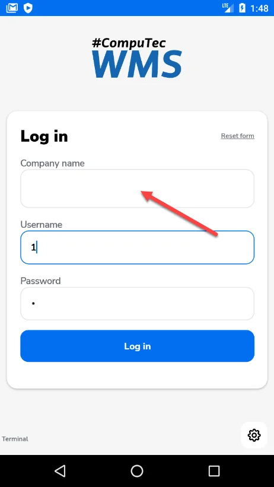 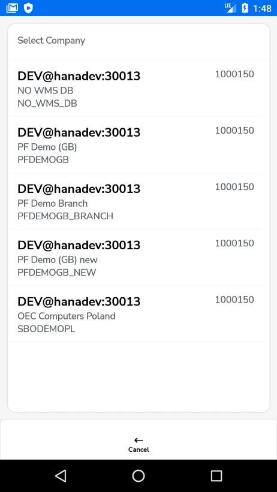 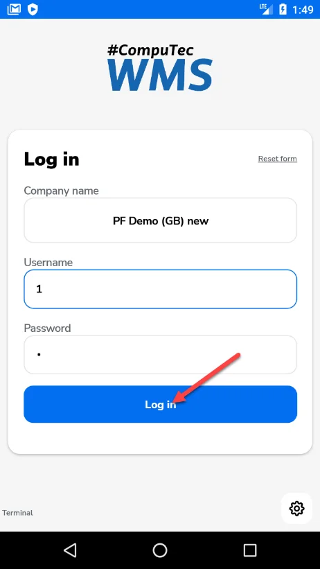

## Overwriting a Client Version

:::info[note]
Starting with **CompuTec WMS 3.2607.1**, automatic client upgrade is available for **CompuTec WMS Android** and **CompuTec WMS Desktop**. Manual client replacement is only required for **CompuTec WMS Legacy Client** and **CompuTec WMS CE**, or in scenarios where automatic upgrade cannot be used. [Read more](/docs/wms/administrator-guide/upgrade/#automatic-client-update)
:::

A manual option is available to change the client version, making the testing process easier. This helps prevent issues caused by mismatched versions between the CompuTec server and client, which can arise when testing the Android client with different CompuTec server versions.

To modify the version number, go to the CompuTec WMS client information section. Click the information icon in the General tab, double-click the client number, update the version, and click the Save button.

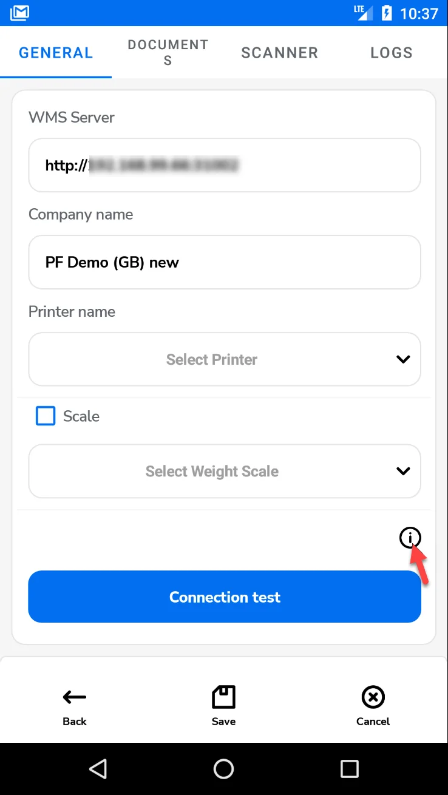 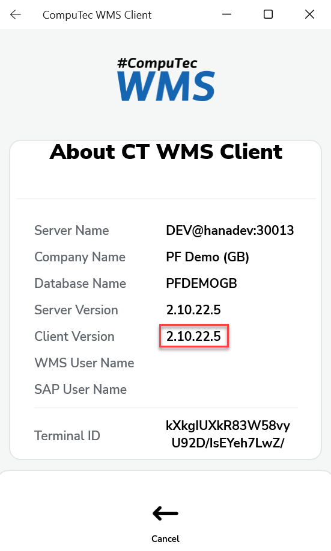 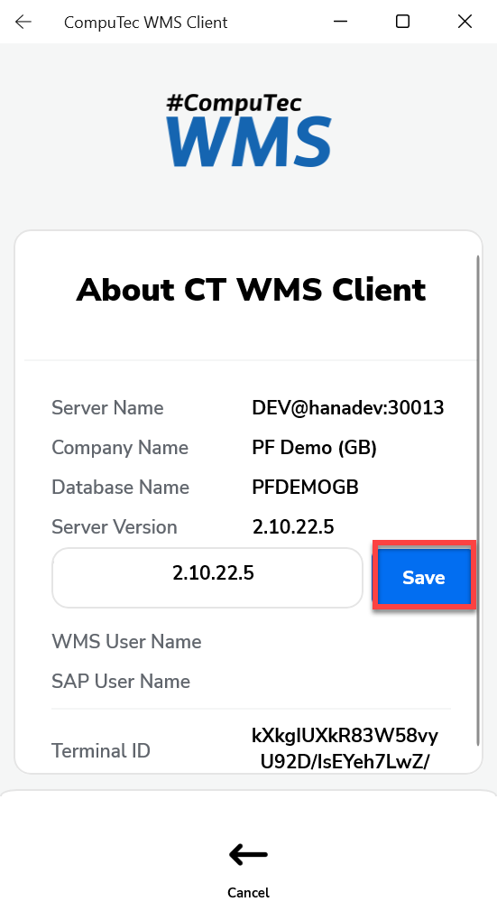

## Connection Testing

The Android version of the CompuTec WMS client includes tools to test the connection and its quality to the server. These tools can be found in the General tab, under the Connection Test button.

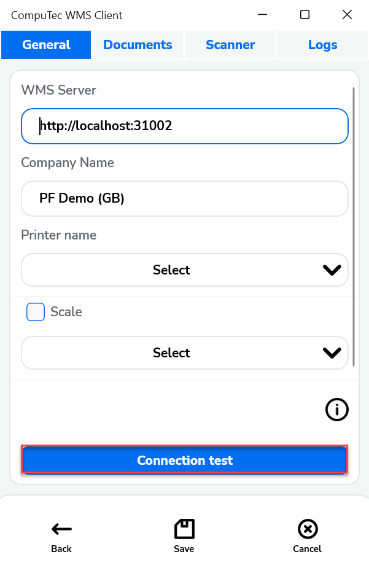

Here, you can use one of three tests:

- **Server**: Select this option and click Test to check the connection to the CompuTec WMS server. You will receive a message indicating whether the connection attempt was successful.

    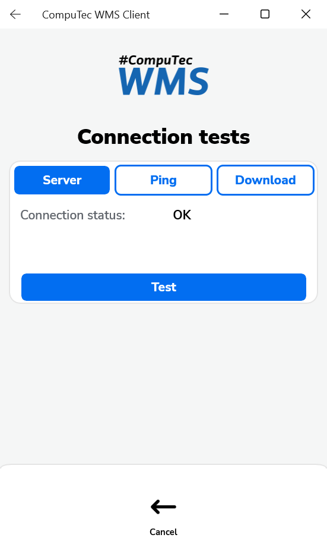

- **Ping**: Choose this option and click Test to measure the latency of the connection. A message will display the latency value. Click Stop to end the test.

    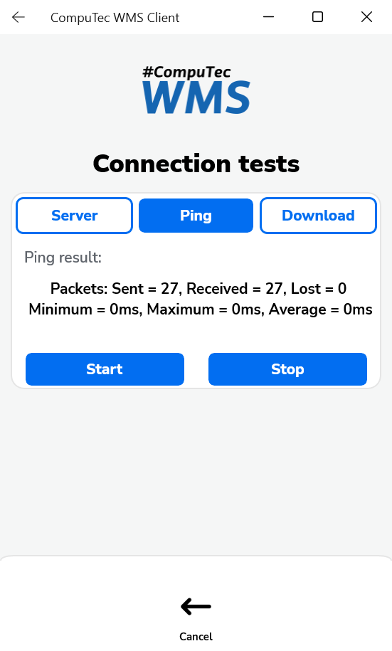

- **Download**: Select this option and click Start to test the download speed. You will receive an approximate download speed message. The test will automatically stop after a short period, or you can click Stop to end the test.

    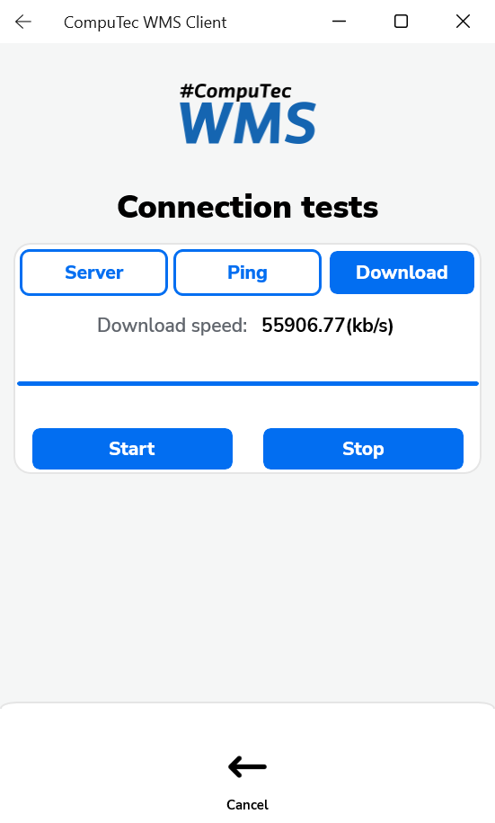

## Log Files

Direct access to the CompuTec WMS log files directory is not available on Android devices. However, you can view the log files through the Logs tab.

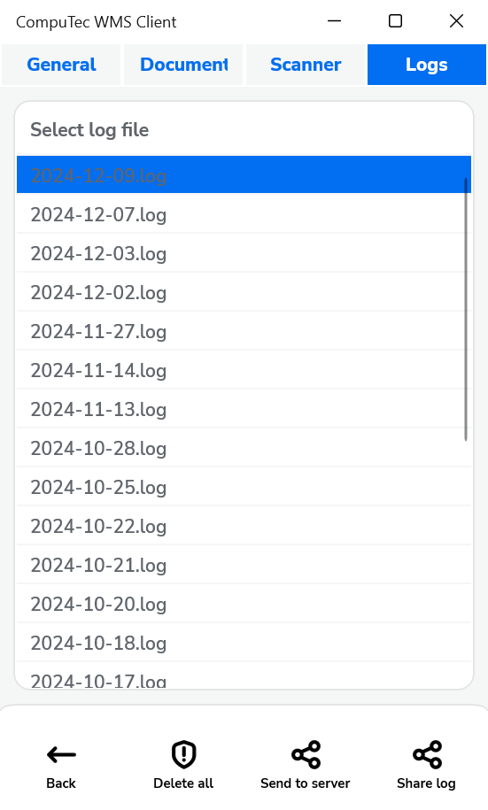

**Share log** – Use this option to send the selected log file via text message or save it as a file.

**Send to server** – This option allows you to send the selected log file to the associated server. The default location for the server is: `c:\programdata\CompuTec\CompuTec WMS\Server\Logs\ClientLogs\XXXXXXXX-XXXX-XXXX-XXXX-XXXXXXXXXXXX`.

This section `XXXXXXXX-XXXX-XXXX-XXXX-XXXXXXXXXXXX` refers to the device's unique identification number.

## Configure Scanning on Android Handheld Decoders

CompuTec WMS supports several methods for receiving barcode data from Android handheld scanners. The correct scanner input mode depends on the device and its scanner configuration.

To configure scanning, go to **Options** > **Scanner**. Scanner settings on Android take effect after you save the changes. You do not need to restart CompuTec WMS.

### Scanner input mode

Use **Scanner input mode** to select how CompuTec WMS receives scanned barcodes.

| Mode | Description |
| --- | --- |
| **Auto** (default) | Automatically detects the device. Supported Bluebird devices use the Bluebird scanner service. All other devices use DataWedge. |
| **DataWedge** | Creates a DataWedge profile named CompuTecDataWedge and receives scanned barcodes through its intent output. Use this mode on Zebra, Motorola, and Symbol devices. |
| **CustomIntent** | Receives scanned barcodes through the configured intent action. Use this mode when the device has its own scanner application that can broadcast an intent, for example, Honeywell, Newland, Urovo, and Chainway devices. |
| **Bluebird** | Uses the Bluebird native scanner service (BBApi). Use this mode on supported Bluebird EF, VX, and RG series devices running Android 10 or later. No additional scanner configuration is required. |
| **KeyboardWedge** | Receives the barcode as keyboard input. Use this mode when the device cannot send an intent or when using an external Bluetooth or USB HID scanner. |

On devices that are not recognized as Bluebird devices, **Auto** works in the same way as in previous versions of CompuTec WMS, so existing installations are not affected by an upgrade.

If a supported Bluebird device is not detected automatically, select **Bluebird** manually.

### Scanner settings

#### - Intent action

**Intent** action is available when Scanner input mode is set to **Auto**, **DataWedge**, or **CustomIntent**.

Set the **Intent Action** to: `barcodescanner.RECVR` – This action allows CompuTec WMS to receive data from the scanner. In **DataWedge** mode, this value is also written to the **DataWedge** profile created by CompuTec WMS. In **CustomIntent** mode, the value must match the intent action configured in the scanner application on the device.

#### - Intent data string

**Intent data string** is available when Scanner input mode is set to **Auto**, **DataWedge**, or **CustomIntent**.

For the **Intent Extra Key Data**, set it to: `com.motorolasolutions.emdk.datawedge.data_string` – This is the default key used by CompuTec WMS to extract barcode data from the Intent.

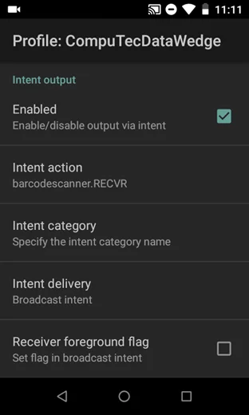 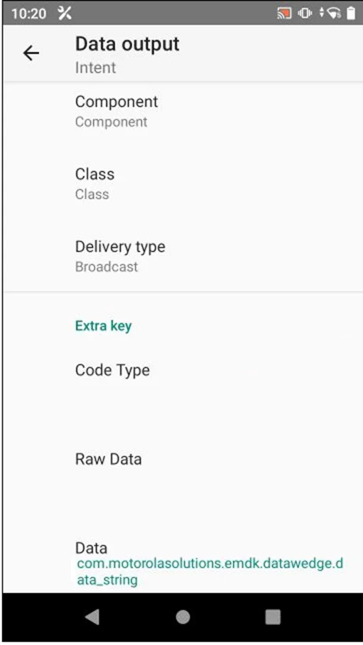

On certain Zebra devices, such as the MC330K, these settings are automatically configured because CompuTec WMS creates a **DataWedge** profile.

:::info[note]
If your device does not provide an option to define the **Intent Data** key, refer to your device's documentation to identify the key used for sending barcode data.

Once identified, enter this key in the CompuTec WMS Scanner settings under **Intent data string**.

If you're unable to locate the key, you can enable logging in the CompuTec WMS scanner settings after activating the Intent action. This will allow you to check the log files for the correct barcode data key being sent to CompuTec WMS.

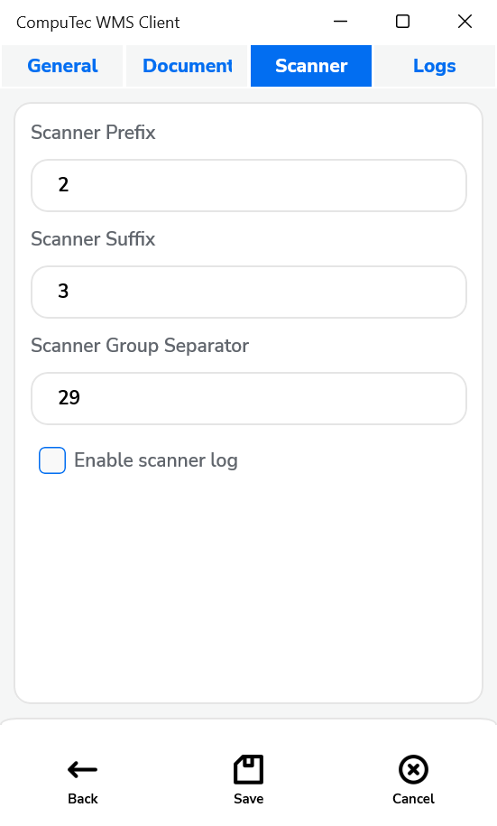
:::

#### - Do not create DataWedgeProfile

**Do not create DataWedgeProfile** is available when Scanner input mode is set to **Auto** or **DataWedge**.

By default, CompuTec WMS creates and activates a DataWedge profile named `CompuTecDataWedge`. The profile includes barcode input, common 1D and 2D decoders, and intent output using the configured **Intent action**.

Select **Do not create DataWedgeProfile** when the DataWedge profile is managed externally, for example, through MDM, StageNow, or manually on the device. This prevents CompuTec WMS from overwriting the externally managed profile.

The external profile must broadcast the same intent action configured in CompuTec WMS and have the required barcode decoders enabled.

#### - Scanner Prefix and Scanner Suffix

On Android, **Scanner Prefix** and **Scanner Suffix** are available when Scanner input mode is set to **KeyboardWedge**.

These settings define the characters that mark the beginning and end of a barcode when the scanner sends barcode data as keyboard input. Enter the values as decimal character codes. The prefix and suffix must match the scanner configuration and cannot use the same character.

| Code | Character |
| --- | --- |
| 2 | STX (default prefix) |
| 3 | ETX (default suffix) |
| 9 | Tab |
| 10 | LF |
| 13 | CR |

If the scanner cannot send the configured prefix character, CompuTec WMS recognizes the barcode by its terminating character instead. In this case, the scanned text is also entered into the currently selected field. Configure a prefix that the scanner can send to avoid this behavior.

#### - Scanner Group Separator

The default **Scanner Group Separator** is `29 (GS)`.

This setting specifies the decimal character code used to separate fields in GS1 barcodes. The value is also sent to the CompuTec WMS server, which uses it to split composite barcodes.

Change this setting only if your barcode labels use a different separator.

#### - Enable scanner log

Enable **Enable scanner log** to record detailed information about barcode scanning, including:

- The received intent
- Intent parameters and their names
- Scanned barcode data
- The scanner input method used

You can view scanner logs under **Options** > **Logs**.

Use this option when configuring a scanner or troubleshooting scanning problems. Disable it after troubleshooting is complete.

:::info[Note]
Scanner logging is verbose and records the content of scanned barcodes.
:::

### Configure scanning on Bluebird devices

CompuTec WMS supports the native scanner service available on supported Bluebird Android handheld devices. Use the **Bluebird** scanner input mode to enable barcode scanning through the Bluebird BBApi service.

This configuration applies to supported Bluebird EF, VX, and RG series devices running Android 10 or later.

:::info[Note]
Before you begin:

- Make sure you are using a supported Bluebird device with Android 10 or later.
- Make sure the device firmware supports the Bluebird BBApi scanner service.
- Close other applications that may be using the scanner.

No additional scanner configuration is required on the Bluebird device when the BBApi service is available.
:::
To configure scanning on Bluebird devices, follow these steps:

1. Open **CompuTec WMS** on the Bluebird device.
2. Go to **Options > Scanner**.
3. In **Scanner input mode**, select one of the following:
   - **Auto**: Recommended. CompuTec WMS automatically detects supported Bluebird devices and uses the Bluebird scanner service.
   - **Bluebird**: Select this option manually if the device is not detected automatically.
4. Configure **Scanner Group Separator** if required. The default value is `29 (GS)`.
5. Click **Save**.
6. Scan a barcode to verify that the scanner is working.

CompuTec WMS receives scanned barcodes directly through the Bluebird native scanner service. You do not need to restart the application after saving the scanner settings.

:::info[note]

If scanning does not work:

1. Go to **Options > Scanner**.
2. Enable **Enable scanner log**.
3. Click **Save**.
4. Scan a barcode again.
5. Go to **Options > Logs** and review the scanner log.

If the log contains `BARCODE_CALLBACK_REQUEST_FAILED`, check whether another application is currently using the scanner. This error can also indicate that the device firmware does not support BBApi.

If **Auto** does not detect the device as a Bluebird scanner, set **Scanner input mode** to **Bluebird** manually.

Disable **Enable scanner log** after troubleshooting. Scanner logging is verbose and records the content of scanned barcodes.
:::

### Configure CipherLab RS38 Scanner

After reinstalling the CompuTec WMS Client, the DataWedge (ReaderConfig) profile was not created automatically. To resolve this, a new profile was configured manually with the correct settings to ensure smooth barcode scanning integration.

To configure CipherLab RS38 scanner, follow these steps:

1. Create a New DataWedge Profile:

    - Open the DataWedge application on the CipherLab device.
    - Tap the “+” (Add) icon to create a new profile.
    - Name the profile: ReaderConfig
    - In the Associated Apps section, link the profile to your CompuTec WMS Client app.
    - Ensure the profile is enabled.

2. Configure CompuTec WMS Client Settings:

    - Navigate to CompuTec WMS Options → Scanner Tab
    - Set Intent Data String to: Decoder_Data

        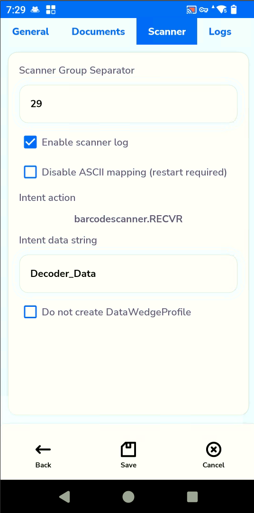

3. Configure ReaderConfig in DataWedge:

        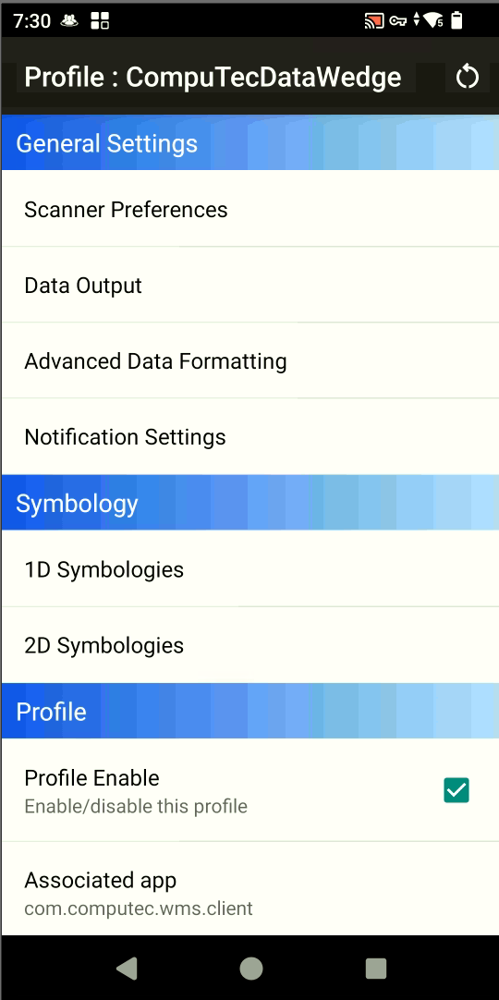

    1. Scanner Preferences:
        Scan Mode: Select Release Scan Mode

            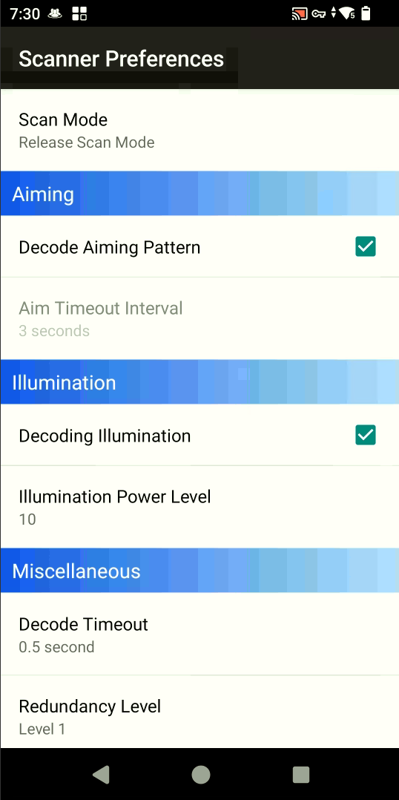

    2. Data Output Settings:

             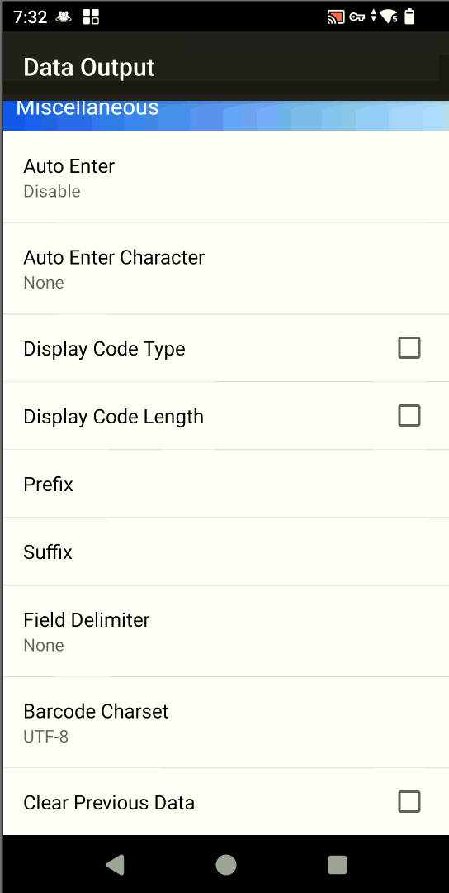  

        1. Default Mode: Set to Intent

            1. Under Related Settings:
                1. Intent Action: barcodescanner.RECVR
                2. Intent Decode Data / Prefix / Suffix: Leave all fields empty

                    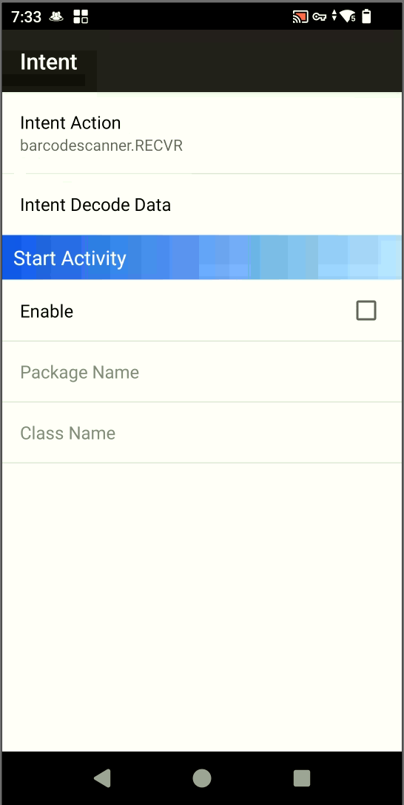

        2. Auto Enter Settings: Set to Disable

        3. Auto Enter Character: Select None

            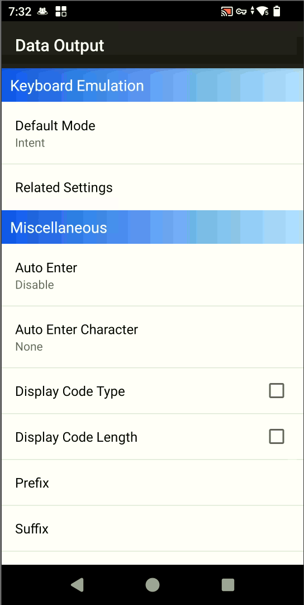

4. Final Verification:

    - Save the DataWedge profile.
    - Relaunch or restart the CompuTec WMS Client app.
    - Perform a test scan to ensure barcode data is received correctly in the app via the Decoder_Data intent.

### Configure barcode scanner settings for Denso Android device

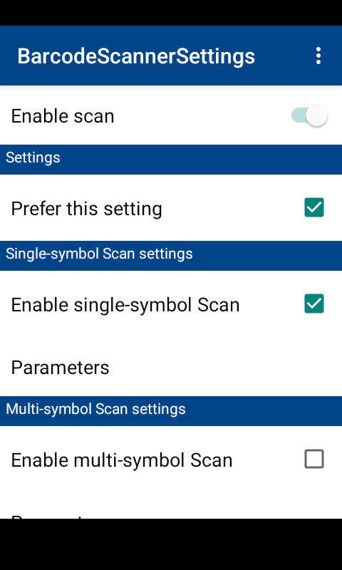 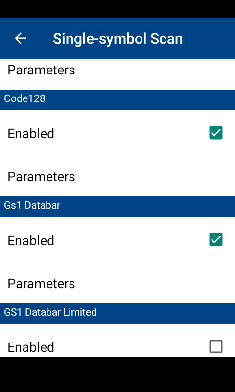 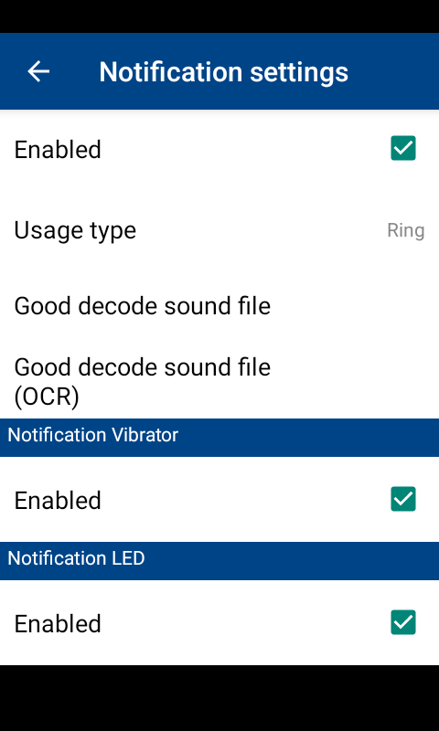

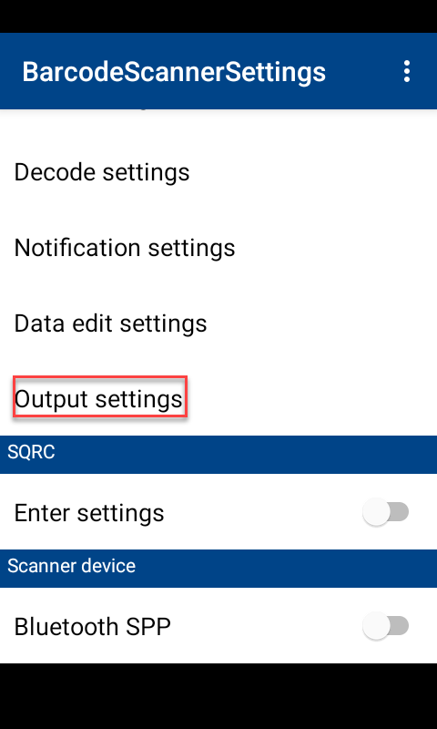 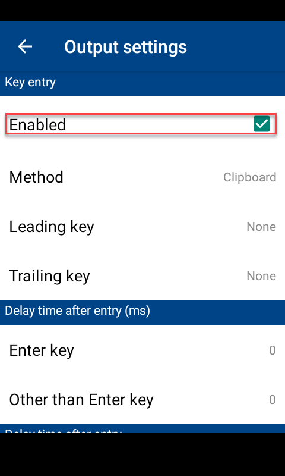 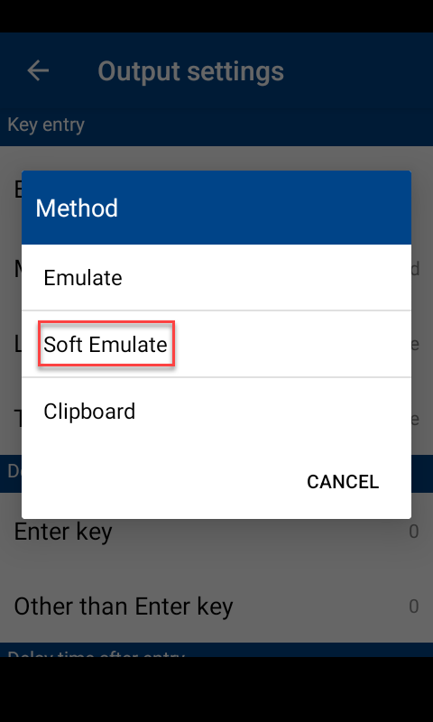

Enter `barcodescanner.RECVR` in Intent Action Name.

    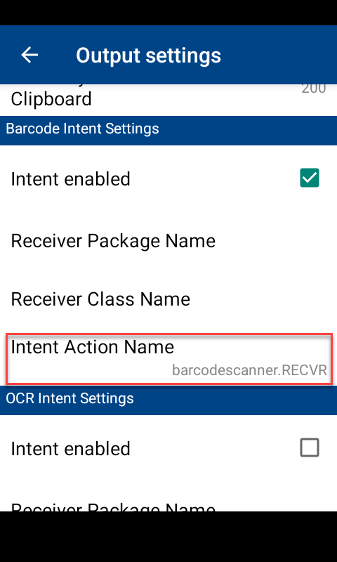

Enter `com.densowave.bhtsdk.barcode.outputsettings.intent.extra.BARCODE_DATA` in Intent data string

    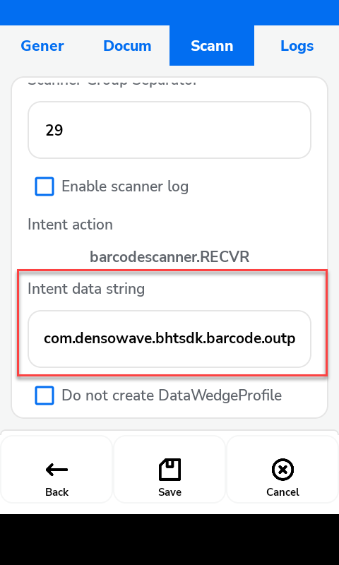

### Troubleshooting

| Problem | Solution |
| --- | --- |
| Nothing happens after scanning a barcode. | Enable **Enable scanner log**, scan again, and check the log. If a different intent action appears, enter it in **Intent action** and select **CustomIntent**. If nothing is logged, configure the device to broadcast an intent or use **KeyboardWedge**. |
| The scan is received, but the barcode value is empty. | Check **Intent data string**. The scanner log shows the parameter name sent by the device. |
| The barcode is entered into a field instead of being processed. | The scanner is operating as a keyboard. Configure intent output on the device, or select **KeyboardWedge** and configure **Scanner Prefix** and **Scanner Suffix**. |
| A Bluebird device does not scan. | Check the scanner log for `BARCODE_CALLBACK_REQUEST_FAILED`. Another application may be using the scanner, or the device firmware may not support BBApi. If **Auto** does not detect the device, select **Bluebird** manually. |
| The DataWedge profile is overwritten. | Select **Do not create DataWedgeProfile**. |
| A GS1 barcode is not split into fields. | Make sure **Scanner Group Separator** matches the separator used by the barcode labels. |

### Default scanner settings

| Setting | Default |
| --- | --- |
| **Scanner input mode** | Auto |
| **Scanner Prefix** | 2 (STX) |
| **Scanner Suffix** | 3 (ETX) |
| **Scanner Group Separator** | 29 (GS) |
| **Enable scanner log** | Off |
| **Intent action** | `barcodescanner.RECVR` |
| **Intent data string** | `com.motorolasolutions.emdk.datawedge.data_string` |
| **Do not create DataWedgeProfile** | Off |
