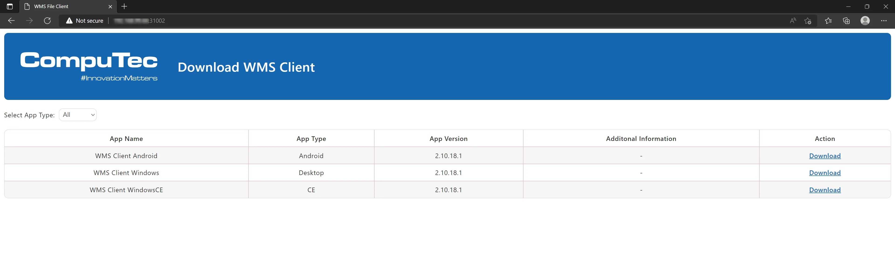

# CompuTec WMS Client Download

This guide will walk you through the steps to download and install the CompuTec WMS Client on your preferred device.

---

With the release of CompuTec WMS 2.10.8 R1 and later versions, downloading CompuTec WMS Client files has become easier and more accessible. Whether you're using a PC, handheld device, or Android device, the process is streamlined, making it faster to get your WMS Client files onto your preferred device. Here's how you can download the required files directly from your CompuTec WMS Server.

## Instructions

To begin, ensure that you have CompuTec WMS Server installed on your system, version 2.10.8 R1 or later. Once installed, follow these simple steps:

1. On the end device (e.g., PC, handheld device, Android device), open an internet browser.
2. Enter the following URL in the address bar: `http://[CompuTec WMS server address]:31002`. Make sure to replace [CompuTec WMS server address] with the actual address of your CompuTec WMS Server.
This will redirect you to the download page where you can easily download the required client files directly to your device.

    

    :::note
    You can download a required Client file directly to the device from [here](https://learn.computec.one/docs/wms/releases/download).
    :::

---
The new download method introduced with CompuTec WMS 2.10.8 R1 provides a more convenient way to access WMS Client files. Ensure that your WMS Server is correctly configured and enjoy the enhanced accessibility.
