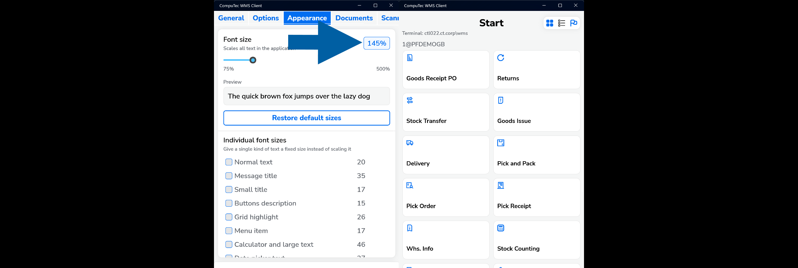
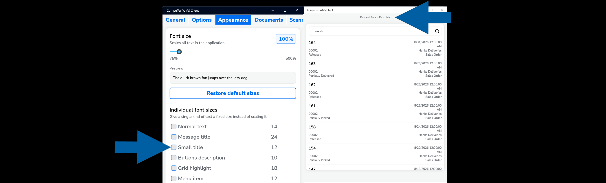
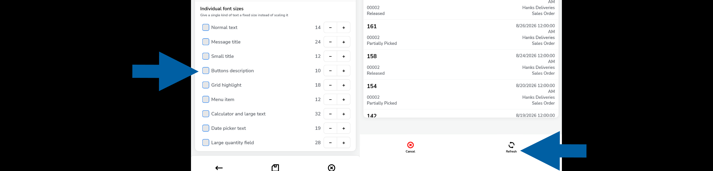
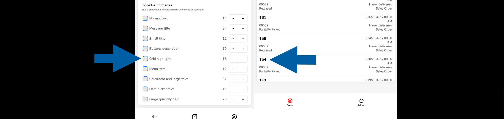
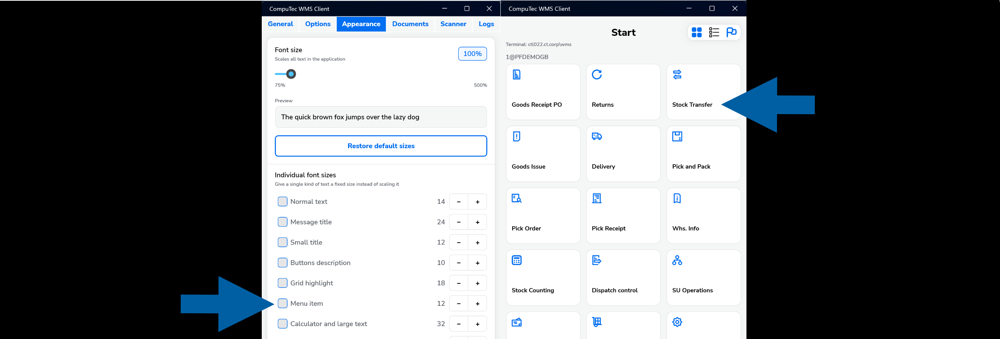
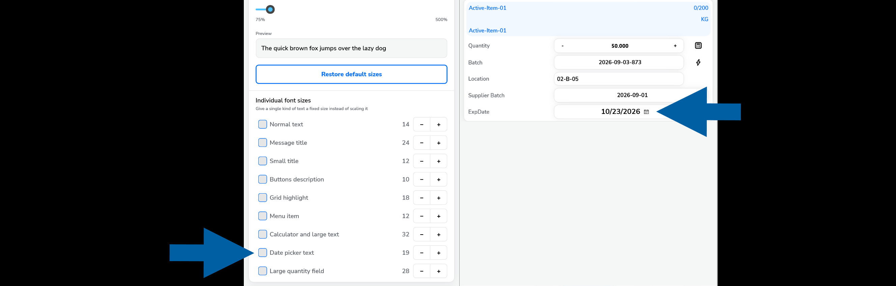
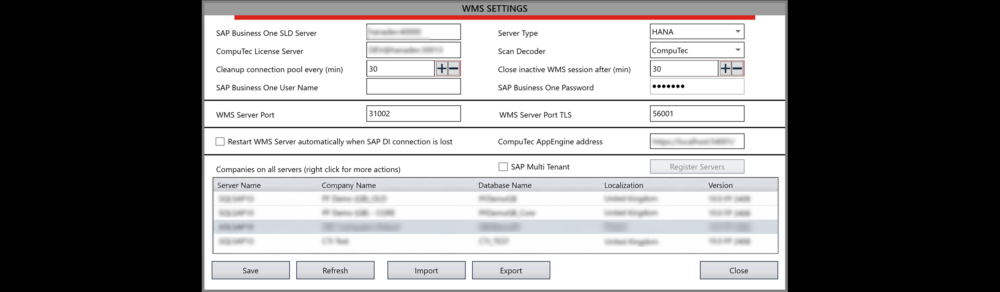
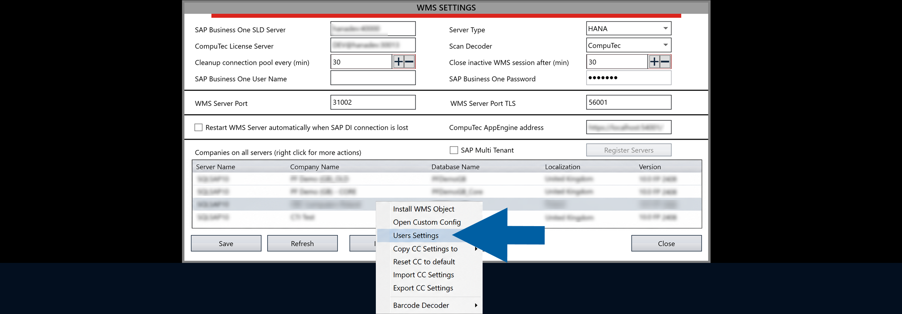
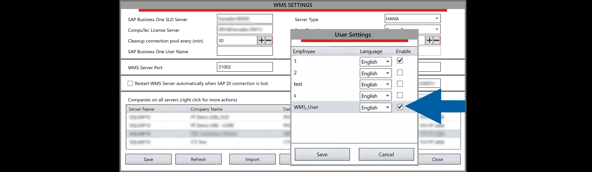

# Configure CompuTec WMS Client

**CompuTec WMS Client** connects warehouse users to **CompuTec WMS Server** and provides access to warehouse operations.

Before logging in for the first time, configure the connection to CompuTec WMS Server and review the client settings.

In **CompuTec WMS Client**, you can configure connection details, printers, scales, interface behavior, document settings, scanner settings, and logs.

## Before you start

Make sure **CompuTec WMS Server** is installed and configured.

:::note[info]
For more information, see [CompuTec WMS Server](/docs/wms/administrator-guide/installation/wms-server/overview.).
:::

## Start CompuTec WMS Client

1. Start the desktop version of **CompuTec WMS Client** from the Windows program list or run `CompuTec.Client.Desktop.exe` from the CompuTec WMS Client installation folder.

    

2. On the login screen, click the **settings icon**.

    

    :::info[note]
    When you start CompuTec WMS Client **for the first time**, configure the connection to CompuTec WMS Server **before logging in**. [Read more](/docs/wms/administrator-guide/installation/wms-server/overview).
    :::

3. Configure the required settings using the following tabs

    - **General**
    - **Options**
    - **Appearance**
    - **Documents**
    - **Scanner**
    - **Logs**

    

## Configure CompuTec WMS Client general settings

Use the **General** tab to configure the connection to CompuTec WMS Server and select the company, printer, and weight scale.

Configure the following settings as required:

- **WMS Server** – Enter the address and port of the CompuTec WMS Server. The address and port must match the CompuTec WMS Server configuration.
- **Company name** – Select the SAP Business One company database that you want to use.
- **Printer name** – Select the printer that CompuTec WMS Client will use for printing. [Read more](/docs/wms/administrator-guide/custom-configuration/custom-configuration-functions/common)
- **Scale** – Enable this option if you want to use a weight scale, and then select the required scale. [Read more](/docs/wms/user-guide/weight-scales/overview)

### Review client and server information

Click the **information (i) icon** on the **General** tab to review information about the current client and server configuration.

The displayed information includes:

- Server Name
- Company Name
- Database Name
- Server Version
- Client Version
- Terminal ID

:::info[note]
On **Android**, tapping **Client Version** twice can also be used when overwriting a client version. [Read more](/docs/wms/administrator-guide/installation/wms-client/computec-wms-android-version#overwriting-a-client-version)
:::

### Test the server connection

Click **Connection test** to verify the connection between CompuTec WMS Client and CompuTec WMS Server.

## Configure CompuTec WMS Client options

Use the **Options** tab to configure the behavior and appearance of CompuTec WMS Client.

Depending on the client, the following options are available:

- **Enable telemetry (not configured on server)** – Enables the collection of telemetry data when telemetry is configured on the server.
- **Large menu icons** – Displays larger icons in the main menu.
- **Open in full screen** – Opens CompuTec WMS Client in full-screen mode.
- **Large transaction label** – Displays a larger transaction label.
- **Auto focus on quantity field** – Automatically moves the focus to the quantity field when quantity input is required.
- **Disable formatting on quantity field** – Disables formatting in the quantity field.
- **Bigger quantity field** – Displays a larger quantity field.
- **Enable editable date control** – Enables editing of the date control.
- **Enable alternate picker control** – Enables the alternate picker control.
- **Highlight last edited row** – Highlights the row that was edited most recently.
- **Auto-scroll to scanned item** – Automatically scrolls to the scanned item.
- **Disable activity indicator** – Disables the activity indicator.
- **Disable progress bar** – Disables the progress bar.
- **Disable software keyboard** – Prevents the software keyboard from being displayed.
- **Show new Success message** – Displays a full-screen confirmation after a document is created successfully. When this option is enabled, use **Visible for (seconds)** to specify how long the confirmation remains on the screen.

:::info[note]
Available options can differ between the desktop and Android versions of CompuTec WMS Client.
:::

### Configure success messages

By default, CompuTec WMS Client displays a standard confirmation message after a document is created successfully.

To configure a new full-screen success message, follow these steps:

1. On the **Options** tab, select **Show new Success message**.
2. In **Visible for (seconds)**, enter how long the message should remain on the screen.

    

3. Click **Save**.

After a document is created successfully, the full-screen confirmation displays the document type and document number.

The message closes automatically after the configured time. To close it earlier, tap or click anywhere on the screen.

:::note[info]

This setting changes only success messages. Error messages continue to be displayed in the existing format.

:::

{/*
Show buttons focus – highlight the buttons focused on

Use global settings –

Full screen – full-screen version of the main menu form

Full screen for login panel – full screen mode for the login panel (even if the screenshot mode is set for the application, the log-in panel has a fixed size, which may lead to the display of an unconventionally small log-in panel on some devices)
*/}

## Configure appearance settings

Use the **Appearance** tab to adjust text sizes in CompuTec WMS Client. You can scale all text in the application or set a specific size for individual types of text.

### Scale all text

Use **Font size** to scale text throughout CompuTec WMS Client.

1. Move the **Font size** slider to the required value.

   The available range is from **75%** to **500%**.

   

2. Review the **Preview** to see how the selected scale affects text.

3. Click **Save** to apply the changes.

    

4. The selected scale is applied to text throughout the application.

    

### Set individual font sizes

You can override the general font scaling for specific types of text.

The following text types can be configured individually:

- **Normal text**
- **Message title**
- **Small title**
    
- **Buttons description**
    
- **Grid highlight**
    
- **Menu item**
    
- **Calculator and large text**
- **Date picker text**
    
- **Large quantity field**

To set an individual font size:

1. Select the checkbox next to the text type that you want to configure.

    

2. Use the **minus (-)** or **plus (+)** button to adjust its font size.
3. Click **Save**.

    

The selected text type uses the specified font size instead of the general font scaling.

### Restore the default font sizes

Click **Restore default sizes** to restore the default font size settings.

## Configure document settings

Use the **Documents** tab to configure warehouse selection for individual transaction types.

Select the checkbox for a transaction if users should select a warehouse when processing that transaction.

If you want to use a default warehouse instead, clear the checkbox for the required transaction and specify the warehouse.

:::note[info]
For more information, see [Client Settings – Warehouses](../user-guide/client-settings-warehouses/overview).
:::

## Configure scanner settings

Use the **Scanner** tab to configure barcode scanner behavior in CompuTec WMS Client.

The following settings are available:

- **Scanner Prefix**: Defines the value expected at the beginning of scanned barcode data. For example, 2 – This means the system will expect scanned data to begin with this prefix.
- **Scanner Suffix**: Defines the value expected at the end of scanned barcode data. For example, 3 – The system will expect the scan to end with this value.
- **Scanner Group Separator**: Defines the ASCII character used to separate groups of data in a scanned value. For example, ASCII `29` is the Group Separator (GS) character commonly used in GS1 barcodes.
- **Enable scanner log (Checkbox)**: Enables logging of scanner activity. Use this option when you need additional information to investigate scanner input or scanning problems.

## Logs tab

Use the **Logs** tab to access and manage log files generated by CompuTec WMS Client.

The following actions are available:

- **Share log** – Shares the selected log file using the sharing options available on the device.
- **Send to server** – Sends the selected log file to CompuTec WMS Server.

By default, client logs sent to the server are stored in:

`C:\ProgramData\CompuTec\CompuTec WMS\Server\Logs\ClientLogs\XXXXXXXX-XXXX-XXXX-XXXX-XXXXXXXXXXXX`

`XXXXXXXX-XXXX-XXXX-XXXX-XXXXXXXXXXXX` represents the unique ID of the device.

## Save the client settings

After configuring the required settings, click **Save** to save the configuration and return to the login screen.

To return without saving your changes, click **Cancel**.

:::warning[Important]
After the first installation of CompuTec WMS Client, open the settings and click **Save**, even if you do not make any changes. This creates the configuration file required by the application.
:::

## Log in to CompuTec WMS Client

After configuring the client, log in to start working with CompuTec WMS.

1. On the login screen, select the required **Company name**.

    

2. Enter the terminal username and password.
    If a barcode is assigned to the terminal user, you can scan the barcode to log in.

    :::note[info]
    For information about creating terminal users and licensing, see [CompuTec WMS Licensing](../administrator-guide/installation/wms-licensing).
    :::

3. Click **Log in**.

### Grant a user access to a company database

Users must have access to the required company database. To grant an access, follow these steps:

1. Open **CompuTec WMS Settings**.

    

2. Right-click the required database and select **User Settings**.

    

3. Select the users who should have access to the database.

    

After a successful login, the CompuTec WMS Client main menu appears.

## Review Pick List notifications

The **Notification Center** displays informational messages and errors related to Pick Lists. Messages are displayed in the Notification Center instead of interrupting users while they work with Pick Lists.

To review notifications:

1. Go to the main screen of **CompuTec WMS Client**.
2. Click the **Notification Center** icon in the upper-right corner.

    

3. Review the available messages and errors.

:::info[note]

The **Notification Center icon** is available on the main screen of CompuTec WMS Client. It is not displayed when you open a Pick List.

Notifications displayed in the Notification Center are based on entries in the `@CT_WMS_ONOT` table related to Pick Lists.
:::
