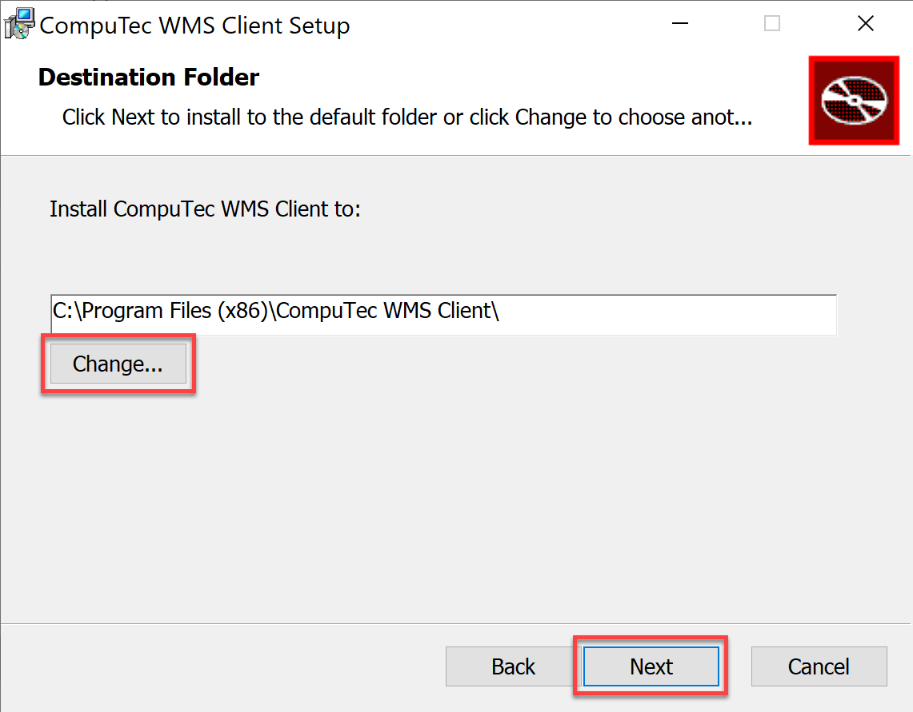

# CompuTec WMS Desktop Client

This guide provides a detailed, step-by-step process to help you install the CompuTec WMS Desktop Client on your computer.

:::note
    Before installing the desktop client, ensure that you have already installed the CompuTec WMS server on your system.
:::

---

## Installation Steps

1. To begin the installation, download the CompuTec WMS desktop client installation file. – you can find the download link [here](../../../releases/download.md) or or you may download it directly to your end device (click [here](../../../releases/download.md) to find out more).
2. Once the installation file is downloaded, run the file to begin the setup. A window will appear with a message about installation preparation. Click the "Next" button after reading the instructions.

    
3. A new window will prompt you to select an installation destination folder. The default location is: `C:\Program Files (x86)\CompuTec\CompuTec WMS Client`. If you prefer a different location, you can modify the path by typing in a new one or browsing existing folders by clicking the "Change..." button. After choosing the desired location, click "Next".

    
4. In the following window, click the "Install" button to begin the installation process.

    

5. After the installation is complete, a message will appear confirming the setup. Click the "Finish" button to close the installer.

    
6. Once the installation is complete, the CompuTec WMS Desktop Client is ready to run. You can now start the application by clicking the shortcut created in your Windows program list.

---
