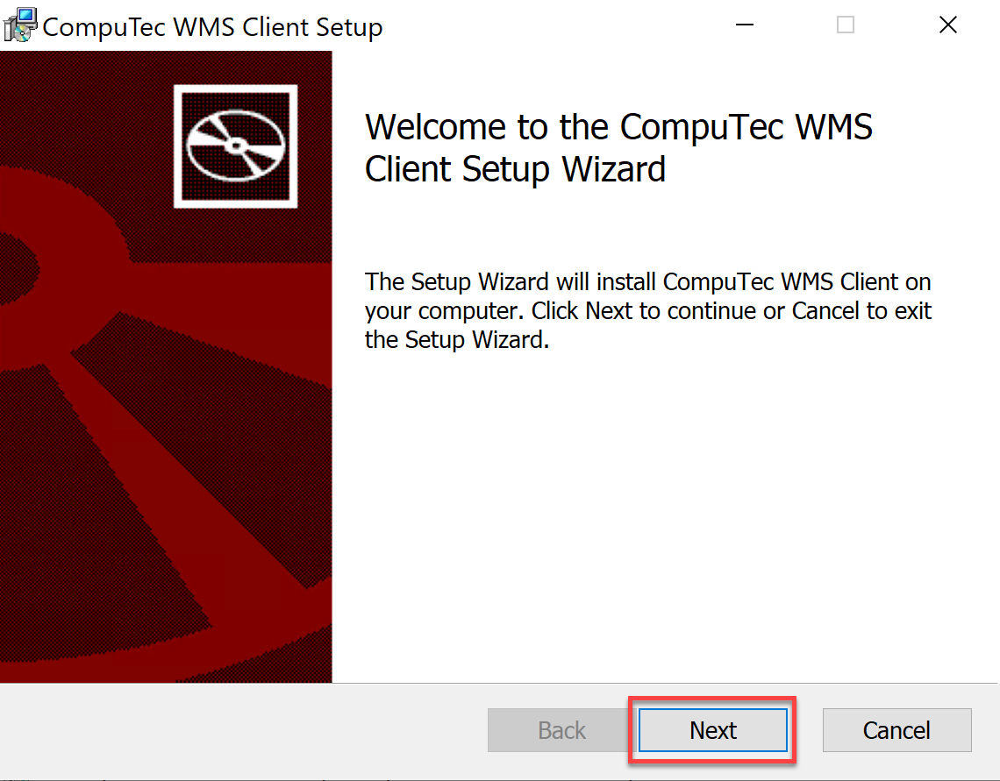
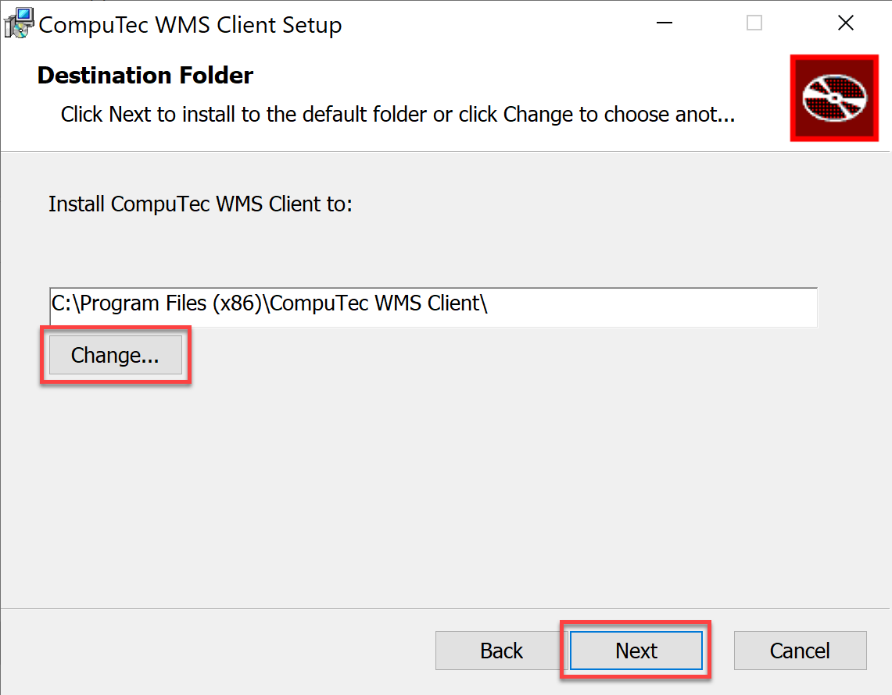
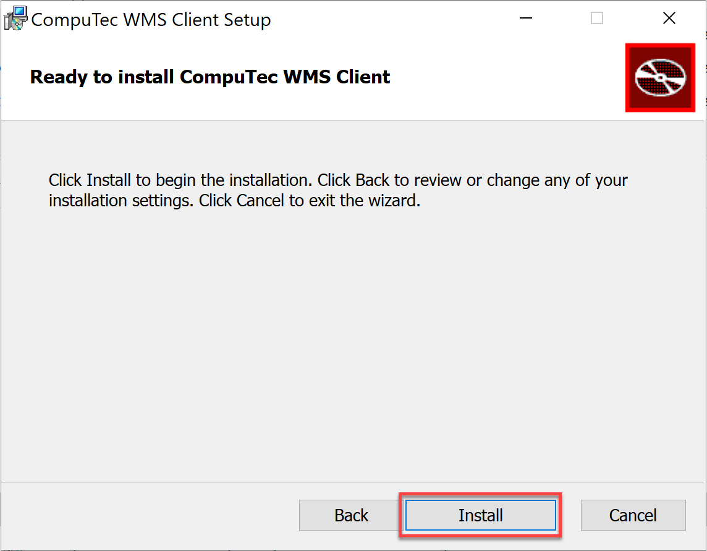
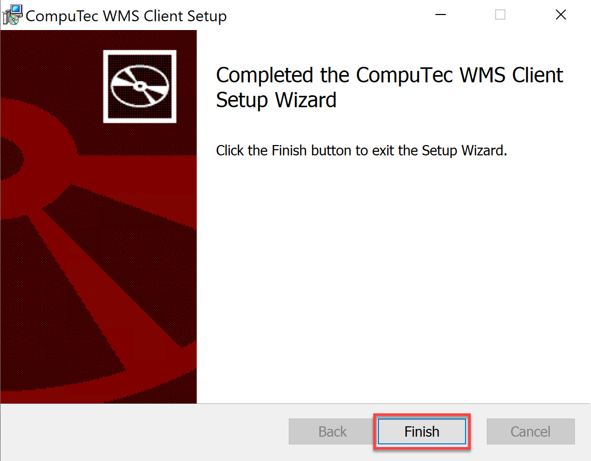

# WMS Desktop Client

This document provides a step-by-step guide on how to install the CompuTec WMS desktop client.

:::danger
    To run the CompuTec WMS desktop client on your computer, you must first install the CompuTec WMS server.
:::

---

1. To install the CompuTec WMS desktop client, download and run its installation file – you can find it [here](../../releases/download.md) or download it directly to your end device (click [here](../../releases/download.md) to find out more).
2. In the window that appears, click the "Next" button after reading the message about installation preparation:

    
3. A window with an installation destination folder path will appear. The default path is "C:\Program Files (x86)\CompuTec\CompuTec WMS Client\". You can change the path by typing in a new one or by browsing existing folders by clicking the "Change…" button. Click the "Next" button:

    
4. A new window appears. Click the "Install" button to start the installation.

    

5. After reading the message, click the "Finish" button to complete the installation:

    
6. Service is ready to run. You can start it by clicking the shortcut created in the Windows program list.
