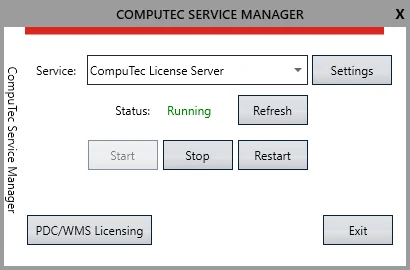
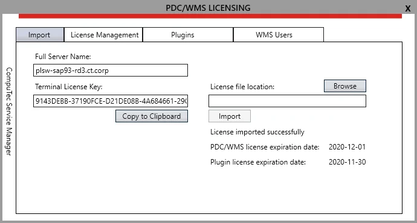
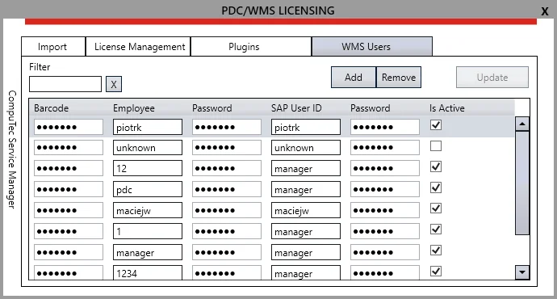
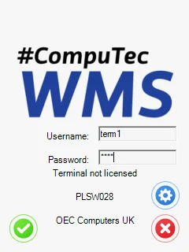
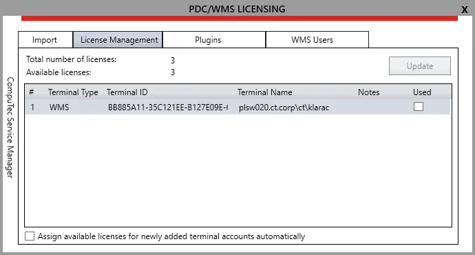
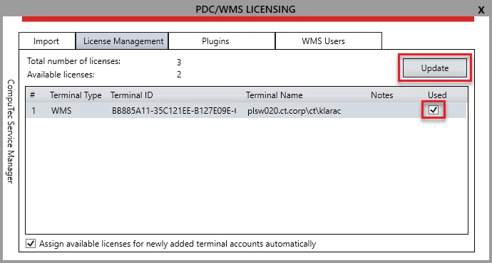
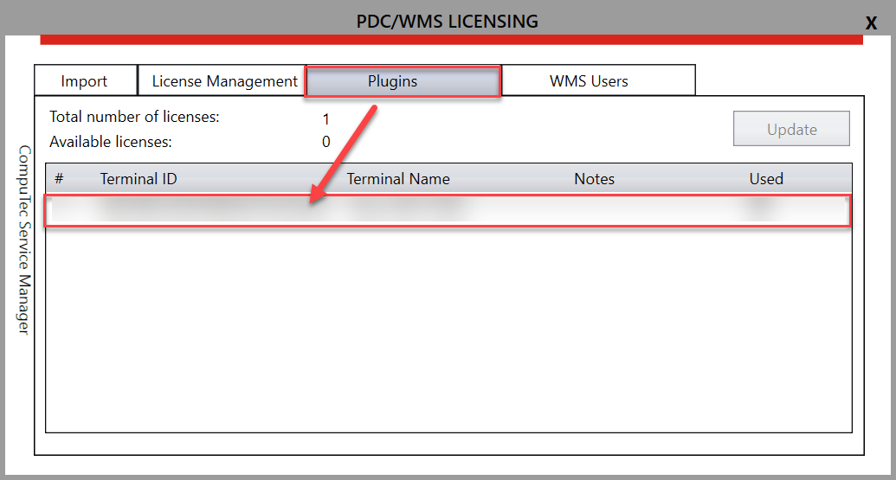

# WMS Licensing

WMS (Warehouse Management System) licensing is structured around server and terminal licenses. This guide provides an overview of the necessary licensing processes to ensure the legal operation of the WMS application.

---

## License Loading and Assigning

1. To begin, open the **CompuTec Service Manager** by selecting its shortcut in the Program list. The CompuTec icon will appear in the system tray; click it to open the application.

2. When you install the **CompuTec WMS Server** application, the service is automatically activated. If the service is not running, you can select it from the dropdown menu and click the **Start** button.

    

3.Click **PDC/WMS Licensing** under the licensing section to configure server/terminal licenses.

    

4. Click on the **Import** tab to set license details.
5. In the **Browse** field, enter the file path or browse for the license file. To obtain a license file, create a license request ticket via the **CompuTec Support Portal**. Select '**License request**' from the **Component/s** dropdown list. The following information must be enclosed on the ticket:

    - **Server Name**
    - **Terminal License Key** – the number generated automatically (click the "Copy" button to copy the value to your clipboard).
    - **Desired Number of Terminals**
    - **Purpose**: Specify whether it’s for customer or partner use (e.g., demo/test purposes).
6. After submitting the ticket, you will receive a license file, which you can then import by clicking the **Import** button.
7. Once the license file is imported, you will receive one of the following messages:

    - **License appears to be valid** – The license was successfully loaded.
    - **License appears to be invalid** – The loaded license file is invalid.
    - **License not found** – The file does not contain a valid license.
8. Following the receipt of the '**License appears to be valid**' confirmation, the system will display the remaining days of validity.

---

## Setting Up Users for WMS

To use the WMS system, terminal users must be set up and assigned to SAP Business One users. Follow these steps:

1. Go to the **WMS Users** tab.

    
2. To add a new terminal user, click the **Add** button. A new row will appear.

3. In the **WMS Users tab**, you can configure the following columns:

    1. **Barcode** – Define a barcode for the user. Scanning this barcode will log the user into WMS.
    2. **Employee** – Username for the terminal user, used to log in to WMS.
    3. **Password** – Password for the terminal user to log in.
    4. **SAP User ID** – The SAP user associated with the terminal user (many terminal users can be assigned to the same SAP User). Changes made and recorded during work with WMS are recorded in the SAP database through this user. Ensure the SAP user has at least an **Indirect Access License**.
    5. **SAP Password** – The corresponding password for the SAP user.
    6. **Is Active check box** – Check this box to activate the terminal user account.

4. Once data is entered, click **Update** to save the new user details.

5. To remove a user, click the corresponding row and then click **Remove**.
You can assign multiple terminal users to a single SAP user.

6. Attempt to log in to the WMS client using the terminal user credentials. If the license is not yet assigned, you will receive the message: **Terminal is not licensed**.

    

---

## Assigning Terminal Licenses

To connect a terminal to the WMS client and license server, follow these steps:

1. Restart CompuTec Service Manager. The terminal will appear under the **Manage Licenses** tab in **Terminal Licensing**.

    

2. In the **License Management** section, check the option to **Assign licenses automatically**. This will automatically assign a license to new terminals if a free license is available.

3. The following information is shown:

    - **Total Number of Licenses** – Total licenses loaded from the file.
    - **Available Licenses** – Licenses not assigned to any terminal.

4. Select the desired terminal from the list, check the box to assign the license, and click **Update**. Note that the "Number of Available Licenses" decreases after this action, as one of the licenses will be in use/assigned.

    

---

## Plugin Configuration

1. Go to the Plugins tab and update the new row that represents **CompuTec WMS Server**.

    
2. Restart **CompuTec WMS** and **CompuTec License Server**.

Now, the license is successfully assigned to the server and terminal, allowing the system to function.

## License Disconnection

License validity is checked every 10 minutes. If the license is disconnected or becomes invalid (e.g., due to a network issue with the CompuTec License Server), the application will continue working for up to 10 minutes.

If the license is lost (e.g., because of connection to CompuTec License Server interruption), go to the **PDC/WMS Licensing form** (see the screenshot above), check a checkbox in the **Used** column, and click **Update**. After re-logging into the application, you can continue with the transaction where you left off.

---

This concludes the licensing process for CompuTec WMS. Ensure that all terminals are licensed and assigned properly for smooth operation.
