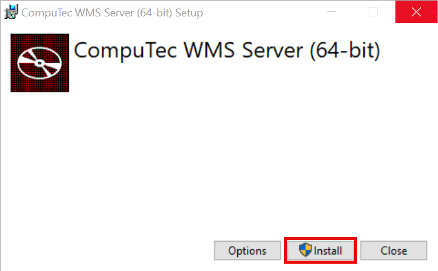
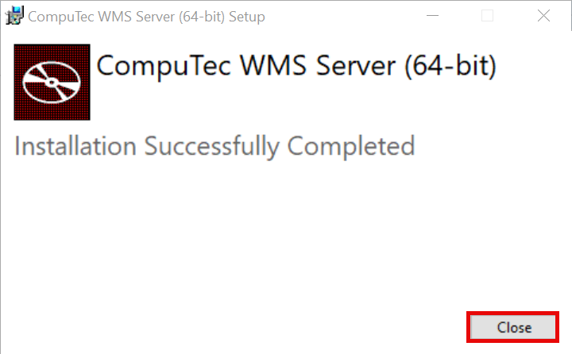
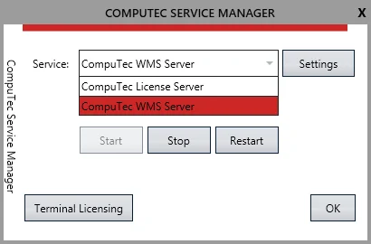
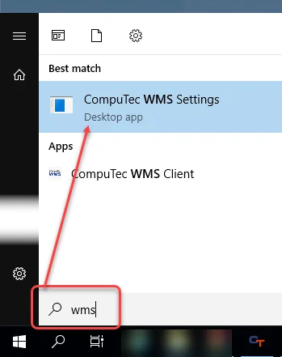
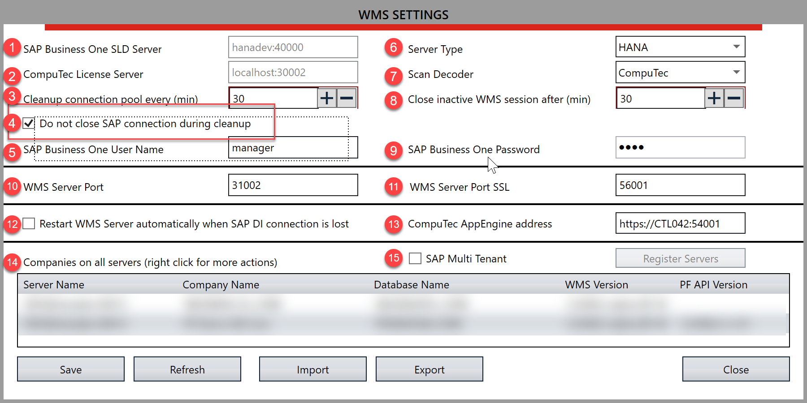

# Overview

This document provides a step-by-step guide for installing the CompuTec WMS Server, along with essential system environment requirements.

:::danger
    Important: Ensure all system [requirements](../../installation/requirements.md) are met before starting the installation process.
:::

---

## CompuTec WMS Installation Requirements

To use the CompuTec WMS desktop version, you must install both the server and client modules. To install, follow the steps below:

1. To install the server, download and run its installation file. You can find it [here](../../../releases/download.md)

    :::caution
        If the CompuTec WMS Server is already installed on this computer, you can access the setup by running the `CompuTecWMSServer.msi file`. This allows you to change, repair, or remove the installation.
    :::
2. In the setup window, click **Install**.

    
3. An installation progress screen will appear, followed by a system message confirming successful setup. Click **Close** to exit the installer.

    
4. From the Windows Start menu, open **CompuTec Service Manager**. The CT icon will appear in the system tray.
5. Click on the CT icon, and select **CompuTec WMS Server** from the service drop-down list.

    
6. Click **Settings** to open the WMS Settings screen. Alternatively, access this screen from the Start Menu.

    

    :::danger
       To access the WMS Settings screen via the Start menu, ensure you run it with Administrator privileges; otherwise, an error may occur when attempting to save changes.
    :::
7. Enter the required details:

    

    1. **Server Name** - This should match the server name defined in the SAP Business One System Landscape Directory. (Default port for SAP HANA: **40000**)
    2. **License Server Name/Address** - Enter the license server name/address. (Default port for SAP HANA: **30002**)
    3. **Cleanup connection pool every (min)** - A connection pool is a cache of connections to a database. Set the interval (in minutes) for clearing the connection pool. It is created so that the connections can be reused during future requests to the database.
    4. **SAP Business One User Name**.
    5. **Server Type** - Select either HANA or MSSQL 20XX.
    6. **Barcode Decoding Type**:

        - **CompuTec** – CompuTec WMS adapted GS1 standard. Click [here](../../barcode-scanning/overview.md#gs1-standard---computec-decoder) to find out more
        - **Odette** – Odette standard. Click [here](../../barcode-scanning/overview.md#odette-standard) to find out more.
        - **Custom** – Barcode interpreter without prefixes and with custom ones.  Click [here](../../barcode-scanning/overview.md#gs1-standard---computec-decoder) to find out more.
    7. Close inactive WMS session after (min) Time, after which a user is logged out from CompuTec WMS (in minutes).
    8. SAP Business One Password.
    9. WMS Server Port.
    10. Related to SSL connection. Click [here](ssl-connection.md) to find out more about SSL connection.
    11. Checking this option restarts a good service on losing CompuTec WMS to SAP Business One or a database connection. The option requires further setting up to be available to use.
        

        
Click here to find out more

        

            Setting up an automatic CompuTec WMS Server restart in case of its crash:

            - Run Custom Configuration.
            - Go to the Common tab and check the Stop WMS Server when the ‘Company/database connection is lost’ checkbox and save changes.
            - Run Services (a Windows app).
            - Find CompuTEc WMS Server service, right-click, and choose Properties.
            - Go to the Recovery tab.
            - Set ‘Restart the Service’ for the ‘First failure,’ ‘Second failure,’ and ‘Third failure’ fields.
            - Set ‘0’ for the ‘Restart fail count after’ and ‘Restart service after’ fields.
            - Click ‘Apply.’
        

        

    12. CompuTec AppEngine address.
    13. Companies on all servers. **Right-click on a specific company row to get to its context menu**. The following options are available:

        1. **Install WMS Objects** - Select this option to install the CompuTec WMS objects (tables, fields) needed for the application to function correctly in the database. **This step must be completed before starting to use CompuTec WMS**. Click the option, enter the database credentials, and begin the installation process. Note that the installation procedure differs slightly when setting up a new database in the HANA version. For more details, check here. Click this option to install to the database CompuTec WMS objects (tables, fields) required for the application's good work. **This procedure is necessary to be performed before starting work with CompuTec WMS**. Click the option and put in database credentials to start the procedure. The object installation procedure is slightly different when using a new database in the HANA version. You can check it out [here](../../../faq/faqs.md#cannot-install-computec-wms-objects-to-a-database)
        2. **Open Custom Config**. It leads to [Custom Configuration options](../../custom-configuration/overview.md).
        3. **User Settings**. Here, you can enable a user for a specific database and set a language version per user. **Enabling a user here is required to work with CompuTec WMS by this user**.
        4. **Copy CC Settings to**. This allows copying the Custom Configuration option setup for one database to another in the same environment.
        5. **Reset CC to default**. Choosing this option erases all changes made to Custom Configuration for this database. The settings are reversed to the default state.
        6. **Import CC Settings/Export CC Settings**. Use the export option to export the CC Settings to a file. You can then use the import option to import it, e.g., on another server.
        7. **Barcode Decoder - Export/Import Decoder Settings**. You can export and import [Barcode Decoder settings](../../../user-guide/custom-decoder.md) the values set in Decoder Definition [here](../../../user-guide/custom-decoder.md#decoder-definitions).
    14. Check this option to operate with the SAP Multi-Tenant option. After checking the option, click Register Servers. In the new form, click the last (empty) row, enter the server's IP address in Multi-Tenant, check its checkbox, and click Save.
8. Click the Update button. Service will be up and running, ready to work with.

## CompuTec WMS Server Automatic Restart

Restarting the CompuTec Server WMS service at least once every 24 hours is required to make it work properly. Use **Windows Task Scheduler** to automate this (it is not a bug; it is just IT system specific).

1. **Task 1 - Stop CompuTec WMS Server**
    - Trigger set for a specific time every day.
2. **Task 2 -    1. Actions: Start CompuTec WMS Server**
   - Schedule this task to start the WMS server shortly after the stop task (e.g., 15 seconds later). Due to SAP Business One’s RAM usage, a daily restart is recommended.

For more detailed instructions, refer to the[video guide](https://www.youtube.com/watch?v=O3K-E4Y0WU4).
