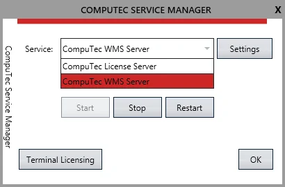
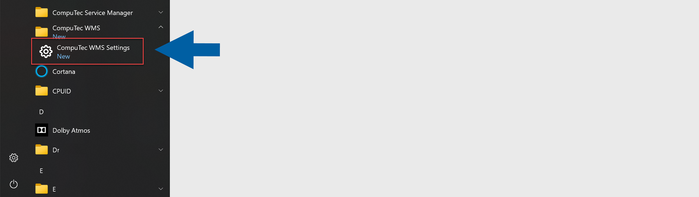
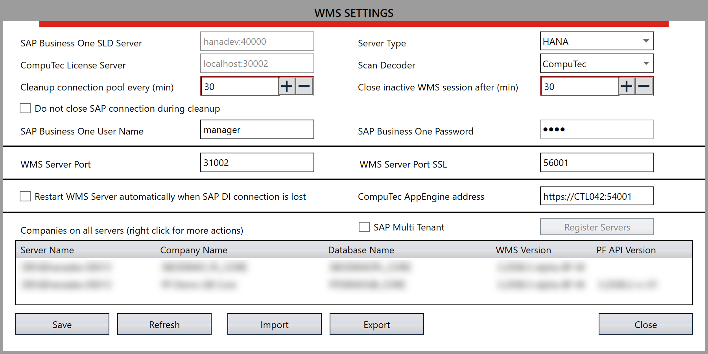

# Overview

This document provides a step-by-step guide for installing the CompuTec WMS Server and (from version 3.2602 Core) the WMS Settings module only, along with the required system environment.

:::caution[important]
    Please ensure all system [requirements](../../installation/requirements.md) are met before starting the installation process.
:::

## CompuTec WMS Installation Requirements

To use the CompuTec WMS desktop version, you must install both the server and client modules.

### Before you start:

- Download and run the **WMS Server installation file**. You can find it [here](../../../releases/download.md).

:::info
If the **CompuTec WMS Server** is already installed on this computer, you can access the setup by running the **CompuTecWMSServer.msi** file. This allows you to change, repair, or remove the installation.
:::

## Install CompuTec WMS Server

To install **CompuTec WMS Server**, follow these steps:

1. After downloading and running [**the installation file**](../../../releases/download.md), click **Next** in the setup window.

    

2. Choose the setup type. You can choose **Typical**, **Custom** or **Complete** installation type, and click **Next**.

    

3. An installation progress screen will appear, followed by a system message confirming successful setup. 

4. Click **Finish** to exit the installer.

    

5. From the Windows Start menu, open "CompuTec Service Manager". The CT icon will appear in the system tray.

6. In the Service Manager, select CompuTec WMS Server from the service dropdown.

    

7. Click "Settings" to open the CompuTec WMS Settings screen. Alternatively, access this screen from the Start Menu.

    

    :::caution[important]
       To access **WMS Settings** from the **Start Menu**, run it **as Administrator**. Otherwise, saving changes may result in an error.
    :::

8. Enter the required details:

    
    

    
Click here to check the required details

    

    1. Server Name: This should match the server name defined in the SAP Business One System Landscape Directory. (Default port for SAP HANA: 40000)
    2. License Server Name/Address: Enter the license server name/address. (Default port for SAP HANA: 30002)
    3. Cleanup connection pool every (min): A connection pool is a cache of connections to a database. Set the interval (in minutes) for clearing the connection pool. It is created so that the connections can be reused during future requests to the database.
    4. Do not close SAP connection during cleanup: The connection to SAP will not be closed during cleanup.
    5. SAP Business One User Name: Enter the User Name.
    6. Server Type: Select either HANA or MSSQL 20XX.
    7. Barcode Decoding Type: Here, you can select the barcode decoding type:
        - **CompuTec**: CompuTec WMS adapted GS1 standard. Click [here](../../barcode-scanning/overview.md#gs1-barcode-standard---computec-decoder) to find out more
        - **Odette**: Odette standard. Click [here](../../barcode-scanning/overview.md#odette-standard) to find out more.
        - **Custom**: Barcode interpreter without prefixes and with custom ones.  Click [here](../../barcode-scanning/overview.md#gs1-barcode-standard---computec-decoder) to find out more.
    8. Close inactive CompuTec WMS session after (min): Time after which a user is logged out from CompuTec WMS (in minutes).
    9. SAP Business One Password: Enter the SAP Business One Password.
    10. WMS Server Port: Enter the server port.
    11. WMS Server Port TLS: Click [here](tls-connection.md) to find out more about SSL connection.
    12. Restart WMS Server automatically when SAP DI connection is lost: Checking this option restarts a good service on losing CompuTec WMS to SAP Business One or a database connection. The option requires further setting up to be available to use.
        

        
Click here to find out more

        

            Setting up an automatic CompuTec WMS Server restart in case of its crash:

            - Run Custom Configuration.
            - Go to the Common tab and check the Stop CompuTec WMS Server when the ‘Company/database connection is lost’ checkbox and save changes.
            - Run Windows Services.
            - Find CompuTec WMS Server service, right-click, and choose Properties.
            - Go to the Recovery tab.
            - Set ‘Restart the Service’ for the ‘First failure,’ ‘Second failure,’ and ‘Third failure’ fields.
            - Set ‘0’ for the ‘Restart fail count after’ and ‘Restart service after’ fields.
            - Click ‘Apply.’
        

        

    13. CompuTec AppEngine address: Enter the CompuTec AppEngine Address.
    14. Company-Specific Configuration Options:
    For each company on the server, right-click a company row to access additional configuration options
        1. **Install WMS Objects** - Select this option to install the CompuTec WMS objects (tables, fields) needed for the application to function correctly in the database. **This step must be completed before starting to use CompuTec WMS**. Click the option, enter the database credentials, and begin the installation process. Note: The process may vary slightly for new databases on HANA. For more details, check [here](../../../faq/faqs.md#cannot-install-computec-wms-objects-to-a-database).
        2. **Open Custom Config** - It leads to [Custom Configuration options](../../custom-configuration/overview.md).
        3. **User Settings** - In this section, you can enable a user for a specific database and set their language preference. This step is necessary for the user to work with CompuTec WMS.
        4. **Copy CC Settings to** - Copies configuration from one database to another in the same environment.
        5. **Reset CC to default** - Reverts all custom settings for the database to default.
        6. **Import CC Settings/Export CC Settings** - Export or import configuration settings to a file for easy transfer to another server.
        7. **Barcode Decoder - Export/Import Decoder Settings**. Export or import [Barcode Decoder settings](../../../user-guide/custom-decoder.md) as needed. Click [here](../../../user-guide/custom-decoder.md#decoder-definitions) to check the values set in Decoder Definition.
    15. SAP Multi-Tenant: Check this option to operate with the SAP Multi-Tenant option. After checking the option, click Register Servers. In the new form, click the last (empty) row, enter the server's IP address in Multi-Tenant, check its checkbox, and click Save.
    

    

9. Click **Update** to apply changes. The service will start, and the system will be ready for use.

10. Done! You've successfully installed **CompuTec WMS Server**.

## Install WMS Settings Only

From version **3.2602 (Core)**, it is possible to install **WMS Settings** only, without installing the **WMS Server** service.

This option is useful when:

- You need access to **WMS Settings** and **Custom Configuration**
- The **WMS Server** is installed on a different machine
- You want administrative access without running the server locally

:::info[note]

- This installation is possible only for **Core** version, available **from version 3.2602**.  
- During installation, select the appropriate option to install only the **WMS Settings** component.  
- The installed **WMS Settings** version must match the version of the **WMS Server**.

:::

To install **WMS Settings** only, follow these steps:

1. After downloading and running [**the installation file**](../../../releases/download.md), click **Next** in the setup window.

    

2. Choose the **Custom** setup type, and click **Next**.

    

3. By default, all installation components are selected. To install only the **WMS Settings**, clear all checkboxes and leave only **WMS Settings** selected.

    

4. An installation progress screen will appear, followed by a system message confirming successful setup. 

5. Click **Finish** to exit the installer.

    

6. Done! Now you can find **WMS Settings** in the list of installed programs.

    

     :::caution[important]
       To access **WMS Settings** from the **Start Menu**, run it **as Administrator**. Otherwise, saving changes may result in an error.
    :::

## CompuTec WMS Server Automatic Restart

Restarting the CompuTec Server WMS service at least once every 24 hours is required to make it work properly. Use "Windows Task Scheduler" to automate this (it is not a bug; it is just IT system specific).

1. **Task 1** - Stop CompuTec WMS Server
    - Trigger set for a specific time every day.
2. **Task 2** - Start CompuTec WMS Server
   - Schedule this task to start the CompuTec WMS server shortly after the stop task (e.g., 15 seconds later). Due to SAP Business One’s RAM usage, a daily restart is recommended.

:::info[note]
For more detailed instructions, refer to the [video guide](https://www.youtube.com/watch?v=O3K-E4Y0WU4).
:::
