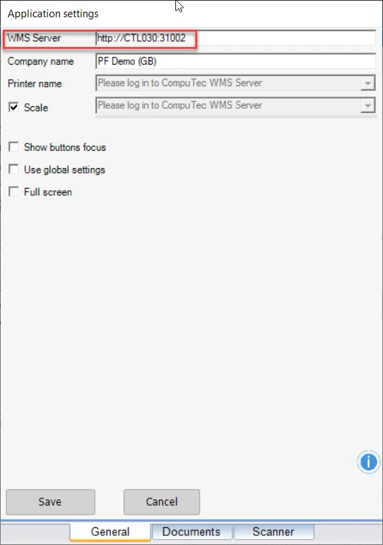
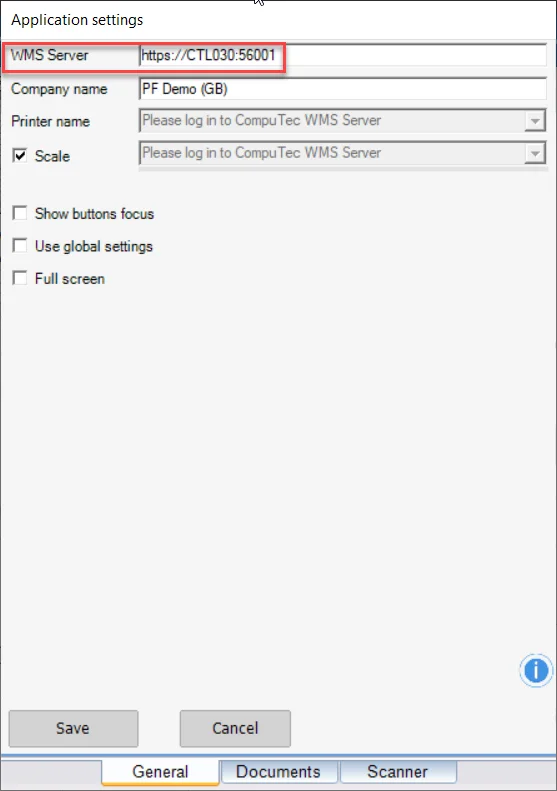

# SSL Connection

CompuTec WMS supports the SSL (Secure Socket Layer) protocol, which ensures secure, encrypted data transfer between clients and servers. SSL operates in a server-client architecture and is designed to verify the server to which the client is connecting, safeguarding the communication channel.

---

## Requirements

To use SSL with CompuTec WMS, the following are required:

    - **CompuTec License Server** - Version 5.10.2.9
    - **SAP Business One Versions** - 9.3 (MS SQL and HANA), 10 (MS SQL and HANA)
    - **Clients Supported** - Windows WMS Client and Windows CE Client
    - **Port Addresses** - SSL and non-SSL connections (The default port for non-SSL usage is 30002)

    

## Usage

In CompuTec WMS Client settings, choose the required port:

1. Without SSL, use the default HTTP settings, with no changes required.

    
2. With SSL, Add 'HTTPS' to the connection and change the port accordingly.

    
3. Ensure that SSL or non-SSL settings are correctly configured on the server. Make the same SSL or non-SSL settings on the mobile device to ensure consistency across devices.

---
