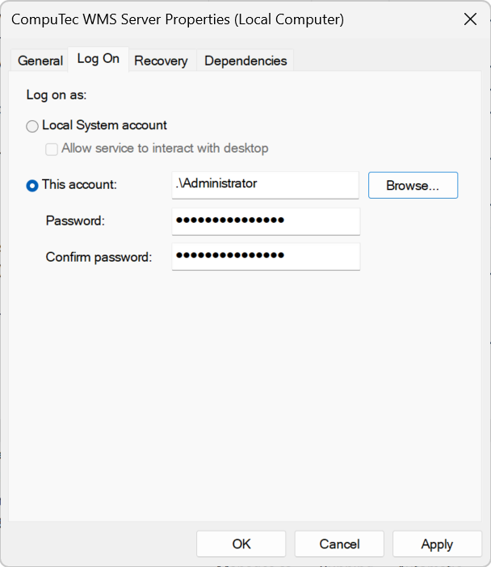

# SSO Configuration

Single Sign-On (SSO) simplifies the login process by allowing users to access multiple systems with a single set of credentials, enhancing security and user convenience. To ensure seamless integration with CompuTec WMS, specific conditions must be met for WMS databases to be displayed when SSO is enabled.

---

## Configuration Details

When SSO is enabled, the WMS databases in the WMS Settings and WMS Client will only appear if the following prerequisites are met:

- The SAP user is mapped to a corresponding domain user.
- The domain user is registered as a logon user under Services → CompuTec WMS Server.

    

---
