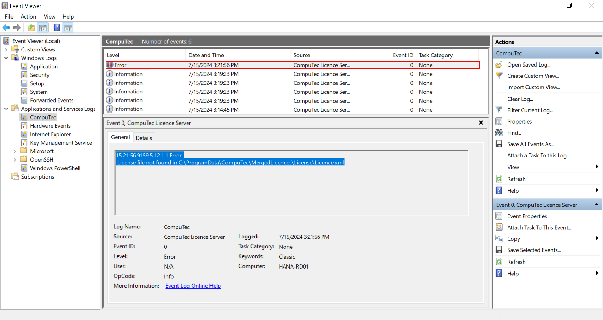

# Log file locations of CompuTec WMS Components

To help diagnose and resolve issues effectively, CompuTec WMS generates log files for its various components. These logs contain detailed records of application activity and errors. When reporting a problem to CompuTec Support, it's helpful to include the relevant log files based on the component involved.

The table below lists the default file paths for each component’s logs:

|            Component             |                                                                  Default path                                                                  |
| :------------------------------: | :--------------------------------------------------------------------------------------------------------------------------------------------: |
|     CompuTec WMS Server logs     |                                                C:\ProgramData\CompuTec\CompuTec WMS\Server\Logs                                                |
| CompuTec WMS Windows Client logs | C:\Users\[username]\AppData\Local\CompuTec\CompuTec WMS\Client\Logs (where the [username] component has to be replaced with a proper username) |
|   CompuTec WMS CE Client logs    |                                              [Device_name]\Program Files\CompuTec WMS 1.0.0\Logs                                               |
|    CompuTec WMS Settings logs    |                                                  C:\ProgramData\CompuTec\ServiceManager\Logs                                                   |
|   CompuTec License Server logs   |                       C:\ProgramData\CompuTec\License Server\Logs C:\ProgramData\CompuTec\License Server\Logs\Terminals                        |

You can check Windows Event Viewer logs if you cannot find adequate files in the above locations.

    

    
Click here to find out more

    

    You can find information about an error in two locations (highlighted in screenshots below):

    

    If there is an error connecting to the CompuTec application, click its row, copy the contents and include them in your support ticket.

    
    

    

