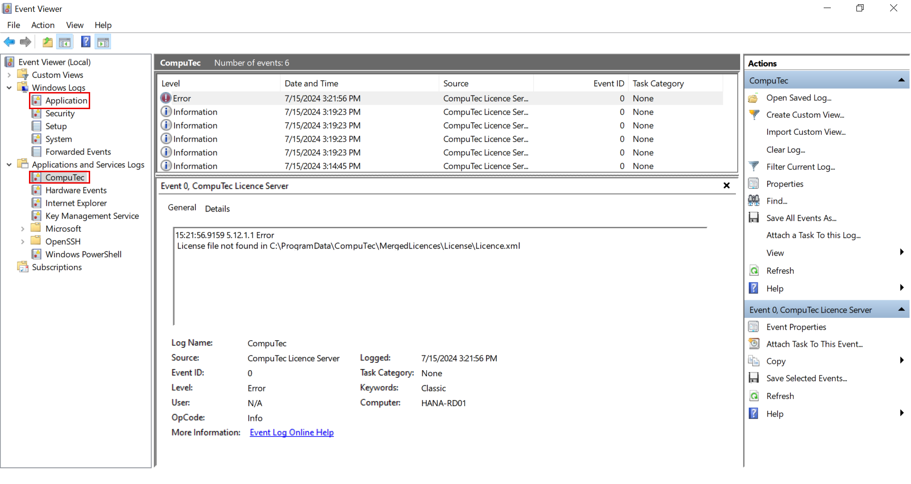

# Log File Locations - CompuTec WMS Components

This reference guide provides default file paths for accessing log files generated by different components of **CompuTec WMS**. These logs are essential for diagnosing issues, auditing application activity, and troubleshooting errors.

When reporting issues to **CompuTec Support**, it is recommended to include the relevant log files based on the component involved.

---

## Component-wise Log Locations

| Component                         | Default Log File Path                                                                                                                                         |
|----------------------------------|--------------------------------------------------------------------------------------------------------------------------------------------------------------|
| **CompuTec WMS Server logs**     | `C:\ProgramData\CompuTec\CompuTec WMS\Server\Logs`                                                                                                           |
| **CompuTec WMS Windows Client**  | `C:\Users\[username]\AppData\Local\CompuTec\CompuTec WMS\Client\Logs`  _(Replace `[username]` with the actual Windows username.)_                         |
| **CompuTec WMS CE Client**       | `[Device_name]\Program Files\CompuTec WMS 1.0.0\Logs`                                                                                                        |
| **CompuTec WMS Settings logs**   | `C:\ProgramData\CompuTec\ServiceManager\Logs`                                                                                                                |
| **CompuTec License Server logs** | - `C:\ProgramData\CompuTec\License Server\Logs`   - `C:\ProgramData\CompuTec\License Server\Logs\Terminals`                                               |

---

## Additional Troubleshooting – Windows Event Viewer

If the standard log files are missing or insufficient, additional diagnostic details may be found in **Windows Event Viewer**:

1. Open `Event Viewer` from the Start Menu.
2. Navigate to `Windows Logs → Application`.
3. Look for entries associated with the CompuTec WMS application.
4. Click the relevant row and copy the error message.
5. Include this information in your support ticket.

View Sample Screenshots

---

## Best Practices

- Always include **Server** and **Client logs** when submitting issues involving transactions, connectivity, or synchronization errors.
- Ensure logs are collected **immediately after reproducing** the issue for most accurate diagnostics.
- Use **Event Viewer** logs when applications crash or fail to launch.

---
