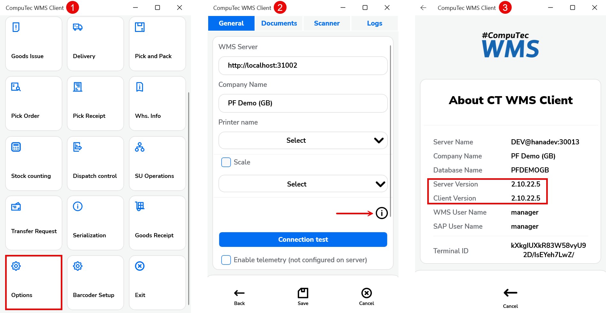

# Overview

If you have a problem with WMS application performance, please contact CompuTec support.

You can create an issue in the WMS Support space on support.computec.pl. Click [here](https://support.computec.pl/projects/SWMS/welcome-guide) to visit this page. To shorten the process of WMS support, please be sure to describe a problem closely.

To make the whole process easier, you can add the following information to the issue:

- CompuTec WMS Server and Client version

    

    
How can I check it?

    

    Run CompuTec WMS Client and choose the options pointed out in the screenshots below:

    
    

    

- **Application performance log file** is a text file that contains a record of an application's work. The logs folder contains text files that can be opened in Windows Notepad. The filenames are automatically generated based on the current date. Please attach to the support ticket files the date of an error occurrence. For more information, click [here](log-file-locations-of-computec-wms-components.md).
