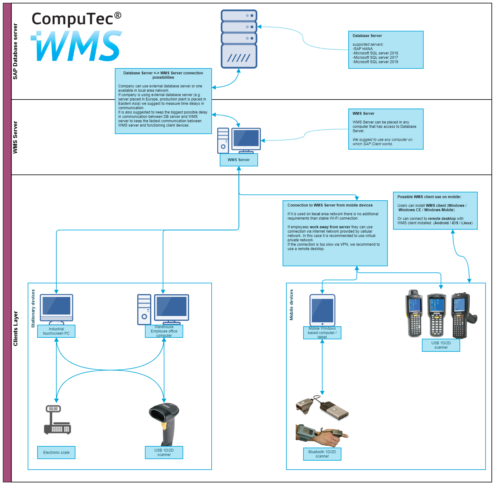

# Supported Network Architecture

CompuTec WMS (Warehouse Management System) is designed to work seamlessly across various network environments. Whether you're operating in a local network or a more complex, multi-site setup, CompuTec WMS is adaptable to meet your needs. This flexibility ensures that businesses of all sizes can implement the system without concerns about network compatibility.

---

The below image illustrates the architecture of the CompuTec WMS (Warehouse Management System), detailing the flow of connections between various components in the system.

    

    - **Database Server and WMS Server Connection**: The diagram shows that the WMS system can connect to an external database server, which could be running various database systems. The database server handles the database management, while the WMS server manages the warehouse operations. A low delay in communication between these servers is essential for smooth functioning.

    - **WMS Server Configuration**: The WMS server can be installed on any computer or server that has access to the database server. It's suggested that the WMS server be placed in a location that minimizes communication delay to ensure smooth data flow.

    - **Client Layer**: This section outlines the various devices that interact with the WMS system. These devices include industrial touchscreen PCs and office workstations that communicate with the WMS server through USB devices like scanners and electronic scales.

    - **Mobile Device Integration**: The system allows mobile devices (such as barcode scanners or handheld computers) to connect to the WMS server remotely. The diagram explains that for mobile devices in local area networks (LANs), no additional requirements are needed other than a stable Wi-Fi connection. However, for remote work, a VPN or other remote desktop connection solutions are recommended.

    - **Remote Access for WMS Clients**: There are provisions for users to connect to the WMS system remotely, either via desktop computers (using Windows or Linux) or mobile devices (with WMS client installed on Android or iOS). These remote devices can use either wired USB connections or Bluetooth-enabled scanners.

---
