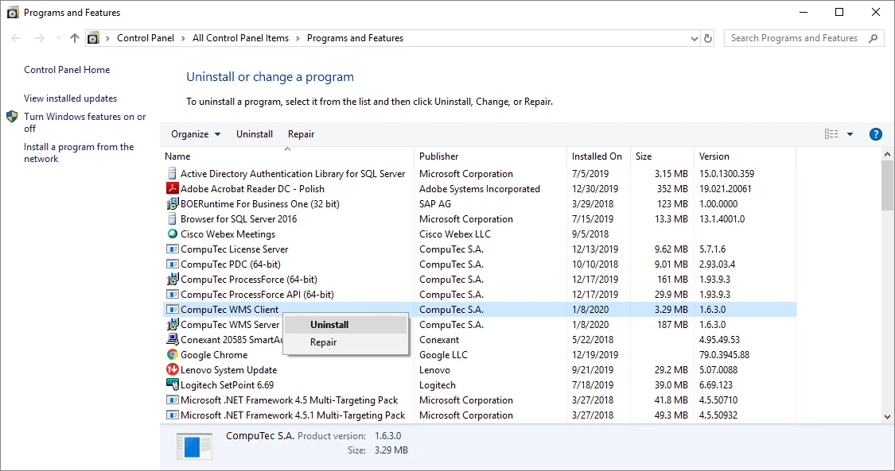

# Upgrade

This document provides information on upgrading the WMS application to a newer version.

:::caution
    You must manually uninstall the CompuTec WMS Server through the Programs and Features section in Windows before installing the new version of CompuTec WMS.
:::

---

To upgrade to CompuTec WMS 2.0, follow these steps:

1. Before installing the new version, uninstall the current CompuTec WMS Server and Client applications from your system:

    

    - Open Control Panel.
    - Navigate to Programs and Features.
    - Locate CompuTec WMS Client, right-click it, and select Uninstall.
    - Repeat the same process for CompuTec WMS Server.

2. Ensure you have the latest installers for both the WMS Server and WMS Client components. You can download them from [here](../releases/download.md)
3. Perform the installation procedure described [here](././installation/requirements.md) using new files. Please fulfill the [requirements](./installation/requirements.md) and install both [WMS Server](../administrator-guide/installation/wms-server/overview.md) and [WMS Client](../administrator-guide/installation/wms-client/wms-desktop-client.md) components.

---
