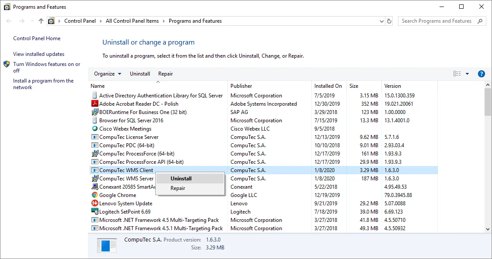

# Upgrade

This document provides information on upgrading the CompuTec WMS application to a newer version.

:::caution
    You must manually uninstall the CompuTec WMS Server through the Programs and Features section in Windows before installing the new version of CompuTec WMS.
:::

## Upgrade to CompuTec WMS 2.0 Application

To upgrade to CompuTec WMS 2.0, follow these steps:

1. Before installing the new version, uninstall the current CompuTec WMS Server and Client applications from your system:

    

    - Open Control Panel.
    - Navigate to Programs and Features.
    - Locate CompuTec WMS Client, right-click it, and select Uninstall.
    - Repeat the same process for CompuTec WMS Server.

2. Ensure you have the latest installers for both the CompuTec WMS Server and Client components. You can download them from [here](../releases/download.md)
3. Perform the installation procedure described [here](././installation/requirements.md) using new files. Please fulfill the [requirements](./installation/requirements.md) and install both [WMS Server](../administrator-guide/installation/wms-server/overview.md) and [WMS Client](../administrator-guide/installation/wms-client/wms-desktop-client.md) components.

## Automatic Client Update

Starting with **CompuTec WMS 3.2607.1**, **CompuTec WMS Android** and **CompuTec WMS Desktop** can update themselves directly from the application.

When an older client version starts, **CompuTec WMS** checks whether a newer version is available. If an update is found, the application prompts the user to download and install it.

This significantly reduces the time required to upgrade multiple devices. Instead of manually reinstalling the application on every device, users only need to confirm the update.

### Update Computec WMS Android or CompuTec WMS Desktop app

To update your **CompuTec WMS Android** or **Desktop** app, follow these steps:

1. Start **CompuTec** **WMS Android** or **Desktop app**.  

2. If a newer client version is available, click **Yes** in the **Update available** dialog.

    

3. Follow the installation prompts to complete the update.  

    

4. After the update is complete, open the newly installed version.

    

:::info[Note]
Automatic client upgrade replaces the previous recommendation to manually overwrite the **Android Client** version when only server-side fixes were required. Manual installation is still required for **Legacy Client** and **CE clients**.
:::

### Supported clients

Automatic client upgrade is **available** for:

- **CompuTec WMS Android**  
- **CompuTec WMS Desktop**  

The following clients **do not support automatic upgrade** and must still be updated manually:

- **CompuTec WMS Legacy Client**
- **CompuTec WMS CE**
