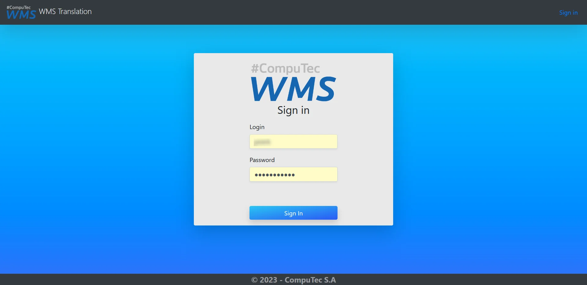
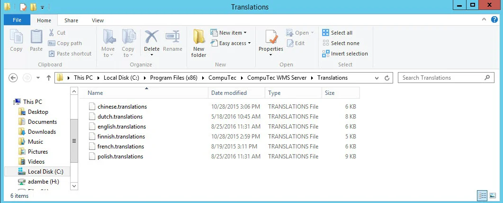
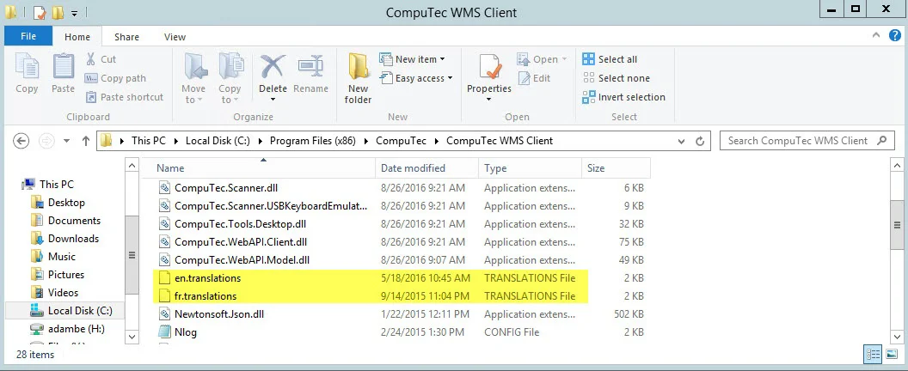

# CompuTec WMS Translator

This guide explains how to use the CompuTec WMS Translator, an essential IT solution for businesses utilizing CompuTec WMS. The tool enables users to easily translate the default language of CompuTec WMS (American English) into any other language, making the system more accessible to non-English-speaking users. It is particularly useful for international organizations or businesses that need to customize the interface for different regions or languages. Whether you're translating for a specific locale or testing a new language version, CompuTec WMS Translator offers an intuitive and efficient process.

---

:::caution
    If you have created a translation for a specific language, it’s advisable to send these files to CompuTec to be incorporated into the next installer release. Otherwise, the language will revert to the default (American English) after a system upgrade, and your changes will be lost.
:::

## CompuTec WMS Translator Address

You can access the CompuTec WMS Translator by navigating to [https://translate.processforce.eu:4433](https://translate.processforce.eu:4433) in your web browser.

## Logging in

Log in using credentials provided by CompuTec.

## Home Page

**Key Features**:

- Use the switch at the top of the window to access CompuTec WMS Client and Server translation.
- Choose the target language from the dropdown menu. Use the search function to find specific strings. Click Load data to display the content.
- When you implement changes, you can send them to the server (by clicking "Save Changes"). They will be stored there and added to the following official CompuTec CompuTec WMS release.
- The default language is a source. You cannot change it.

## Translation Download

If you want to test the translation before an official release, you can download the translation files for the selected language. You can then update your CompuTec WMS installation with the downloaded files.

:::caution
Keep in mind that once you upgrade to an official release, the translation files will be overwritten with the latest version.
:::

To swap downloaded language files with the ones in your CompuTec WMS Server and Client installation folders, copy the translation files to both the CompuTec WMS Server and Client installation folders.

    

    
Click here to find out more

    

    - **A file with a longer name**:

        

        (Alternatively, use the same path with the Program Files folder instead of Program Files (x86) if you're using a 64-bit version of the application.)(Or the same path with the Program Files folder, instead of Program Files (x86), in case of using a 64-bit version of the application)

    - **A file with a shorter name**:

        

    

    

---
