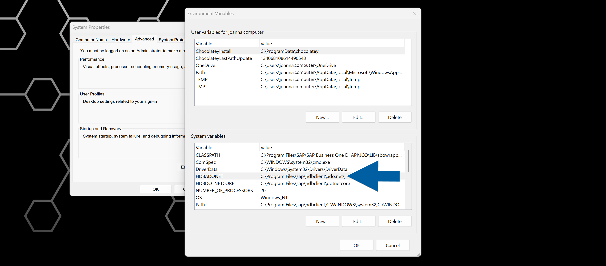
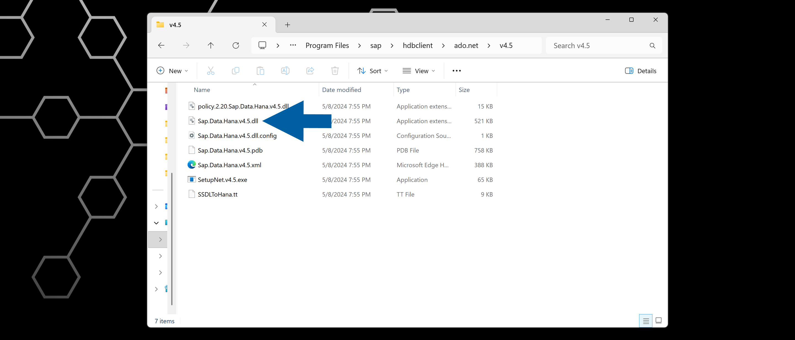
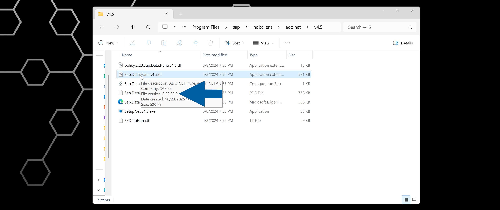
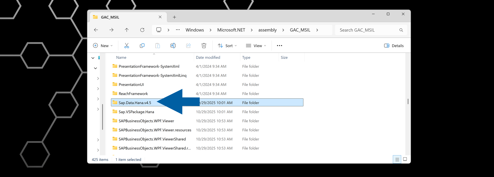

# Troubleshooting

## Problem: “DataLayerConnectionNotEstablischedException” error in WMS Server Logs (HANA Environments)

This error indicates that the CompuTec WMS Server is unable to establish a stable connection to the SAP HANA database. In many cases, the issue is caused by conflicting or outdated `Sap.Data.Hana.v4.5.dll` assemblies on the Windows server.

Here's how to resolve this problem:

### Step 1: Verify the HDBADONET Environment Variable

1. Open the **Environment Variables** on your computer.
2. Locate the variable named `HDBADONET`.

    

3. Note the directory path defined in this variable.

### Step 2: Check the DLL file version in the HDBADONET directory

1. Navigate to the folder identified in the `HDBADONET` variable.
2. Open the **v4.5** subfolder.
3. Locate the **Sap.Data.Hana.v4.5.dll** file.

    

4. Hoover over the file to check its version.

    

    :::info[note]
    The version should be similar to 2.17.22.0 (your actual version may vary depending on the HANA client installed).
    :::

### Step 3: Check the Global Assembly Cache (GAC) for conflicting versions

1. Go to: `C:\Windows\Microsoft.NET\assembly\GAC_MSIL\Sap.Data.Hana.v4.5\`

    

2. Check whether multiple subfolders exist, each containing different versions of `Sap.Data.Hana.v4.5.dll` file.
3. If you find versions that don't match the version in the `HDBADONET` directory, remove the mismatched folders. Only keep the version that matches the installed HANA client DLL.
4. Done!
