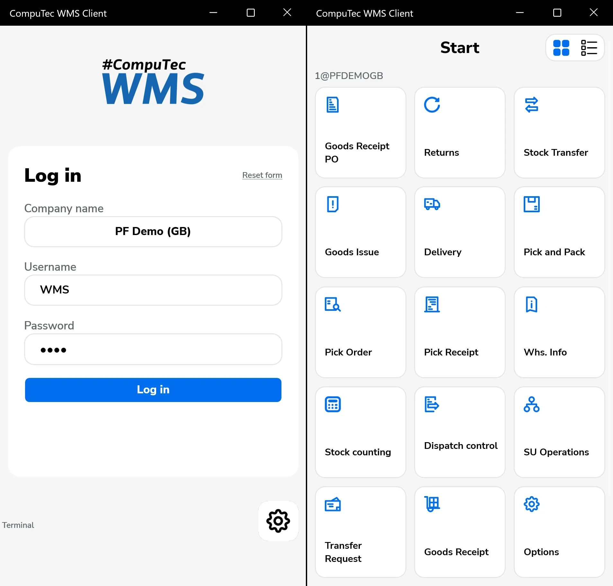

# Introduction to WMS

CompuTec WMS (Warehouse Management System) is a solution integrated with SAP Business One, designed to streamline and manage warehouse operations directly from mobile devices, including GS1 barcode scanners and Android devices. The CompuTec WMS enables real-time inventory management, tracking items from their arrival to dispatch—whether as standalone items or as components of a final product.

---

## Key Features and Functions

- **Core Warehouse Transactions** -  Supports all essential warehousing tasks, from receiving to dispatch.
- **Enhanced Manufacturing Integration** -  Offers additional features for CompuTec ProcessForce users to aid in manufacturing.
- **Batch and Serial Number Management** - Allows for detailed tracking and tracing of Inventory through Batch and Serial data.
- **Serialization Support** - Enhanced with CompuTec ProcessForce for added manufacturing precision.
- **Handling and Storage Unit Management** - Optimizes organization within storage units for improved efficiency.
- **Catch Weight Management** - Facilitates weight-based stock control, often essential in certain industries. To know more about "Catch Weight", click [here](./user-guide/catch-weight.md)
- **Stock Counting** - Provides accurate stock verification and counting tools.
- **Packing Process Management** - Manages packing workflows for streamlined order fulfillment.
- **Customization Options** - Offers tools like task queues, workflows, user-defined fields, SQL query fields, and data validation for tailored warehousing needs.

## Transactions

CompuTec WMS focuses on generating documents within the SAP Business One database for specific warehouse transactions. By selecting a transaction tile in the main menu, users can create documents detailing items, dates, remarks, and other specifics for efficient tracking and management.

    

---
CompuTec WMS provides a robust, mobile-enabled solution that enhances productivity and supports growth. By automating and simplifying complex warehouse tasks, businesses can improve their overall Supply Chain Management, reduce errors, and deliver superior service to customers.
