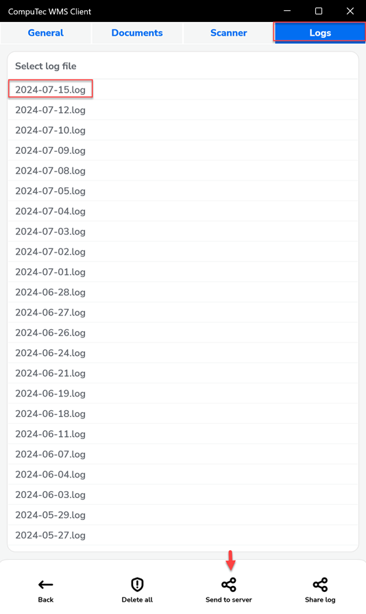
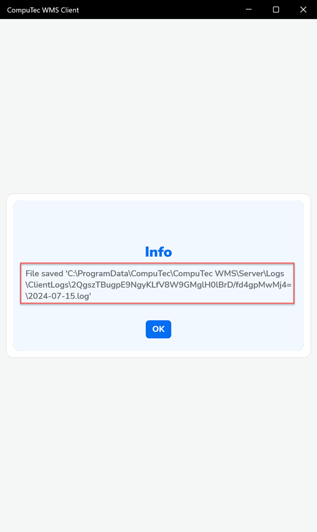
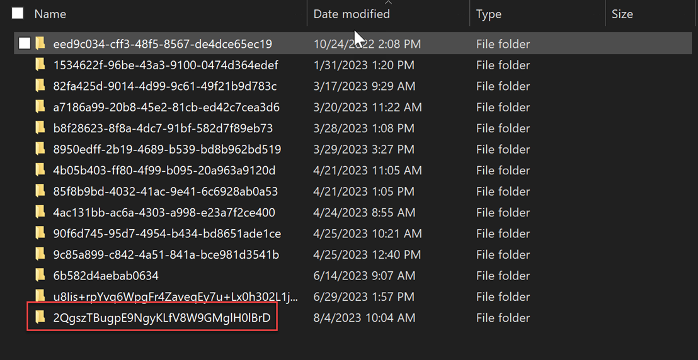
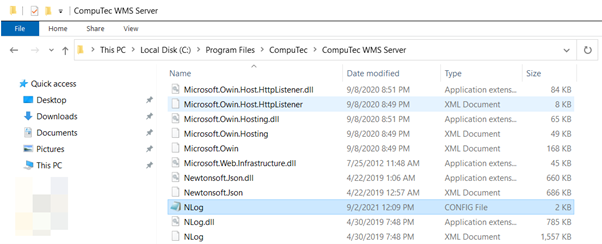
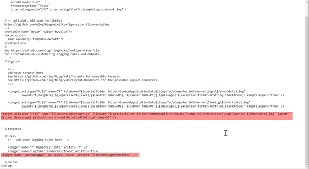
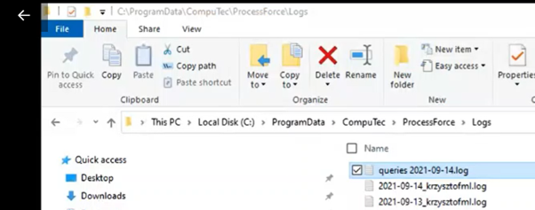

# Log Files

Here is the detailed information on the locations of logs for CompuTec WMS:

**1. Server logs**

    - Logs: C:\ProgramData\CompuTec\CompuTec WMS\Server\Logs
    - TimeLog: C:\ProgramData\CompuTec\CompuTec WMS\Server\TimeLog

**2. Service manager**

    Here, you will find logs regarding the installation of CompuTec WMS objects.

    - Logs: C:\ProgramData\CompuTec\ServiceManager\Logs

**3. Client**

    **a. Client (legacy)**
    
    - Logs: C:\Users\[USER_NAME]\AppData\Local\CompuTec\CompuTec WMS\Client\Logs
    - TimeLog: C:\Users\[USER_NAME]\AppData\Local\CompuTec\CompuTec WMS\Client\TimeLog

    **b. Client Desktop or Android**
    
    - Client Logs on Server: C:\ProgramData\CompuTec\CompuTec WMS\Server\Logs\ClientLogs

    You can send logs from the client to the server (does not apply to legacy version)

      
    

**4. Enabling additional logs**

    To log additional execution details by CompuTec WMS:

    - Navigate to:
    
        C:\Program Files\CompuTec\CompuTec WMS Server or C:\Program Files (x86)\CompuTec\CompuTec WMS Server

    - Open the configuration file:

        

    - Add the following code to enable detailed query logging

        ```xml
        <target xsi:type="File" name="fileEventLogForQueries" fileName="${specialfolder:folder=CommonApplicationData}\CompuTec\Computec WMS\Server\Logs\queries ${shortdate}.log" layout=" ${time} ${message} ${stacktrace:format=DetailedFlat:topFrames=5}" />
        ```
        ```xml
        <logger name="QueryNLogger" minlevel="Trace" writeTo="fileEventLogForQueries" />
        ```

        in the below file:

            

    - Upload the log file from:

        C:\ProgamData\CompuTec\CompuTec WMS\Server\Logs\queries

            

**5. Additionally, you can view the log from Microsoft Event Viewer**

Logs can also be viewed using the Microsoft Event Viewer for more detailed system logs and diagnostics

---
