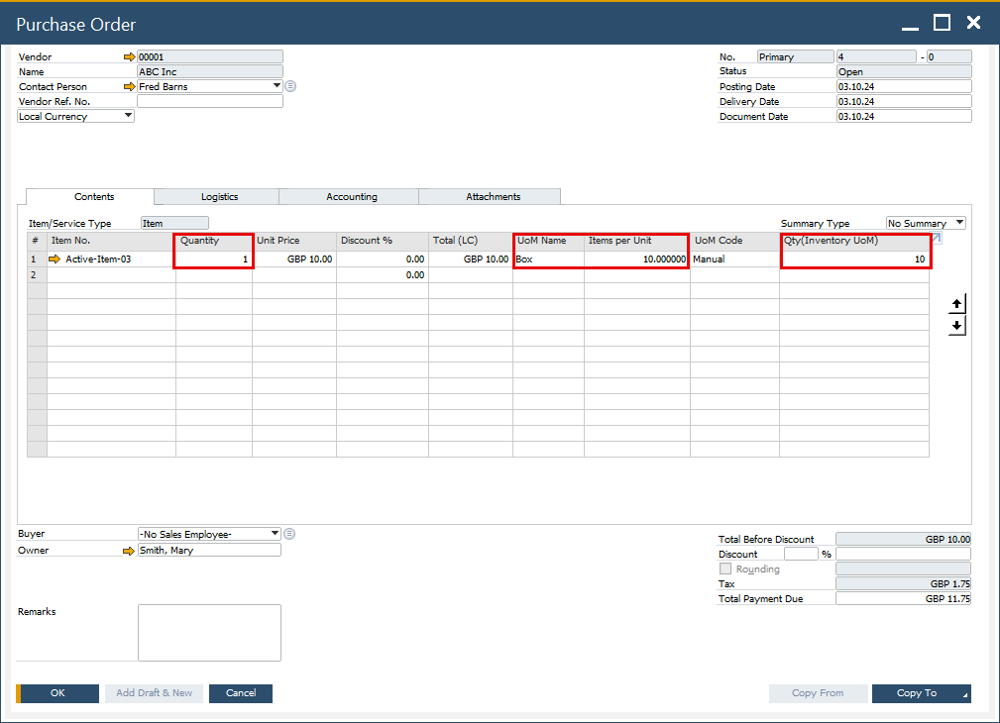
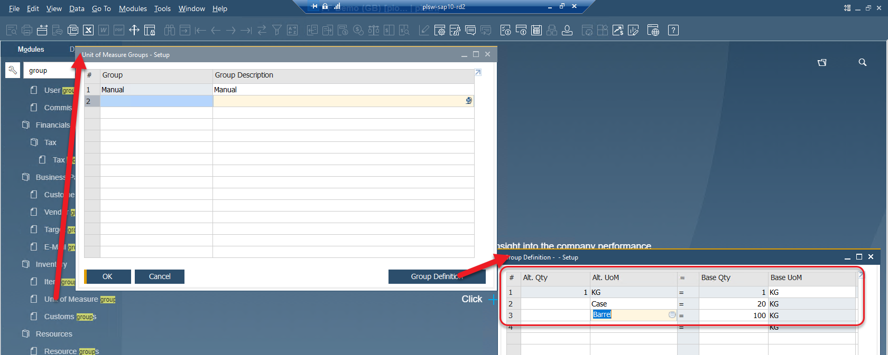
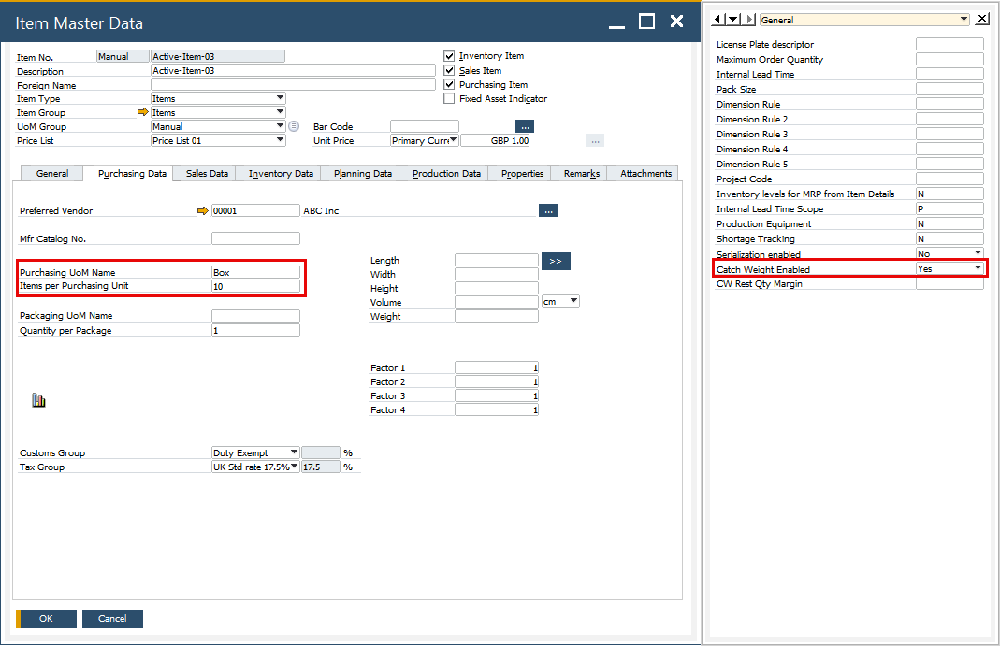
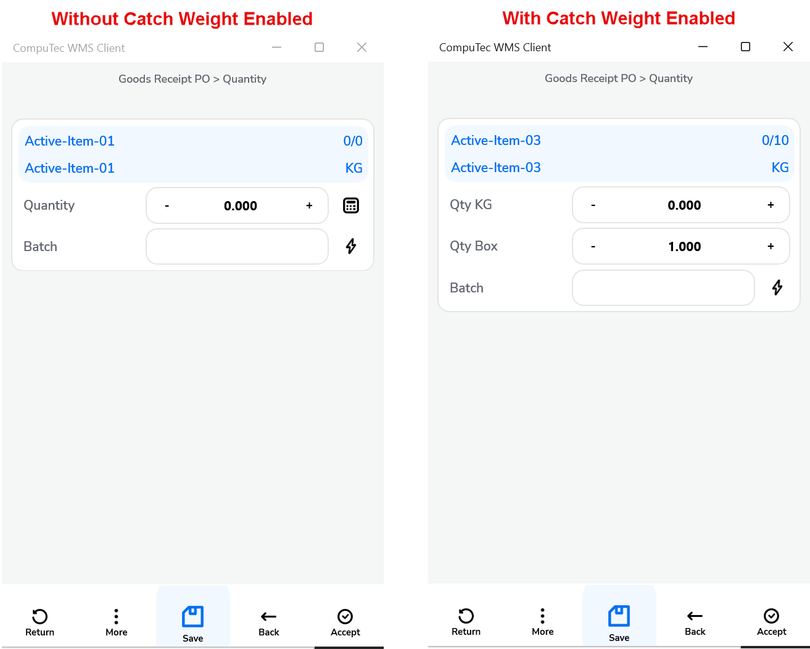
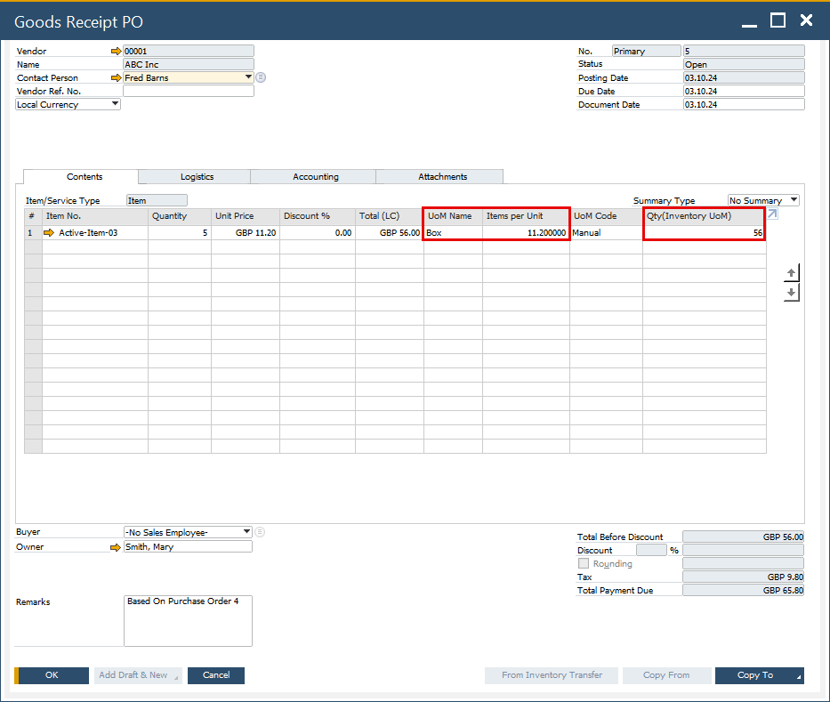
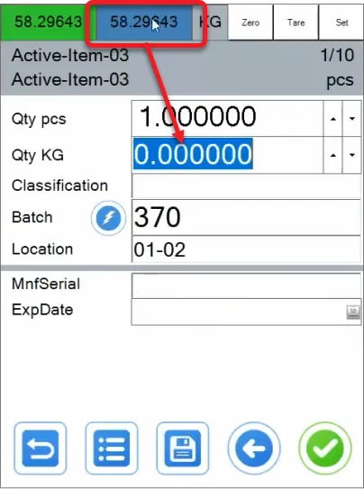

# Catch Weight

This guide explains the Catch Weight functionality in CompuTec WMS (Warehouse Management System), which allows users to measure inventory using both the Inventory Unit of Measurement (IUoM) and Document Unit of Measurement (DUoM). Catch Weight is particularly useful when the actual weight of items varies slightly, even when they are grouped in a standardized quantity, such as boxes with different weights.

To learn more about Catch Weight, watch the introduction video, click [here](https://www.youtube.com/watch?v=XGptQ9TQ90U).

---

## Overview

The Catch Weight feature in CompuTec WMS addresses two primary challenges:

1. **Accurate Weighting of Pieces**

    

    Often, inventory items are received in units where the weight varies slightly. For instance, a purchase order may state that 10 boxes of an item should weigh a total of 100 kilograms, but in practice, each box may weigh anywhere between 9.7 to 10.2 kilograms. Without Catch Weight, the system would assume that all boxes weigh 10 kilograms, leading to discrepancies. With Catch Weight enabled, the system allows for the accurate recording of the total weight of each item, adjusting for variations.

2. **Label Printing and Tracking**

    A Batch is created when the boxes are received and the document is saved. Printing is initiated automatically once the document is saved to the database, generating all labels at once.

    When integrated with CompuTec Labels, labels should be printed as each inventory item is entered onto the document (for each box). This ensures that each label is easily matched to its corresponding inventory item.

## Requirements

:::caution
Please note that the Catch Weight functionality does not work with different UoM defined in SAP Business One.

:::

### Item Master Data

:::info Path
SAP Business One → Inventory → Item Master Data
:::

To activate the option for Catch Weight, follow these steps:

1. Navigate to Item Master Data and select the desired item.
2. Set the Purchasing UoM under the Purchasing Data tab.
3. Open the User-Defined Fields (Ctrl+Shift+U) and set the Catch Weight Enabled field to Yes.

    

The Catch Weight option can be used in the following transactions:

- Goods Receipt PO
- Goods Receipt PO from Purchase Order
- Goods Receipt PO from AP Invoice
- Stock Transfer
- Delivery
- Delivery based on Sales Order
- Return
- Return PO
- Pick and Pack

## Usage

When the Catch Weight option is enabled, two quantity fields appear: the top field for the DUoM quantity (e.g., pcs in this example) and the lower field for the IUoM (e.g., KG in this case).

By default, the pcs field is set to allow you to select the quantity for KGs.

:::tip
When recording multiple entries, it is recommended to enable the Keep selected Bin Location option in Custom Configuration to maintain the bin location after adding an item.
:::

### Recording total Quantity for different UoMs of different quantity

In the example shown in the [video](https://www.youtube.com/watch?v=HHxk_J8FX1E), CompuTec WMS with the Catch Weight option demonstrates the process of recording ten packages (pcs) with weights ranging from 9.21 to 11.45 kilograms, even though the DUoM is set to 10. The transaction used here is Goods Receipt PO from Purchase Order.

Please note that the checkbox on the quantity form does not work with Catch Weight. After setting up the units, return to the Document Details, select the required item row, click the right arrow, and then click the Save icon (as shown at the end of the video).

Saving the document from our example results in the following Goods Receipt PO:

    

As shown, CompuTec WMS records the total quantity and calculates the average quantity per unit.

It’s important to note that the created packages are informational only—they are not as fixed as Storage Units. In the Batch Number Transactions Report (accessible via the context menu on Goods Receipt PO), a single batch with the total quantity is recorded. To view specific package records, navigate to CompuTec WMS → Whs. Info → Batch/Serial Info and select the relevant batch.

Click [here](https://www.youtube.com/shorts/lJHc8UuSsT8) to know more.

### Using Weight Scales

When CompuTec WMS is integrated with weight scales, inventory quantities can be set based on the weight measurements. To do this, click the IUoM field (e.g., Qty KG in this example) and press the highlighted weight button. The IUoM field will automatically populate with the measured weight:

    

If the [Weight Scale auto-complete quantity](../administrator-guide/custom-configuration/custom-configuration-functions/common.md) option is enabled in Custom Configuration, the IUoM field will be automatically filled with the scale's weight measurement when you click the Save icon.

### Average Quantity per DUoM

You can set both the number of units and the total quantity. Saving documents in this manner will create units with an [average quantity per unit](https://www.youtube.com/shorts/w_7l1lH6eTs)..

This feature is useful when, for example, a user knows the exact weight of each unit but the weight per unit differs from what is set in SAP Business One (for instance, in our example, one pcs is set to 10 KG).

#### Indivisible Rest Handling

In cases where the total quantity cannot be evenly divided between units, CompuTec WMS handles the indivisible rest by allocating the remaining weight to one of the units. For example, if you have 3 boxes and 10 kilograms, the system may create two boxes weighing 3.33 kilograms each and one with 3.34 kilograms, depending on the system’s precision settings (e.g., six decimal places).

### Label Printing for Inventory Tracking

If CompuTec WMS is integrated with CompuTec Labels, a label can be automatically printed each time a unit is saved. In this example, the user receives a label for each of the ten units (e.g., a box) upon saving them individually, rather than receiving all ten labels when the entire document is saved.

---
The Catch Weight functionality in CompuTec WMS offers a practical solution for managing inventory where weight discrepancies exist, ensuring accurate tracking and management of inventory based on both DUoM and IUoM. Whether you're managing goods receipt, stock transfer, or deliveries, Catch Weight can improve the accuracy and reliability of your warehouse operations.
