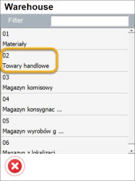
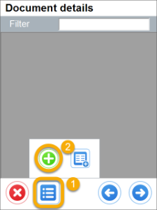
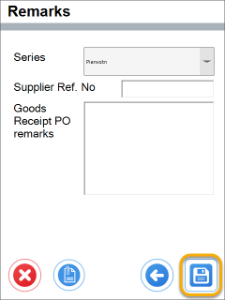
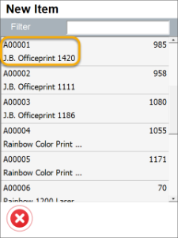

# Goods Receipt Purchase Order Settings

## New Goods Receipt

1. **Show Warehouse Selection and no default Warehouse or Bin Location chosen**– it is required to choose a Warehouse on document creation or adding Items

    

    
Click here to expand

    

    We start by selecting the warehouse, though this step can be skipped initially. However, the warehouse information will be required when adding the index. The forms are opened in the following order to create a new GRPO document:

           
    

    

2. **Show Warehouse Selection, default Warehouse and Bin Location are chosen** – if Warehouse selection step is skipped, user is not asked about it on adding Items (a default will be added).

    

    
Click to check the effect on the workflow

    

         
    

    

3. **Do not show Warehouse Selection and no default Warehouse or Bin Location chosen** – no Warehouse selection on creation of a document, but on adding an Item.

    

    
Click to check the effect on the workflow

    

          
    

    

4. **Do not Show Warehouse Selection and default Warehouse or Bin Location are chosen** – user is not asked to choose a Warehouse at all. When the checkbox is unchecked but user put Warehouse or Bin code, the transaction should be a little bit shorter, but if user skips Warehouse selection, the Item lists is empty.

    

    
Click to check the effect on the workflow

    

         
    

    

## From Purchase Order

In case of creating a Goods Receipt PO from Purchase Order, choosing or putting Warehouse code does not affect document creation (a Warehouse code has already been defined in a related Purchase Order).

    1. **Default Warehouse checked or unchecked**:
        

        
Click here to expand

        

              
        

        

    2. **Default Warehouse code chosen** – user chooses only from Purchase Orders for the chosen Warehouse:

        

        
Click here to expand

        

            
        

        

## From A\P Reserve Invoice

In case of creating a Goods Receipt PO from A/P Reserve Invoice, choosing or putting Warehouse code does not affect document creation (a Warehouse code has already been defined in a related A/P Reserve Invoice).

    1. **Default Warehouse checked or unchecked** – It is required to choose a Warehouse first on adding a new Item.

        

        
Click here to expand

        

              
        

        

    2. Warehouse code put in – only documents for chosen Warehouse are available to choose.

        

        
Click here to expand

        

             
        

        

## From Draft Goods Receipt PO

In case of creating a Goods Receipt PO from a Draft document, choosing or putting Warehouse code does not affect document creation (a Warehouse code has already been defined in a related Draft document). The new index is accepted into the index store from the first line.

        

        
Click here to expand

        

             
        

        

If 'Enable adding Items from different Warehouses' is checked in Custom Configuration, then the application asks for a Warehouse every time – even after unchecking the checkbox and putting in a default Warehouse.

    
