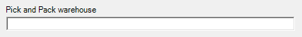
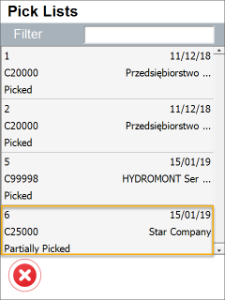
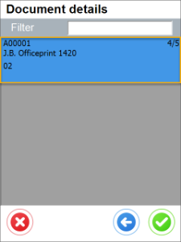
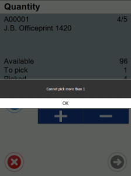
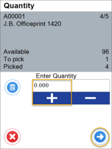
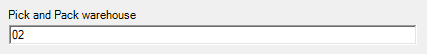
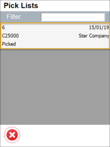
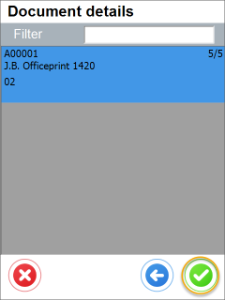

# Pick and Pack Settings

1. When in the Application settings Pick and Pack field is empty:

    

         

2. When in Pick and Pack warehouse field a Warehouse number is put, only Pick Lists for this Warehouse are displayed:

    

       
