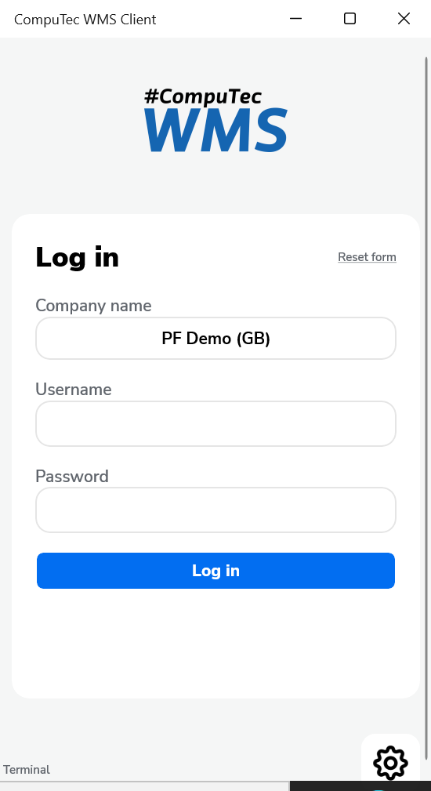
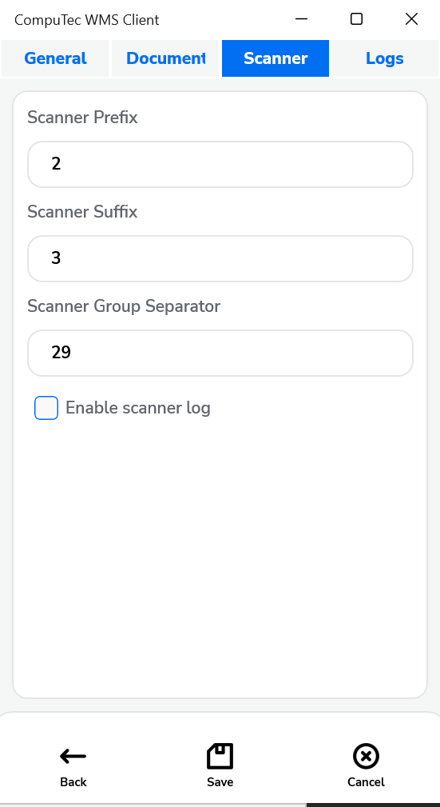

# Custom Decoder

Custom decoders in CompuTec WMS allow you to define unique data scanning rules and recognize barcode information within specific workflows, streamlining data processing and accuracy in Warehouse Management System transactions. The steps and configuration options detailed here guide users through setting up and testing custom decoders in CompuTec WMS, highlighting the potential for customized, efficient scanning operations.

---

## Requirements

To implement custom decoders, ensure the following setup is complete:
    - CompuTec WMS Server is installed.
    - CompuTec WMS objects is installed in the database.
    - The MAUI WMS client is installed (configure Barcoder Setup at the Windows level of MAUI only).
    - The latest version of the scanner simulator is available for testing.
    - The Scanner tab is correctly configured with the appropriate Prefix, Suffix, and Scanner Group Separator.

        

        

The settings in the scanner simulator must match those configured in the Scanner tab.


## Usage

Choose the option in the main menu:


### Decoder Definition


Here, you can view a list of pre-defined custom decoders.

Each decoder includes the following details:

#### Columns

- **Code**: Unique decoder ID.
- **Name**: Name of the decoder.
- **Enabled**: Indicates whether the decoder is enabled or diabled.

#### Buttons

- **Edit**: Modify an existing decoder.
- **Test**: Test the configuration.
- **Delete**: Delete the chosen decoder
- **Create new**: Add a new decoder
- **Close**: Exit/close the window.

### Decoder Selection Rules

Specify which decoders are linked to particular WMS transactions or forms. To refresh the list, click the filter button.


- **WMS Transaction**: Filter the table to show results for either all transactions or a specific one.
- **WMS Form Id**: Filter the list by a specific Form ID.
- **Edit**: Edit a decoder assignment.
- **Delete**: Delete a decoder assignment.
- **Create new**: Create a decoder assignment.
- **Close**: Exit/close the window.

### Decoder Definitions

Configure how the decoder handles data, including the setup of rules and variables.

    

- **Decoder Code**: Automatically generated unique ID for the decoder.
- **Decoder Name**: Name of the decoder.
- **Enabled**: Enables or disables the decoder.
- **Variables Definition**: Specify variables used in the decoder's logic.
- **Test**: Validate the decoder's functionality through testing.

The table displays a comprehensive list of rules associated with a specific decoder:

- **Name**: The name of the rule.
- **Type**: Specifies the type of the rule.
- **Enabled**: Enables or disables the rule.
- **Edit**: Allows modification of the rule.
- **Delete**: Deletes the rule.
- **New Rule**: Creates a new rule (requires selecting a rule type from a drop-down menu).
- **Add/Update**: Saves or updates the decoder.
- **Back**: Returns to the previous window.

### Variables Definition


This section allows you to define variables for use in the decoder's rules.

**Types of variables**:

- **Input Variables**: Used as input parameters for rules. By default, the BARCODE variable captures the full text scanned from a barcode.
- **Internal Variables**: Temporary variables that serve as both inputs and outputs. To reference a BusinessObject value, prefix the variable name with #.
- **Output Variables**: Act as output parameters for rules.
- **Use GS1 Decoder**: When enabled, this automatically interprets GS1 prefixes and transfers the decoded data to CompuTec WMS. If disabled, each data field must be defined manually.

#### Columns [01]

- **Name**: Unique identifier for the variable.
- **GS1 Code**: GS1 segment selected from a predefined list, used during both input and output stages of decoding.
- **Pass to output**: Determines whether the variable is passed to CompuTec WMS.
- **Description**: A brief description of the temporary variable.

#### Buttons

- **New**: Create a new variable.
- **Delete**: Remove an existing variable.
- **Save**: Save all defined variables.
- **Back**: Return to the previous window.

### Rules

Create and manage rules to define how data is processed.

1. **SQL Rules**: his rule allows proceeding SQL queries.

    

    This rule assigns the result of an SQL query to output variables. Input and internal variable values can be used as parameters, with input variable names starting with @. The column names in the query result must match the output variable names, and the query should return a single row.

    - **Name**: Name of the rule.
    - **Enabled**: Enable or disable the rule.
    - **Stop processing more rules on failure**: Prevent further rules from executing if this rule fails.
    - **Query**: Enter the SQL Query here.
    - **New**: Add an input or output variable by selecting from a drop-down list.
    - **Copy**: Copy the variable name to the clipboard.
    - **Delete**: Delete the variable.
    - **Test Query**: Test the SQL query by entering input variable values in the Test Value field.
    - **Save**: Save the rule.
    - **Back**: Return to the previous window.

2. **Regexp**: This rule allows you to get data using regular expressions.

    

    This rule leverages regular expressions to extract data from barcodes or variables. Named groups in the expression must correspond exactly to the defined output variable names.

    - **Name**: Name of the rule.
    - **Enabled**: Enable or disable the rule.
    - **Stop processing more rules on failure**: If this rule fails, subsequent rules will not be executed.
    - **Pattern**: Field for entering the regular expression.
    - **New**: Add a new output variable by selecting from a drop-down menu.
    - **Copy**: Copy the name of a variable to the clipboard.
    - **Delete**: Delete the variable.
    - **Save**: Save the rule.
    - **Back**: Return to the previous window.

3. **Replace**: This rule allows you to replace a portion of text. With this rule, you can modify specific code text or variables.

    

    - **Name**: Name of the rule.
    - **Enabled**: Enable or disable the rule.
    - **Old Value**: A searched value.
    - **New Value**: A new value.
    - **Save**: Save the rule.
    - **Back**: Return to the previous window.

### **Testing Decoder**

    Use the test option to validate decoder behavior with sample barcode values.

    

    - **Decoder Code**: The unique ID of the decoder.
    - **Decoder Name**: The name of the decoder.
    - **Enabled**: Enable or disable the decoder.
    - **Barcode**: A field to enter the barcode.
    - **GS**: Click to insert a GS1 separator at the specified location in the Barcode field. The separator must be defined in the CompuTec WMS options (Scanner tab).
    - **Test**: Test the decoder's functionality with a specific barcode. Clicking will display the output variable values sent to CompuTec WMS.
    - **Back**: Return to the previous window.

**Assigning rule to spot/screen in CompuTec WMS**


You can assign a specific decoder to a chosen transaction or screen in CompuTec WMS.

- **Decoder**: Select the decoder to assign.
- **WMS Transaction**: Choose the relevant CompuTec WMS transaction.
- **WMS Form Id**: Enter the screen ID for the CompuTec WMS form.
- **Optional condition**: If assigning multiple decoders to the same screen, you can define an SQL query with conditions to determine which decoder to use.
- **Save**: Save the assignment.
- **Back**: Return to the previous window.

**Current Form Details**: Provides additional information for a specific screen in CompuTec WMS.

:::note
    This option is only available in the new CompuTec WMS Windows client.
:::

To access this screen, press and hold the left CTRL key while logging into CompuTec WMS. The screen will appear once you click the highlighted icon:

    

    

Here, you get access to the following information:

1. **The Info tab**:

    - **Transaction**: Name of the transaction.
    - **FormId**: Name of the screen.
    - **Supported scanning segments**: The data that CompuTec WMS reads from barcodes and utilizes on this screen.
2. **The Business Object tab**: Here, you can preview variable values available in a specific CompuTec WMS screen.

3. **The Decoder tab**: Here is information on a specific decoder.

    

    - **Current Decoder Code**: The ID of the decoder assigned to this screen.
    - **Current Decoder Name**: The name of a decoder assigned to this screen.
    - **Assign decoder transaction**: Assign a decoder to a specific transaction.
    - **Assign decoder screen**: Assign a decoder to the current transaction and screen.
    - **Enter Barcode**: A field where barcode can be entered.
    - **GS**: Click to insert a GS1 separator at the selected position in the Barcode field. The separator must be defined in the CompuTec WMS options under the Scanner tab.
    - **Test barcode**: Test the decoder’s functionality with a specific barcode. Clicking this will display the output variable values sent to CompuTec WMS.
    - **Back**: Return to the previous window.

## Examples

### Example 1

The scanned code consists of the following URL address: `https://address.com/ItemCode/BatchNumber/dd-mm-yyyy`.

    We aim to extract the following information from this URL and pass it to CompuTec WMS:: Item Code, Batch Number, and Expiry Date, with the date converted to the YYMMDD format.

    1. Create a new decoder.
    2. Create the following variables:

        1. Internal variables:

            1. Day.
            2. Month.
            3. Year
        2. Output variables:

            1. BatchNumber (GS1 Code 10, pass to output: enabled).
            2. ItemCode (GS1 Code 91, pass to output: enabled).
            3. ExpireDate (GS1 Code 17, pass to output: enabled).
    3. Create the following rules:

        1. Regexp type rule (rule name 1)

            1. Set the input variables to BARCODE.
            2. Set the following output variables: BatchNumber, ItemCode, Day, Month, Year.
            3. Set the following for the regular expressions:
                ```ruby
                ^https?:\/\/.*?\/(?\<ItemCode>[^\/]+)\/(?\<BatchNumber>[^\/]+)\/(?\<Day>\d{2})-(?\<Month>\d{2})-(?\<Year>\d{4})$.
                ```

        2. An SQL-type rule (rule name 2).

            1. Set the following input variables: Day, Month, Year.
            2. Set the following output variables: ExpireDate.
            3. For the SQL query, set:
                                ```sql
                                SELECT Right('@Year',2) || '@Month' || '@Day' as "ExpireDate" FROM DUMMY
                                ```

    4. Save rules and decoder.
    5. Test.

        

### Example 2

The scanned code includes the 3202 prefix, which is not natively supported in CompuTec WMS. We want this data to be treated as a quantity, with the last two digits representing the decimal places.

    1. Create a decoder.
    2. Create the following variables (check the USE GS1 Decoder option)

        1. Input variables:

            InputQuantity (GS1 Code 3202).
        2. Output variables:

            Quantity (GS1 Code Quantity, pass to output: enabled)
    3. Create the following rules:

        1. An SQL-type rule (rule name 1)

            1. Set input variables to InputQuantity.
            2. Set output variables to Quantity.
            3. Set the following SQL query:

                        ```sql
                        SELECT CASE WHEN LENGTH('@InputQuantity') > 0 THEN LEFT('@InputQuantity',4) || '.' || RIGHT('@InputQuantity', 2) ELSE '' END AS "Quantity" FROM DUMMY
                        ```

    4. Save the rules and decoder.
    5. Test the decoder to ensure it functions as expected.

    

### Example 3

You can display messages in WMS by creating custom queries. In the output section, choose ErrorMessage from the available options.


Here’s an example of a query you can use:

```sql
SELECT
 CASE WHEN '@ItemCode' = 'N1' THEN '' ELSE 'bad item [test error msg]' END AS "ErrorMsg"
,'@ItemCode' AS "ItemCodeOut"
FROM DUMMY
```

Watch the demonstration video [here](https://www.youtube.com/watch?v=8JUxu5RUcvA). This video shows how to configure and display messages in the CompuTec WMS client using Barcoder Setup.

You can also use your own query and rules. Below are some examples:

**Example A**


**Example B**


---
