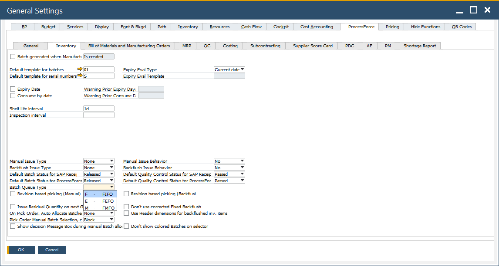

# FIFO, FEFO, FMFO Queues

In this guide, you'll find descriptions of FIFO, FEFO, and FMFO queue types for handling items managed by **Batches**, **Serial Numbers**, and **Items not managed by Batches or Serial Numbers**.

---

## Batch Managed Items

The queue type for Batch Managed Items depends on whether **ProcessForce** is installed:

- **With ProcessForce Installed:** The queue type follows the ProcessForce settings.

- **Without ProcessForce Installed:** You can set the queue type by navigating to: [Custom Configuration → Manager → Enable Batch Management → Set Default Settings.](../administrator-guide/custom-configuration/custom-configuration-functions/manager/batch-management-manager.md)

*Here's a breakdown of each queue type:*

- **FEFO (First Expiry, First Out):** The queue is determined by `ExpDate` (and `U_ExpiryTime` if ProcessForce is installed). This method ensures items with the earliest expiry are dispatched first.

- **FMFO (First Manufacture, First Out):** The queue relies on the `MnfDate`, sending items produced earlier out first.

- **FIFO (First In, First Out):** The queue is based on `InDate`, releasing the items in the order they arrived.

  

## Managed and Not Managed Items

For items managed by **Serial Numbers** or neither by **Batches nor Serial Numbers**, **FIFO** is always applied. This is implemented by ProcessForce and takes into account the **document creation date** in the Inventory Location Management (ILM) module.

When items are transferred to a warehouse post-receipt, **the transfer date is considered the latest and used for queue management**.

:::warning
For FEFO-managed items, if there is no `ExpDate` **set for a Batch** using this queue type, the system defaults to recognizing it as the **earliest date** during location-based searches in this queue type. This ensures proper sequence management based on available expiry dates.
:::
