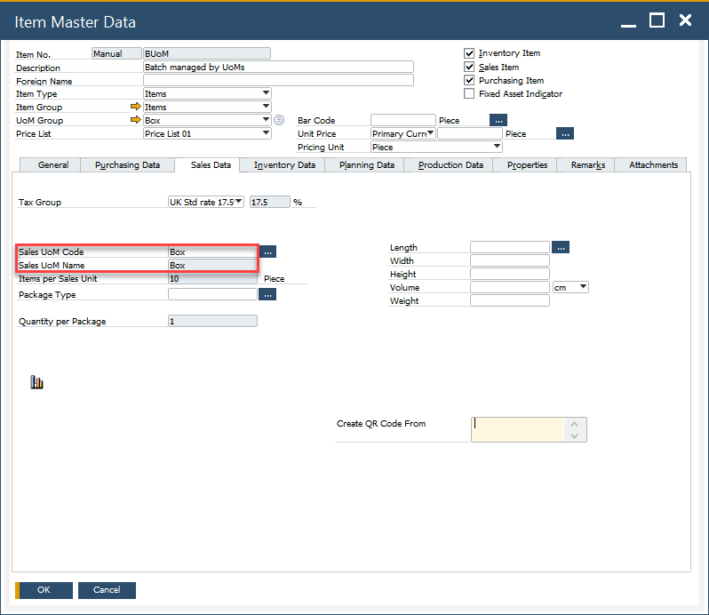

# Managing UoM in CompuTec WMS

This guide provides a comprehensive overview of how to manage Units of Measurement (UoM) in CompuTec Warehouse Management System (WMS) for various transactions. Proper management of UoM is essential for accurate inventory control and seamless transaction processing across different modules in SAP Business One (SAP B1). The guide covers key features for managing UoM in the following transactions:

- Pick Lists from Transfer Request,
- Transfer Request (apart from MOR Transfer Request),
- Stock Transfer.

By following this guide, you will learn how to configure and customize the UoM handling process in CompuTec WMS to suit your business needs.

---

## Pick Lists from Transfer Request

To manage UoM for Pick Lists created from Transfer Requests, follow these steps:

1. Check the Delivery checkbox in Custom Configuration (CC) to manage UoM based on the Delivery document.

        

2. In SAP Business One, the Inventory Transfer document manages the UoM for the document.

        

3. A Pick List for this document - The Pick List document in CompuTec WMS allows you to manage quantities either by warehouse stock or by Units of Measurement (UoM), depending on the configuration of the Custom Configuration (CC) checkbox.

        

        - Without the CC checkbox, the quantities are displayed by Warehouse quantities:

                

        - When the CC checkbox is checked, the quantities are displayed by UoM:

                

## From Transfer Request

For Transfer Requests, the UoM is taken from the Inventory Transfer Request in SAP Business One, as shown in the document details.

        

        

## Stock Transfer / Transfer Request

This feature in CompuTec WMS allows you to configure how Units of Measurement (UoM) are sourced, either from the Inventory or Sales Data tab, depending on your system configuration.

1. By default, CompuTec WMS retrieves the UoM from the Inventory Data tab in SAP Business One.

    
2. To modify the UoM source, check the highlighted checkbox in Custom Configuration:

    

3. Once the checkbox is selected, CompuTec WMS will take the UoM from the Sales Data tab instead:

        

        

## Custom Queries

By using a custom query, you can specify a line with any desired UoM. To do this, simply add a column named "UoM" in the query. If this column is present, the UoM will be retrieved from it.


### For SAP without ProcessForce

```sql
SELECT TOP 100 PERCENT

T0."ItemCode",

COALESCE(u."UomCode", T0."InvntryUom")  AS "UoM",

T0."ItemCode" AS "Field1",

T0."ItemName" AS "Field3",

T1."OnHand" AS "Field2",

COALESCE(u."UomCode", T0."InvntryUom")  AS "Field4"

FROM "OITM" T0

        INNER JOIN "OITW" T1 ON T1."ItemCode" = T0."ItemCode"

LEFT JOIN "OUGP" g ON g."UgpEntry" = T0."UgpEntry"

        LEFT JOIN "UGP1" g1 ON g1."UgpEntry" = g."UgpEntry"

        LEFT JOIN "OUOM" u ON u."UomEntry" = g1."UomEntry"

WHERE (('@WhereFilterValue' = '' AND ''='') OR ('@WhereFilterValue' <> '' AND (@WhereFilterQuery) ))

        AND T0."InvntItem" = 'Y'

        AND T0."validFor" = 'Y'

        AND T1."WhsCode" = @WhsCode

        @SerializationFilter

        @InventoryTransferExistsCondition

ORDER BY T0."ItemCode", u."UomCode"
```

### For SAP with ProcessForce

```sql
SELECT T0."ItemCode",  T0."UoM", T0."ItemCode" AS "Field1", T0."ItemName" AS "Field3", SUM(T0."Qty") AS "Field2", T0."UoM" AS "Field4" FROM (

        SELECT T0."ItemCode", T0."ItemName", ROUND(T1."OnHand" / g1."BaseQty", 3)  AS "Qty", COALESCE(u."UomCode", T0."InvntryUom") as "UoM", T0."U_CTSRSerialization", 'True' AS "ShowAllUoM"

        FROM "OITM" T0

                       INNER JOIN "OITW" T1 ON T1."ItemCode" = T0."ItemCode"

                       LEFT JOIN "OUGP" g ON g."UgpEntry" = T0."UgpEntry"

                       LEFT JOIN "UGP1" g1 ON g1."UgpEntry" = g."UgpEntry"

                       LEFT JOIN "OUOM" u ON u."UomEntry" = g1."UomEntry"

        WHERE

                       T0."InvntItem" = 'Y'

                       AND T0."validFor" = 'Y'

                       AND T1."WhsCode" = @WhsCode

        UNION ALL

        SELECT T3."ItemCode", T3."ItemName", ROUND(-T2."U_Quantity" / g1."BaseQty", 3) AS "Qty", COALESCE(u."UomCode", T3."InvntryUom") AS "UoM", T3."U_CTSRSerialization", 'True' AS "ShowAllUoM"

        FROM "@CT_PF_OPOR" T0

                       INNER JOIN "@CT_PF_POR1" T1 ON T1."DocEntry" = T0."DocEntry"

                       INNER JOIN "@CT_PF_POR2" T2 ON T2."DocEntry" = T0."DocEntry" AND T2."U_ReqItmLn" = T1."LineId"

                       INNER JOIN "OITM" T3 ON T3."ItemCode" = T2."U_ItemCode"

                       LEFT JOIN "OUGP" g ON g."UgpEntry" = T3."UgpEntry"

                       LEFT JOIN "UGP1" g1 ON g1."UgpEntry" = g."UgpEntry"

                       LEFT JOIN "OUOM" u ON u."UomEntry" = g1."UomEntry"

        WHERE

                       @IncludePickAlloc = 'True'

                       AND T0."U_Status" <> 'C'

                       AND T1."U_SrcWhsCode" = @WhsCode

                       AND T2."U_Quantity" > 0

                       AND T2."U_Issued" = 'N'

) T0

WHERE

        (('@WhereFilterValue' = '' AND ''='') OR ('@WhereFilterValue' <> '' AND (@WhereFilterQuery) ))

        @SerializationFilter

GROUP BY T0."ItemCode", T0."ItemName",  T0."UoM"

@InventoryTransferExistsCondition

ORDER BY T0."ItemCode", T0."UoM"
```

CompuTec WMS will display a list of all available Units of Measurement (UoM), and you can select the appropriate group as needed.

 

You can also add custom queries to specific transactions, such as the Transfer Request. By doing this, CompuTec WMS allows you to manage UoM with greater flexibility.

To use Sales UoM for new Inventory Transfers, check the Use Sales UoM option. If unchecked, the system will use the UoM from the Inventory.

---
By configuring these options, you can tailor UoM management in CompuTec WMS to suit your business processes and improve inventory handling efficiency.
