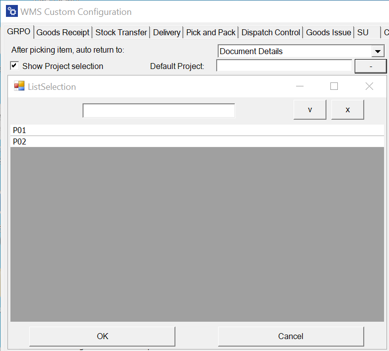
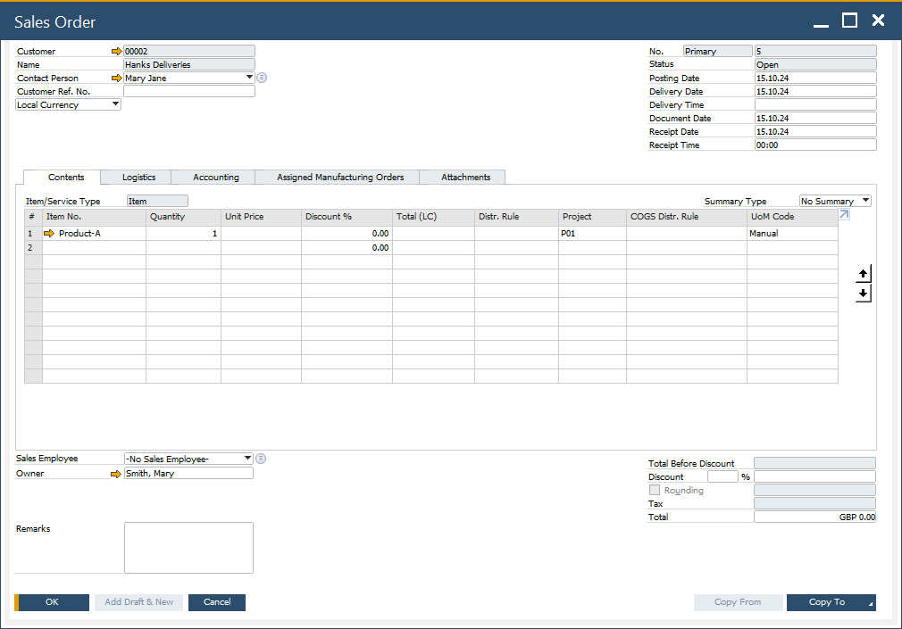

# Project

Here, you can obtain additional information regarding [SAP Business One Projects](/docs/processforce/user-guide/costing-material-and-resources/projects) on documents created using CompuTec WMS.

---

It is impossible to set Enable Dimensions SQL, Proper Line to Project. This setting has a priority over the default Project and a Project picked during a transaction.

Default Project for a specific transaction can be set in related [Custom Config tabs](../administrator-guide/custom-configuration/overview.md) (Goods Receipt PO, Goods Receipt, Delivery, Goods Issue, and Inventory Transfer).

    

Priority of assigning Project to a document line:

1. Project set in Dimensions option, Project Line; if not set, then:
2. A Project picked in Project Selection form during the transaction; if not picked, then:
3. A default Project set in Custom Config for a specific transaction.

    
